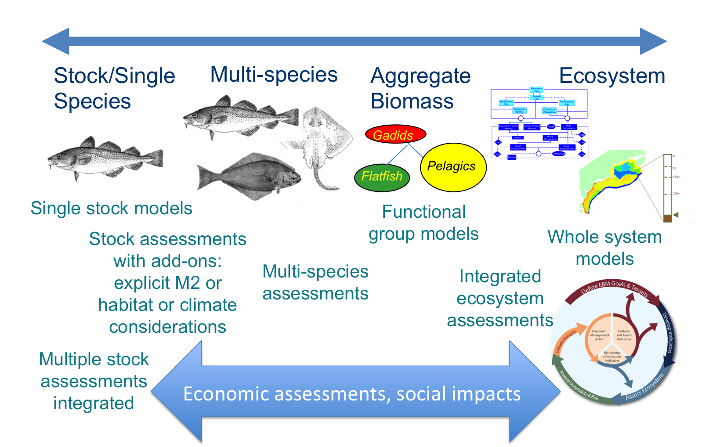
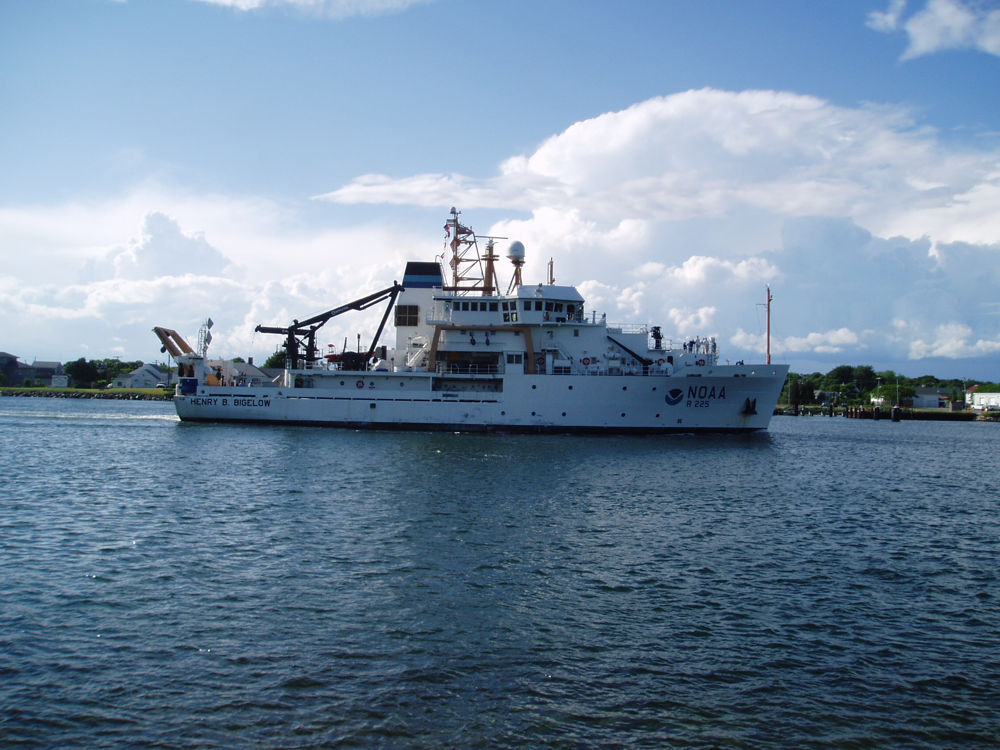
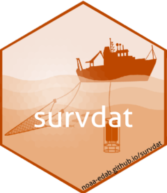

```{r setup, include=FALSE}
knitr::opts_chunk$set(echo = TRUE, 
                      message = FALSE,
                      warning = FALSE)
library(magrittr)
options(warn=-1)

```

# Georges Bank Multispecies Keyrun Project 

.pull-left[
- New England Fisheries Management Council (NEFMC) is considering a shift to place-base, ecosystem-based fisheries management (EBFM)
- Example Fisheries Ecosystem Plan (eFEP) will focus on the Georges Bank Ecological Production Unit (EPU)
- NEFMC's EBFM Plan Development Team proposed a management procedure using ceilings and floors
- An implementation of this procedure using the Hydra model was reviewed by the Center of Independent Experts in 2018

]

.pull-right[


```{r GBfoot, eval=T, echo = F, fig.align='center'}
crs <- 4326
# NEW GB EPU def based on survey strata
coast <- sf::st_read("data-raw/gis/NES_LME_coast.shp", quiet = T) %>%
  sf::st_transform(.,crs=crs)
GB_strata <- sf::st_read("data-raw/gis/EPU_extended.shp",quiet=T) %>%
    sf::st_transform(.,crs=crs)
ggplot2::ggplot(data=coast) +
  ggplot2::geom_sf() +
  ggplot2::geom_sf(data=GB_strata,col="black",fill="grey") + 
  ggplot2::coord_sf(xlim = c(-76,-65), ylim = c(38,44))

```

]


---

# Georges Bank Multispecies Keyrun Project 

.pull-left[

- Several concerns remained
    - What happens with all the species in the region under proposed management regime?
    - How well do multispecies models perform for assessment?
    - How does this compare to what we are currently doing?

]

.pull-right[

```{r GBfoot2, eval=T, echo = F, fig.align='center'}
crs <- 4326
# NEW GB EPU def based on survey strata
coast <- sf::st_read("data-raw/gis/NES_LME_coast.shp", quiet = T) %>%
  sf::st_transform(.,crs=crs)
GB_strata <- sf::st_read("data-raw/gis/EPU_extended.shp",quiet=T) %>%
    sf::st_transform(.,crs=crs)
ggplot2::ggplot(data=coast) +
  ggplot2::geom_sf() +
  ggplot2::geom_sf(data=GB_strata,col="black",fill="grey") + 
  ggplot2::coord_sf(xlim = c(-76,-65), ylim = c(38,44))

```

]

???
Georges Bank MSKEYRUN project designed to address the first two concerns

Develop potential operating models for a management strategy evaluation (MSE) that could be used to address the third

---

# Multispecies/Ecosystem modeling in the Northeast US

<center>



</center>

---

# Motivation for a common data set

.pull-left[
- Objectives will require the development (refinement) of several multispecies/ecosystem models
- **LOTS** of data to sift through/ decisions to be made
- Time spent organizing data is magnified when dealing with multiple species
- Need to generalize solutions to common data issues
- Did **NOT** want multiple versions of starting parameters
]

.pull-right[

]

---

# Creating a reproducible workflow

.pull-left[
- Lots of decision points
    - Spatial domain
    - Temporal domain
    - Focal species
- Easy to forget why or even what decisions were made
- Create a repository to document decisions
- Tracked progress with a kanban board software

]

.pull-right[

]
---

# Data, data, everywhere ...

.pull-left[
## Fisheries Independent
- Survey Biomass
- Length Composition
- Age Composition
- Diet/Consumption
]

.pull-right[
## Fisheries Dependent
- Landings
- Discards
- Length Composition
- Age Composition

]

<center>



</center>

???
Fisheries independent data resides on the survey database schema (SVDBS) while fisheries dependent data is split between the commercial fisheries and observer databases

---

# Creating R Packages to pull/manipulate data

- Turned older R scripts into packages
- Focused on making more accessible with consistent data outputs
- Survey data - [Survdat](https://noaa-edab.github.io/survdat/)
- Commercial landings and discards - [Comlandr](https://noaa-edab.github.io/comlandr/)
- Commercial length data - [MSCatch](https://noaa-edab.github.io/mscatch/index.html)

<center>



</center>

---

# Creating a data repository

- Some experience with [Ecodata](https://noaa-edab.github.io/ecodata/landing_page) for our State of the Ecosystem Reports
- Converted documentation repository into data repository
- Data and documentation in one place ([MSKeyrun](https://noaa-edab.github.io/ms-keyrun/))

---

<br>
<br>
<br>
<br>
# MSKeyrun data repository walkthrough

---
background-image: url("EDAB_images/Ocean_sunset.jpg")
background-size: cover

## Questions?


# Thank you!

