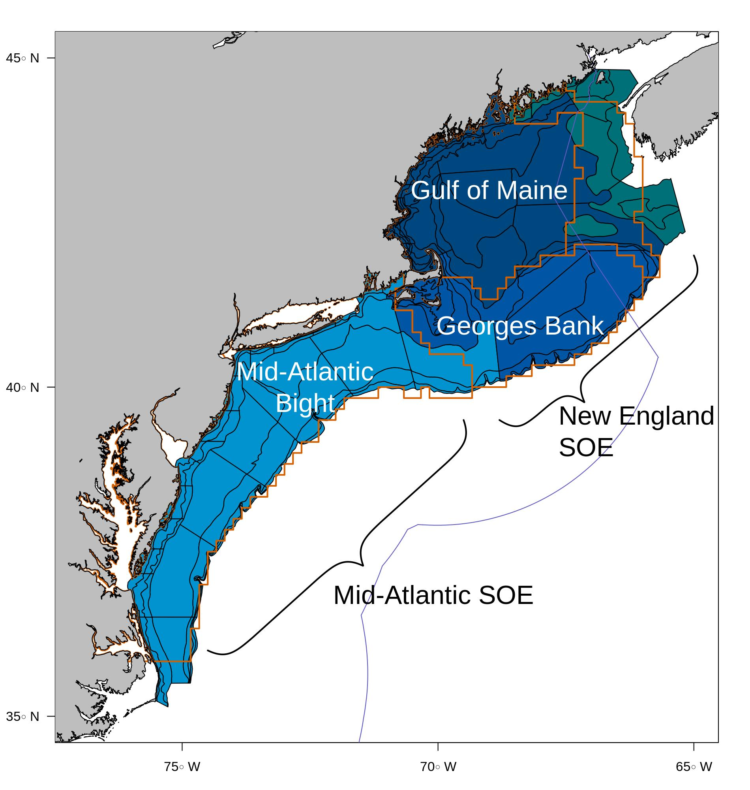

class: top, left

## Purpose: Ecosystem science for fisheries advice

.pull-left[

]

.pull-right[


]

???
Good afternoon and thank you for the invitation to present today on some ideas and concepts that I have found useful in organizing and advancing ecosystem science activities alongside the Ecosystem Dynamics and Assessment Branch at the Northeast Fisheries Science Center. Before I begin, I want to thank all of the members of the Branch for their willingness to explore these ideas with me and the Northeast Fisheries Science Center for providing some training and software resources to help along the way. This presentation won't really be about the science that we're doing, rather, to introduce some project management principles and open science tools that we are using to keep our science collaborative, transparent, and efficient. Basically -- I want to challenge people to think about and maybe even sketch out the process behind their science and recognize that there are efficiencies gained using some project management concepts. 

Alright, so EDAB has a pretty neat role -- we to provide ecosystem information to improve living marine resource management for the Northeast United States. We produce a series of Ecosystem Reports in collaboration with academics (including faculty and students at SMAST), NGOs (Audubon), and Federal and State Government partners to provide ecosystem context for Fisheries Managers before they develop fishing specifications. We provide these reports annually to the New England and Mid-Atlantic Fisheries Management Councils.

---
## Purpose: Holistic models for fisheries advice
.pull-left[

]

.pull-right[
* Develop ecosystem and multispecies models to inform scientific advice for fisheries management
    + designed to clearly identify trade-offs
    + e.g., Atlantis, Hydra, Kraken, and Rpath
]


???
We are also developing a suite of multispecies models, ecosystem models, and analytical tools to provide a more holistic understanding of how trade-offs affect different components of the coupled socio-ecological system in which we operate. Maybe a few of you are familiar with some of the ecosystem and multi-species models -- Atlantis, Hydra, Kraken, and Rpath.

These models vary in complexity and can provide useful ecosystem insights at different levels of spatial, temporal, and ecosystem resolution
---
## Purpose: Ecosystem tools for fisheries advice

.pull-left[

]

.pull-right[
* Develop and apply remote-sensing algorithms and incorporate regional ocean models for fisheries managmenet
    + Provide higher temporal and spatial resolution than ship board measurements
    + Hindcasts, forecasts, and retrospective analyses of physical conditions and lower-trophic level taxa
    + e.g., Primary production size-fractionation, ROMs
]

???
We are also busy linking regional ocean models and remote-sensing data into the NEFSC scientific enterprise. These data can serve as input parameters into the other types of models and analyses under development to inform trade-offs on future ocean-state or to identify changes in ecosystem status and function.
---
## Purpose: Analytical tools for fisheries advice

.pull-left[
 
]

.pull-right[
* Identify common patterns of ecosystem change across the Northeast Shelf
    + Empirical dynamical models, dynamic factor analysis, vector auto-regressive spatio-temporal models, etc
* Explore patterns of fish condition, growth, and other demographic processes over space and time
    + Generalized additive models, structural equation models, etc
]

???
We also use a number of analytical tools on a wide array of data to identify changes in ecosystem productivity, relationships between environmental drivers and demographic processes, and how to best communicate ecosystem status to fisheries managers.

---
## The big picture of our science enterprise

.pull-left[
Ecosystem science realities:
* Collaborative projects across interdisciplinary groups
* iterative in nature (can we make the perfect model/analysis/...?)
* multiple competing priorities
* strong desire to chase leads and develop new hypotheses 
]

.pull-right[
Ecosystem science:
* incomplete or slowly developing research
* blown deadlines
* lack of resources (time/staff hours) to finish
* "Perfect is the enemy of good" -- Voltaire
]
<br>
<br>

> We require a process/framework to track progress, communicate objectives, and keep everyone accountable

???
So, based on this brief overview, I hope that you can see that there is a broad range of ongoing investigations and models in development. Reflecting on the big picture, I notice that each project that I briefly introduced is reliant on multiple contributors and sources of data, there is a strong tendency to continue to iterate on analyses and model development with a nebulous endpoint. Branch staff and contractors are also juggling multiple priorities -- some have overlap but many don't. Finally, most of us got into science for the thrill of discovery and it can be difficult to finish out a project after the null has been rejected.  

With so much going on and a reasonably small team, it is relatively easy to fail to complete tasks or to constantly be chasing a new problem, blow through deadlines, and run out of resources to finish research -- rendering projects orphaned. With the added complication of reduced time due to dependent-care responsibilities and mandatory telework, we must find more efficient ways of working.
 
These concerns are actually incredibly common in construction, software development, and manufacturing. In fact, there is an entire institute (PMI; Project Management Institute), Certification system (PMP; Project Management Professional), and 756 page manual describing how to manage projects. I guess that I had never thought of "science" along the lines of a project, but I think that we can glean a lot of lessons from the Project Management world to improve our science. I guess that I mention that there is a 756 page manual for a particular type of Project Management as a warning that your results might vary and science doesn't happen exactly like a discrete and time-bound project, so don't get lost in the weeds trying to match up all of the PM jargon with science jargon. 


---
## Project Management
* the art of planning, organizing and managing the discrete and sometimes disparate pieces that will ultimately contribute toward the completion of a pre-defined whole. - Susan Singer
* principles intended to provide a structured approach to making the everyday decisions that keep your research running. [Portney and Austin 2002](https://www.sciencemag.org/careers/2002/07/project-management-scientists)

.pull-left[

]

???
A project can be defined as a discrete set of tasks that has: A beginning and ending that must be balanced against its scope and budget. 

From this triangle, it is clear that the quality of work is constrained by the project's budget, deadlines, and scope (or features). Changes in one constraint necessitate changes in others to compensate or quality will suffer. The addage "Good, fast, cheap -- pick two" is used to highlight the triangles's constraints.


---

## PM "waterfall" framework
.pull-left[
A. Planning
* Statement of work (why are we doing this..., purpose, objectives, and constraints)
* Define the audience (Who is going to be interested in the project, are affected by it, or are needed to support it)
* Work breakdown structure (outline of all the work that needs to be done.) 
]


.pull-right[

]

???

The "waterfall" approach typically requires projects to be linear, goal- or market-driven settings. Scientific research doesn't always fit squarely traditional project management as the need for scientific discovery might be too constraining for pure project management.

Here, I'll quickly walk you through a typical waterfall-type framework. Imagine that you have a specific and linear project that is relatively straight-forward, here, it's a piece of software. 

* Purpose (background, scope of work, strategy)
* Objectives (the end results achieved by the project)
    + Statement - a description of the desired outcome when the project is complete
    + Measure - indicators to assess how well you have achieved the desired outcome
    + Specifications - Target values of the measures that define successful results
Audience
  + Driver - at some level defines what constitutes success
  + Supporter - worker bees
  + Observer - interested but not a driver or supporter
* Constraints (restrictions on the project)
    + limitations (constraints set by others, such as weekly time available for each team member)
    + Needs (set by project team, someone is planning on vacationing for August)
WBS
* Break broad assignments into activities, steps, and tasks. 
    + What resources are required for this step
    + How much time should this take?
    + Unambigous enough for responsible individual can complete task

---

## PM "waterfall" framework

.pull-left[
B. Implementation
* Identify activities and events (from the WBS).
* Identify constraints (from the statement of work).
* Determine the durations of different activities and, if more than one person
will be involved, who will be doing them.
* Decide on the order of performance.
* Develop an initial schedule.
* Revise your schedule as necessary.
]

.pull-right[

]

???
Implementing basically enacts the plan with some flexibility for revision.

---
## PM "waterfall" framework
.pull-left[
C. Control
* Organizing, focusing, and continually motivating project personnel
* Tracking and comparing project work and results against the plan
* Considering and making changes to plans when tracking suggests a change is called for
* Keeping everyone informed of project accomplishments, issues, and changes
* Continuously tracking and dealing with evolving project risk
]
.pull-right[

]

???
The last step is controlling the project. Which requires active tracking and revisions and communication with the team

---
## >9 flavors of Project Management

.pull-left[
```{r pm-flavors, out.width="80%", echo = FALSE, fig.align='center'}
knitr::include_graphics("https://thedigitalprojectmanager.com/wp-content/uploads/2017/03/List-of-Popular-Project-Management-Methodologies.png")
```
]

???
Waterfall PM might be a bit extreme for a lot of situations. In fact, we found it too extreme and sought an alternative path. Here, I highlight some of the other flavors of project management. Each has trade-offs between over-planning and frequent meetings, but there are good lessons to be learned across the suite of applications. I'll take this opportunity to again highlight that the intent isn't to jump head-long into a particular type of project management technique, but to sketch out how you are doing your work and explore some techniques that might be useful.
---

## Agile project management
Agile removes many of the strictures of the waterfall approach 


> Don't go chasing waterfalls... - Lopes et al 1994

---
## Scientific research examples

.pull-left[Agile
* *How agile project management can work for your research* [Laura Pirro, *Nature* Career Column, 10 April 2019](https://www.nature.com/articles/d41586-019-01184-9)
* *A project-management tool from the tech industry could benefit your lab* [David Adam, *Nature* Career Feature, 03 September 2019](https://www.nature.com/articles/d41586-019-02620-6)
]
.pull-right[Waterfall
* Some have been applied, broadly, to scientific research (mostly to pharma, genetics, etc.)
* *Making the Right Moves: A Practical Guilde to Scientific Management for Postdocs and New Faculty* [Howard Huges Medical Institute 2006](https://www.hhmi.org/sites/default/files/Educational%20Materials/Lab%20Management/Making%20the%20Right%20Moves/moves2_ch7.pdf#page=3 ) 
]

<br>
<br>
<br>
Ecosystem science examples:
1. NEUS Atlantis reparameterization
1. Multispecies keyrun project

???
Project management is a series of methods and processes. However, research focuses on gaining knowledge instead of driving for new product creation. It is imperative for research project management to use tools and resources to better organize projects, but with the flexibility in the planning process to evolve with the project as needed.

Again, there are some good examples in Nature career columns about different approaches that research groups have taken to apply project management principles to their work.

Now I want to present a few variations on a theme -- we aren't perfectly implementing Agile Project Management, but we are trying to kick the tires and find our own process.

---
## NEUS Atlantis reparameterization
.pull-left[
Problem: 
* End-to-end ecosystem model. It's a monster and defining "done" can be a challenge.
* Small collaborative group working on somewhat nebulous timeline
]

.pull-right[
Atlantis model domain
```{r atlantis-domain, out.width="95%", echo = FALSE, fig.align='center'}
knitr::include_graphics("https://raw.githubusercontent.com/NOAA-EDAB/neus-atlantis/master/Geometry/AtlantisNeusDomain.PNG")
```
]

???
Atlantis is a series of submodels (biological, geophysical, fishing, assessment, and management) and as a whole simulates a Management Strategy Evaluation (MSE) procedure which allows for qualitative comparisons of different management choices. We have parameterized Atlantis for the Northeast United States Continental Shelf (NEUS), including the major functional groups from an ecosystem perspective. We have also parameterized and simulated the physiographic dynamics of the ecosystem, as well as the most important fleets. Our goal was to recreate, at least in approximate terms, the biomass, catch, and effort trends in the NEUS from 1964 to the mid 2000s.


---
## NEUS Atlantis reparameterization
Process: 
* 3-person Kanban development with 1 "Product Owner"

```{r jira-board, out.width="75%", echo = FALSE, fig.align='center'}

```
???
We've approached Atlantis with the a "kanban" project management style, where we have a series of "stories" - that describe in plain language a component of the model that needs to be finished in order to complete the model and tasks, which are activities that can be completed in less than 2 weeks. 

---
## NEUS Atlantis reparameterization
.pull-left[Process
* Add stories and tasks to kanban board (via Jira)
* Daily 15 minute stand-up meetings (via google meet)
    + What each person did yesterday, what they will do today, and any impediments (to be addressed by product owner)
* Bi-weekly sprint meetings (via google meet)
    + Discuss progress for *Selected for development*, *In Progress*, *Done*, and *Backlog* stories
* Code on github with an increasingly in depth [Wiki](https://github.com/NOAA-EDAB/neus-atlantis/wiki) recording decisions and documentation
]
.pull-right[
```{r jira-task, out.width="75%", echo = FALSE, fig.align='center'}

```
]

???
Hat's off to Andy Beet for his efforts in pulling together a lot of the processes with docker, documentation, and the difficult decisions that can really slow down a project. He is a great example of how agile can be useful when there are people with various levels of expertise. He doesn't have experience running Atlantis, but he found a ton of other stuff that he could do. Now he has grown more comfortable with the model and will probably be running scenarios before long.


---
## NEUS Atlantis reparameterization
.pull-left[
Advantages:
* Very collaborative
* Easy to bounce around ideas and have multiple perspectives
* 2-week sprints make it easy to adjust expectations
]
.pull-right[
Disadvantage: 
* on average ~2.25 hours/week in dedicated project meetings
* End-point is still nebulous because the plan changes a bit every sprint
]

```{r atlantis-story, out.width="75%", echo = FALSE, fig.align='center'}
# knitr::include_graphics("EDAB_images/atlantis-jira-story.PNG")

```

???
Also, I should recognize Rob Gamble and Joe Caracappa for their efforts in developing Atlantis but also for the adoption of agile processes, and Ryan Morse, Sarah Gaichas, and Gavin Fay for their efforts getting the model to the current stage. 

---
## Multispecies keyrun project
Problem: 
* 1 goal (multispecies modeling tools need to be vetted according to [ICES WGSAM criteria](https://ices-eg.github.io/wg_WGSAM/ReviewCriteria.html) and ready to go for any questions coming from Councils.)
* 3 distinct objectives
* Large collaborative group (>10) working on a tight timeline (completion no later than 09-2021)

???
Next, I want to highlight a relatively new project that will be taking kanban to a different extreme. Instead of 3 contributors, we have more than 10 from across NEFSC Branches and even SMAST. The project is also more broad in that it has multiple epics, or subprojects, while it is also more focused with a tight timeline. 

---
## Multispecies keyrun project
.pull-left[
Process: 
* Group Kanban development board on Jira
* Epics - each subproject Add stories and tasks to kanban board (via Jira)
* Weekly "epic" 15 minute stand-up meetings (via google meet)
    + What each person did yesterday, what they will do today, and any impediments (to be addressed by product owner)
* Bi-weekly sprint meetings (via google meet)
* Code on github
]
.pull-right[
```{r jira-story, out.width="75%", echo = FALSE, fig.align='center'}
knitr::include_graphics("EDAB_images/atlantis-jira-story.PNG")
# 
```
]
???
The team is still working out some of the process as they go. The idea is to recognize that some project management components will be too strict -- might not have time for 15m stand up meetings, or even weekly stand up meetings. So, we will have to adjust and figure out other ways to keep eachother accountable. 

---
Multispecies keyrun project

Might be too early to be critical of the advantages/disadvantages from the kanban approach, still sorting out how to meet and proceed. There might need to be more work on estimating the duration of tasks to ensure completion by 9/21

```{r ms-story, out.width="75%", echo = FALSE, fig.align='center'}
# knitr::include_graphics("EDAB_images/atlantis-jira-story.PNG")

```

---
## In summary
* Ecosystem science is an active and highly collaborative field.
* There is plenty of scope for improving how we work.
* Project management can be a deep-dive.
* Where does process help and where does it hurt?
* Regardless, I think most research teams (or even researchers) can benefit from taking a step back and sketching out goals, objectives, and a process for finding "done"
* We are just starting to find a rhythm and it feels good to establish a process around how we do science can save time, facilitate collaboration, and improve the final product


## Thank you!
* special thanks to EDAB, FMRD, ITD and other NEFSC groups for being Project Management Champions!
* Thanks to OpenScapes for leading the charge on Open Science! 