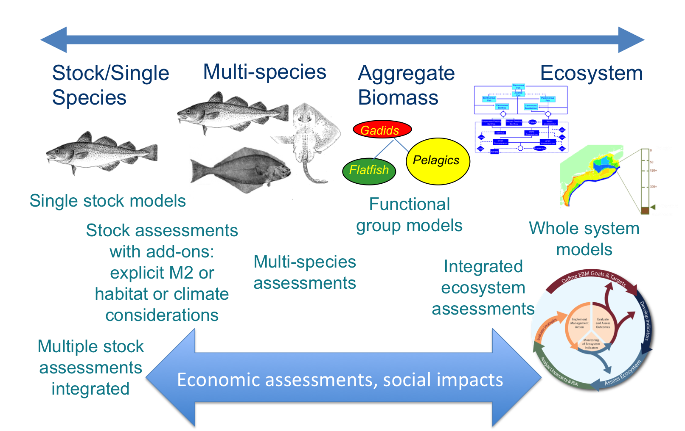
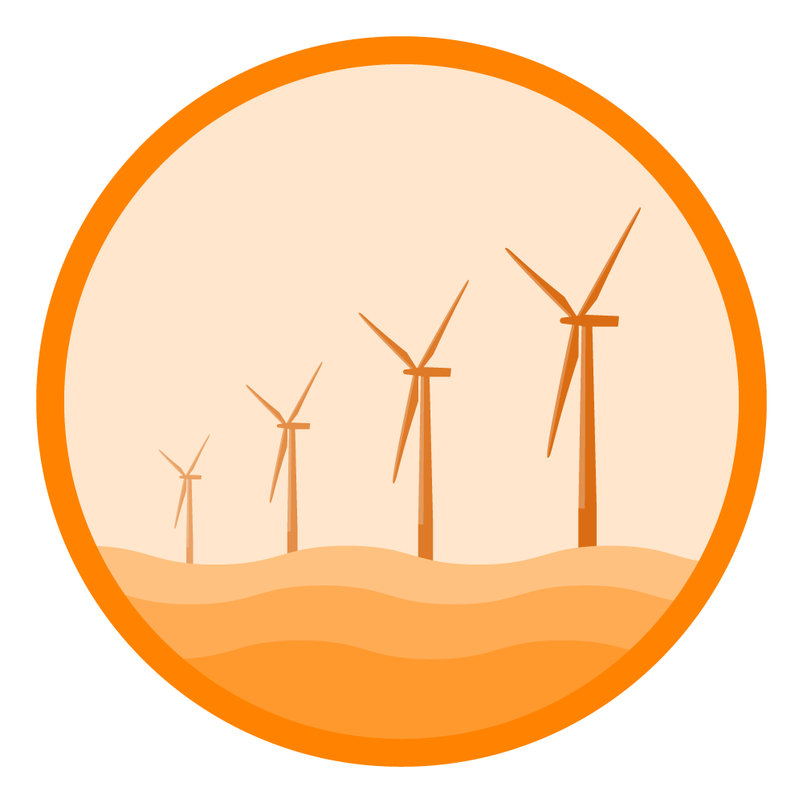
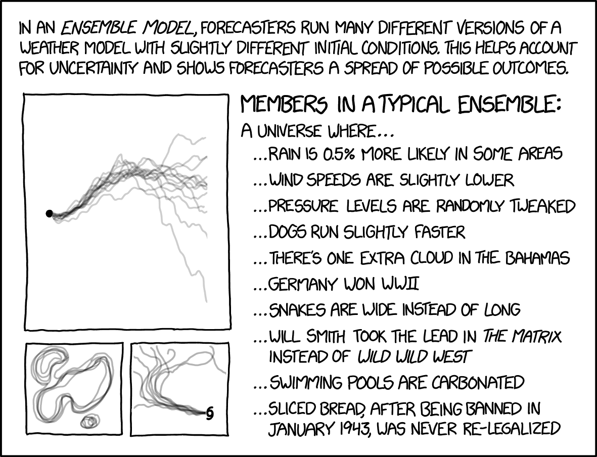

class: top, left

```{r setup, include=FALSE}

options(htmltools.dir.version = FALSE)
knitr::opts_chunk$set(echo = F,
                      fig.retina = 3,
                      #fig.width = 4,
                      #fig.height = 2,
                      fig.asp = 0.45,
                      warning = F,
                      message = F)
#Plotting and data libraries
library(ggplot2)
library(dplyr)
library(tidyr)
library(here)
library(kableExtra)
library(ggrepel)
library(stringr)
library(ggthemes)
library(readr)


```


.pull-left[
# Outline

* Atlantis and assessment

* Assessment model testing  

    * What do models need to do?
    * Challenges with what models need to do  
    * Addressing challenges  

* Examples

1. Single species assessment
1. Multispecies assessment
1. Other models?

* Future needs

    * Atlantis output verification
    * New outputs?

]

.pull-right[
.center[

https://xkcd.com/242/
]
]

---
background-image: url("EDAB_images/noaafisheries.png")
background-size: 900px
background-position: bottom center

# We do a lot of assessments

.center[
  
<!---->
]

---
background-image: url("EDAB_images/ecomods.png")
background-size: 900px
background-position: bottom center

# With a wide range of models

.center[
<!---->
]

---
# How do we know they are right?

 * Fits to historical data (hindcast)
 
 * Influence of data over time (retrospective diagnostics)
 
 * Keep as simple and focused as possible
 
 * Simulation testing

# But, what if 

##   data are noisy? 

##   we need to model complex interactions?

##   conditions change over time?

---
## Fisheries: what do we need to know?

**How many fish can be caught sustainably?**

.pull-left[
* How many are caught right now?
* How many were caught historically?
* How many are there right now?
* How many were there historically?
* How productive are they (growth, reproduction)? 
]

.pull-right[

]


.bluetext[
* <span style="color:blue">What supports their productivity?</span>  
* <span style="color:blue">What does their productivity support, besides fishing?</span>  
* <span style="color:blue">How do they interact with other fish, fisheries, marine animals?</span> 
* <span style="color:blue">How do environmental changes affect them?</span>  
* <span style="color:blue">What is their ecological, economic, and social value to people?</span>  
]

---
## Challenges, how we address them
.pull-left[
* We don’t live in the ocean; can’t see or directly count what we manage 


* We know only basic biological properties of species; data are expensive


* Catch coming to land is not the only fishing effect


.bluetext[
* <span style="color:blue">We manage species separately but they interact</span>
]


.bluetext[
* <span style="color:blue">Different laws govern different species, activities</span>
]


.bluetext[
* <span style="color:blue">People depend on these estimates for livelihoods</span>
]
]

--

.pull-right[
.greentext[
* <span style="color:green">Statistical design of surveys, sampling and estimation</span>
* <span style="color:green">Observation models for data</span>


* <span style="color:green">Sampling and estimation</span>
* <span style="color:green">Model structure and parameterization</span>


* <span style="color:green">Discarded catch estimation, habitat and other alterations</span>


* <span style="color:green">Multispecies and integrated assessment</span>


* <span style="color:green">Integrated assessment, management strategy evaluation</span>


* <span style="color:green">Validation, quality control, transparency</span>
]
]


---
# Risks to meeting fishery management objectives

.center[
 &nbsp; &nbsp; &nbsp; 
] 

.center[
 &nbsp; &nbsp; &nbsp;  &nbsp; &nbsp; &nbsp;  &nbsp; &nbsp; &nbsp;   &nbsp; &nbsp; &nbsp;  
]


---
background-image: url("EDAB_images/seasonal-sst-anom-gridded-2021.png")
background-size: 700px
background-position: right top

```{r, code = readLines("https://raw.githubusercontent.com/NOAA-EDAB/ecodata/master/chunk-scripts/LTL_MAB.Rmd-setup.R")}
```

## Risks: Climate change 

.pull-left[
Indicators: ocean currents, bottom and surface temperature, marine heatwaves
```{r, code = readLines("https://raw.githubusercontent.com/NOAA-EDAB/ecodata/master/chunk-scripts/LTL_MAB.Rmd-gsi.R"), fig.width=4}
```


```{r, code =readLines("https://raw.githubusercontent.com/NOAA-EDAB/ecodata/master/chunk-scripts/LTL_MAB.Rmd-bottom-temp.R"), fig.width=4}

```

```{r, code = readLines("https://raw.githubusercontent.com/NOAA-EDAB/ecodata/master/chunk-scripts/LTL_MAB.Rmd-heatwave.R")}
```
]

.pull-right[

&nbsp;  
&nbsp;  
&nbsp; 
&nbsp; 
&nbsp;  
&nbsp;  
&nbsp;  
&nbsp; 
&nbsp;  
&nbsp;  
&nbsp; 
&nbsp;  
&nbsp; 
&nbsp;  
&nbsp;  
&nbsp; 
&nbsp;  
&nbsp;  

```{r , code=readLines("https://raw.githubusercontent.com/NOAA-EDAB/ecodata/master/chunk-scripts/LTL_MAB.Rmd-heatwave-year.R"), fig.width=5, fig.asp=.6}
#heatwave-year, fig.cap="Marine heatwave events (red) in the Mid-Atlantic occuring in 2020."
```

]
???
A marine heatwave is a warming event that lasts for five or more days with sea surface temperatures above the 90th percentile of the  historical daily climatology (1982-2011). 


---
## Modeling management strategies

.pull-left[

- Changing climate and ocean conditions &rarr; Shifting species distributions, changing productivity

- Needs:
  - Improve our ability to project global change impacts in the California Current and Nordic/Barents Seas (and elsewhere)
  - Test the performance of stock assessments to these impacts
]

.pull-right[
*Climate-Ready Management<sup>1</sup>*


]

.footnote[
[1] Karp, Melissa A. et al. 2019. Accounting for shifting distributions and changing productivity in the development of scientific advice for fishery management. – ICES Journal of Marine Science, doi:10.1093/icesjms/fsz048.
]

???
---
## Virtual worlds: end-to-end ecosystem models

Atlantis modeling framework: [Fulton et al. 2011](https://onlinelibrary.wiley.com/doi/full/10.1111/j.1467-2979.2011.00412.x), [Fulton and Smith 2004](https://www.ajol.info/index.php/ajms/article/view/33182)

.pull-left[
**Norwegian-Barents Sea**

[Hansen et al. 2016](https://www.imr.no/filarkiv/2016/04/fh-2-2016_noba_atlantis_model_til_web.pdf/nn-no), 
[2018](https://journals.plos.org/plosone/article?id=10.1371/journal.pone.0210419)


]
.pull-right[
**California Current**

[Marshall et al. 2017](https://onlinelibrary.wiley.com/doi/full/10.1111/gcb.13594), 
[Kaplan et al. 2017](https://www.sciencedirect.com/science/article/pii/S0304380016308262?via%3Dihub)


]


Building on global change projections:  [Hodgson et al. 2018](https://www.sciencedirect.com/science/article/pii/S0304380018301856?via%3Dihub), 
[Olsen et al. 2018](https://www.frontiersin.org/articles/10.3389/fmars.2018.00064/full)


???
---
## Design: Ecosystem model scenario (climate and fishing)

```{r atlOMdesign, echo = F, fig.align = "center", out.width="85%"}

```

???

.pull-left[
* Recruitment variability in the operating model

* Specify uncertainty in assessment inputs using `atlantisom`
]
.pull-right[

]


---
## Testing a simple "sardine" assessment (in progress)
.pull-left[
Biomass
 

Fishing mortality
 

]

.pull-right[
Recruitment
 

Key: <span style="color:teal">True</span> <span style="color:red">SS3 estimate</span>


]

---
## P.S. What else could we test?



---
# Multiple objectives, multiple challenges

.pull-left[
Fisheries stock assessment and ecosystem modeling continue to develop  
.bluetext[Can we keep pace with climate?]

Existing management systems are at least as complex as the ecosystems, with diverse interests and emerging industries

Integrated ecosystem assessment and management strategy evaluation
* Include key interactions
    + Species
    + Fisheries
* Environment
* Make tradeoffs explicit
* Account for uncertainty

.bluetext[Mathematical innovation needed!]
]

.pull-right[

]

