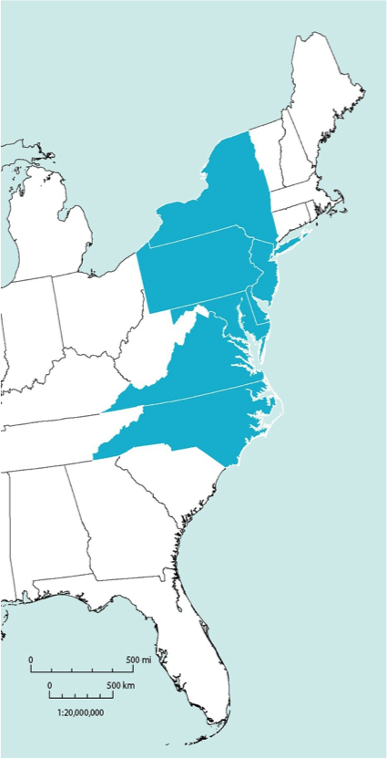
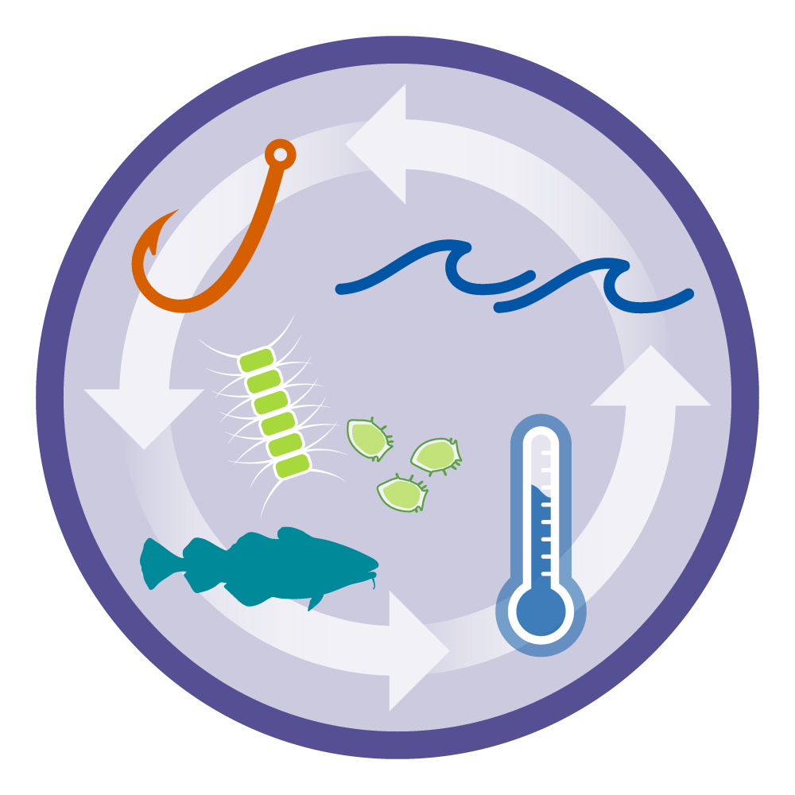
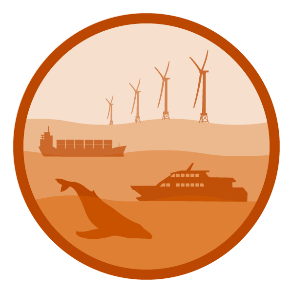
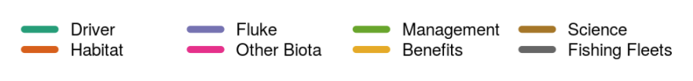

class: top, left

```{r setup, include=FALSE}

options(htmltools.dir.version = FALSE)
knitr::opts_chunk$set(echo = F,
                      fig.retina = 3,
                      fig.asp = 0.45,
                      warning = F,
                      message = F)
#Plotting and data libraries
library(tidyverse)
library(tidyr)
library(here)
library(kableExtra)
library(ecodata)
library(readxl); library(data.table)
library(DT)
library(widgetframe)


```

```{r, load_refs, include=FALSE, cache=FALSE}
library(RefManageR)
BibOptions(check.entries = FALSE,
           bib.style = "authoryear",
           cite.style = "authoryear",
           longnamesfirst = FALSE,
           max.names = 1,
           style = "markdown")
myBib <- ReadBib("./MidSOE.bib", check = FALSE)

#,
#           hyperlink = FALSE,
#           dashed = FALSE

```

```{r, code = readLines("https://raw.githubusercontent.com/NOAA-EDAB/ecodata/master/chunk-scripts/human_dimensions_MAB.Rmd-setup.R")}
```

```{r, code = readLines("https://raw.githubusercontent.com/NOAA-EDAB/ecodata/master/chunk-scripts/human_dimensions_MAB.Rmd-GIS-setup.R")}
```

```{r, code = readLines("https://raw.githubusercontent.com/NOAA-EDAB/ecodata/master/chunk-scripts/macrofauna_MAB.Rmd-setup.R")}
```

```{r, code = readLines("https://raw.githubusercontent.com/NOAA-EDAB/ecodata/master/chunk-scripts/LTL_MAB.Rmd-setup.R")}
```

## Ecosystem reporting used in management processes 

.pull-left-60[

- Ecosystem reporting linked to management objectives 
    + Open science emphasis `r Cite(myBib, "bastille_improving_2020")`
    + Report evolving since 2016
    + Fishery-relevant subset of full Ecosystem Status Reports

- Used within Mid-Atlantic Fishery Management Council's Ecosystem Process `r Cite(myBib, "muffley_there_2020")`
    + Risk assessment `r Cite(myBib,"gaichas_implementing_2018")`
    + Conceptual modeling `r Cite(myBib, "depiper_learning_2021")`
    + Management strategy evaluation (MSE) in progress
    + Further operational use under discussion

- Collaborative process key to getting information used
 
]

.pull-right-40[


]
???
an iterative, collaborative process has evolved to formulate ecosystem advice and to apply it in decision making


---
background-image: url("EDAB_images/nes-components-abstracted.png")
background-size: 700px
background-position: right bottom

## State of the Ecosystem (SOE) Reporting: Context for busy people

*"So what?" --John Boreman, September 2016*

1. Clear linkage of ecosystem indicators with management objectives

1. Synthesis across indicators for big picture

1. Objectives related to human-well being placed first in report

1. Short (< 30 pages), non-technical (but rigorous) text

1. Emphasis on reproducibility 


???
In 2016, we began taking steps to address these common critiques of the ESR model
Many indicators presented at WGNARS, used in larger Ecosystem Status reports
Shorter, fishery specific State of the Ecosystem (SOE) report with conceptual models prototyped based on California Current reporting
Feedback from fishery managers redesigned reporting to align with objectives outlined by WGNARS

---
## [2021 Report](https://doi.org/10.25923/jd1w-dc26): Summary

.pull-left[
.center[

]
]

.pull-right[
.center[

]
]
???
cover, 3 pager with visualizations, 34 pages of narrative/plots, 1 page contributors, 1 page orientation, 2 pages references


---
## Revised structure to address Council requests and improve synthesis 

.pull-left[
* Performance relative to management objectives
    - *What* does the indicator say--up, down, stable?
    - *Why* do we think it is changing: integrates synthesis themes
        - Multiple drivers
        - Regime shifts
        - Ecosystem reorganization
* Objectives
    - Seafood production
    - Profits
    - Recreational opportunities
    - Stability
    - Social and cultural
    - Protected species
]

.pull-right[
* Risks to meeting fishery management objectives
    - *What* does the indicator say--up, down, stable?
    - *Why* this is important to managers: integrates synthesis themes
        - Multiple drivers
        - Regime shifts
        - Ecosystem reorganization
* Risk categories
    - Climate: warming, ocean currents, acidification
        - Habitat changes (incl. vulnerability analysis)
        - Productivity changes (system and fish)
        - Species interaction changes
        - Community structure changes
    - Other ocean uses
        - Offshore wind development
]


---
## The Mid-Atlantic Fishery Management Council (MAFMC)

.pull-left-30[

]
.pull-right-70[

]

---
## Mid-Atlantic Council Ecosystem Approach

* 2016 Ecosystem Approach to Fishery Management (EAFM) Policy Guidance document:
http://www.mafmc.org/s/EAFM-Doc-Revised-2019-02-08.pdf

* Mid-Atlantic EAFM framework `r Cite(myBib,"gaichas_framework_2016")`:
.center[

]


???
The Council’s EAFM framework has similarities to the IEA loop on slide 2. It uses risk assessment as a first step to prioritize combinations of managed species, fleets, and ecosystem interactions for consideration. Second, a conceptual model is developed identifying key environmental, ecological, social, economic, and management linkages for a high-priority fishery. Third, quantitative modeling addressing Council-specified questions and based on interactions identified in the conceptual model is applied to evaluate alternative management strategies that best balance management objectives. As strategies are implemented, outcomes are monitored and the process is adjusted, and/or another priority identified in risk assessment can be addressed. 


---

## Iterative, collaborative development of the risk assessment

.pull-left-40[


  * Council staff and scientists create examples based on Council input
  
  &uarr; &darr; &uarr; &darr; &uarr; &darr; &uarr; &darr; &uarr; &darr; &uarr; &darr; ...
                                                      
  * Council discusses, clarifies, revises with public input


]

.pull-right-60[
```{r riskel2}

elements<-data.frame(
  Category = c("Ecological","Ecological","Ecological","Ecological","Ecological","Ecological","Ecological","Ecological","Ecological","Ecological","Ecological","Economic","Economic","Economic","Economic","Social","Social","Food Production","Food Production","Management","Management","Management","Management","Management","Management","Put Aside","Put Aside","Put Aside","Put Aside","Put Aside","Put Aside","Put Aside","Put Aside"),
#  Category = c("Ecological","","","","","","","","","","","Economic","","","","Social","","Food Production","","Management","","","","","","Put Aside","","","","","","",""),
  Element = c("Assessment performance","F status","B status","Food web (MAFMC Predator)","Food web  (MAFMC Prey)","Food web  (Protected Species Prey)","Ecosystem productivity", "Climate","Distribution shifts", "Estuarine habitat","Offshore habitat", "Commercial Revenue", "Recreational Angler Days/Trips", "Commercial Fishery Resilience (Revenue Diversity)", "Commercial Fishery Resilience (Shoreside Support)", "Fleet Resilience", "Social-Cultural","Commercial","Recreational", "Control", "Interactions", "Other ocean uses", "Regulatory complexity", "Discards", "Allocation", "Population diversity", "Ecological diveristy", "Fishery Resilience (2)", "Fishery Resilience (3)", "Fishery Resilience (5)", "Commercial Employment", "Recreational Employment", "Seafood safety"), 
  Definition = c("Risk of not achieving OY due to analytical limitations", "Risk of not achieving OY due to overfishing", "Risk of not achieving OY due to depleted stock", "Risk of not achieving OY due to MAFMC managed species interactions", "Risk of not achieving OY due to MAFMC managed species interactions", "Risk of not achieving protected species objectives due to species interactions", "Risk of not achieving OY due to changing system productivity", "Risk of not achieving OY due to climate vulnerability", "Risk of not achieving OY due to climate-driven distribution shifts", "Risk of not achieving OY due to threats to estuarine/nursery habitat", "Risk of not achieving OY due to changing offshore habitat", "Risk of not maximizing fishery value", "Risk of not maximizing fishery value" , "Risk of reduced fishery business resilience", "Risk of reduced fishery business resilience due to shoreside support infrastructure", "Risk of reduced fishery resilience", "Risk of reduced community resilience ", "Risk of not optimizing seafood production" , "Risk of not maintaining personal food production" , "Risk of not achieving OY due to inadequate control", "Risk of not achieving OY due to interactions with species managed by other entities", "Risk of not achieving OY due to other human uses", "Risk of not achieving compliance due to complexity", "Risk of not minimizing bycatch to extent practicable", "Risk of not achieving OY due to spatial mismatch of stocks and management", "Risk of not achieving OY due to reduced diversity", "Risk of not achieving OY due to reduced diversity", "Risk of reduced fishery business resilience due to access to capital", "Risk of reduced fishery business resilience due to insurance availabilty", "Risk of reduced fishery business resilience due to access to emerging markets/opportunities", "Risk of not optimizing employment opportunities", "Risk of not optimizing employment opportunities","Risk of not maintaining market access, human health"),
  Indicators = c("Current assessment method/data quality", "Current F relative to reference F from assessment", "Current B relative to reference B from assessment","Diet composition, management measures","Diet composition, management measures","Diet composition, management measures","Four indicators, see text", "Northeast Climate Vulnerability Assessment", "Northeast Climate Vulnerability Assessment + 2 indicators", "Enumerated threats + estuarine dependence", "Integrated habitat model index", "Revenue in aggregate", "Numbers of anglers and trips in aggregate", "Species diversity of revenue", "Number of shoreside support businesses","Number of fleets, fleet diversity","Community vulnerability, fishery engagement and reliance", "Seafood landings in aggregate", "Recreational landings in aggregate", "Catch compared to allocation","Number and type of interactions with protected or non-MAFMC managed species, co-management", "Fishery overlap with energy/mining areas", "Number of regulations by species", "Standardized Bycatch Reporting", "Distribution shifts + number of interests","Size composition, sex ratio, genetic diversity", "Fishery independent species diversity",  "No current indicator available", "No current indicator available", "Needs clarification","EOP Committee unconfident in Fisheries of US employment inicator","EOP Committee unconfident in Fisheries of US employment indicator", "Number of public advisories by species") 
)

# elements1<-elements %>%
#   filter(Category == "Ecological") %>%
#   select(Element, Definition, Indicators)
# 
# kable(elements1, "html") %>%
#   kable_styling(bootstrap_options = c("striped", "condensed"), font_size = 12) %>%
#   group_rows("Ecological", 1,11) 

```

```{r elements2}

elements2<-elements %>%
  dplyr::filter(Category %in% c("Economic", "Social", "Food Production")) %>%
  dplyr::select(Element, Definition, Indicators)

kable(elements2, "html") %>%
  kable_styling(bootstrap_options = c("striped", "condensed"), font_size = 11) %>%
  group_rows("Economic", 1,4) %>%
  group_rows("Social", 5,6) %>%
  group_rows("Food Production", 7,8)

```
]
---
## Risk elements: Management
```{r elements3}

elements3<-elements %>%
  dplyr::filter(Category == "Management") %>%
  dplyr::select(Element, Definition, Indicators)

kable(elements3, "html") %>%
  kable_styling(bootstrap_options = c("striped", "condensed"), font_size = 14) %>%
  group_rows("Management", 1,6) #%>%
  #group_rows("Put Aside", 26,33) 

```


---
## State of the Ecosystem &rarr; Risk assessent example: Commercial revenue

This element is applied at the ecosystem level. Revenue serves as a proxy for commercial profits.

.table[
.pull-left[

```{r riskcomval, echo=FALSE, message=FALSE, warnings=FALSE, results='asis'}
# tabl <- "
# | Risk Level         | Definition                                                          |  
# |:-------------------|:--------------------------------------------------------------------|
# | Low  | No trend and low variability in revenue |
# | Low-Moderate | Increasing or high variability in revenue |
# | Moderate-High | Significant long term revenue decrease |
# | High | Significant recent decrease in revenue |
# "
# cat(tabl) # output the table in a format good for HTML/PDF/docx conversion

tabl <- data.frame("Risk Level" = c("Low", "Low-Moderate", "Moderate-High", "High"),
                   "Definition" = c("No trend and low variability in revenue",
                                    "Increasing or high variability in revenue",
                                    "Significant long term revenue decrease",
                                    "Significant recent decrease in revenue"))

knitr::kable(tabl, format="html",
             col.names = c("Risk Level", "Definition"),
                           booktabs = T) %>%
  #kable_styling(full_width = TRUE) %>%
  column_spec(1:2, width = "20em")%>%
  row_spec(3, bold = T, background = "orange")
```

  
Ranked moderate-high risk due to the significant long term revenue decrease for Mid-Atlantic managed species (red points in top plot)

]
]
.pull-right[
```{r , code = readLines("https://raw.githubusercontent.com/NOAA-EDAB/ecodata/master/chunk-scripts/human_dimensions_MAB.Rmd-comdat-comm-revenue.R"),fig.asp = 0.5}
#comm-revenue, fig.width = 4, fig.asp = 0.45, fig.cap = "Total revenue for the region (black) and revenue from MAFMC managed species (red)."
```

Key: Black = Revenue of all species combined; <p style="color:#FF6A6A;">Red = Revenue of MAFMC managed species</p>

]

--

## Risk element: <span style="background-color:orange;">CommRev</span>, unchanged

---
# Performance relative to management objectives

.center[
 &nbsp; &nbsp; &nbsp;  &nbsp; &nbsp; &nbsp;  &nbsp; &nbsp; &nbsp;  &nbsp; &nbsp; &nbsp; 
]

---
## Objective: Seafood production   &emsp; Risk elements: <span style="background-color:red;">ComFood</span> and <span style="background-color:orange;">RecFood</span>, unchanged

.pull-left[
Indicators: Commercial and recreational landings 

```{r, code = readLines("https://raw.githubusercontent.com/NOAA-EDAB/ecodata/master/chunk-scripts/human_dimensions_MAB.Rmd-comdat-total-landings.R"), fig.asp=.4}
#total-landings, fig.cap = paste0("Total commercial seafood landings (black) and ",region," managed seafood landings (red).")
```
.contrib[
Key: Black = Landings of all species combined; <p style="color:#FF6A6A;">Red = Landings of MAFMC managed species</p>
]

```{r, code = readLines("https://raw.githubusercontent.com/NOAA-EDAB/ecodata/master/chunk-scripts/human_dimensions_MAB.Rmd-recdat-landings.R"), fig.asp=.4}
#, rec-landings, fig.cap = paste0("Total recreational seafood harvest (millions of fish) in the ",region," region.")

```

]

.pull-right[
Multiple drivers: ecosystem and stock production, management, market conditions, and environment

Is biomass driving?
```{r , code = readLines("https://raw.githubusercontent.com/NOAA-EDAB/ecodata/master/chunk-scripts/macrofauna_MAB.Rmd-aggregate-biomass.R"), fig.width=8, fig.asp = 0.75}

#nefsc-biomass-mab, fig.cap = "Spring (left) and fall (right) surveyed biomass in the Mid-Atlantic Bight. Data from the NEFSC Bottom Trawl Survey are shown in black, with NEAMAP shown in red. The shaded area around each annual mean represents 2 standard deviations from the mean."
```

.contrib[
Key: Black = NEFSC survey; <p style="color:#FF6A6A;">Red = NEAMAP survey</p>
]
]

---
## Landings drivers: Ecosystem or stock production? &emsp; Risk elements: Fstatus, Bstatus mostly unchanged
.pull-left[
```{r , code = readLines("https://raw.githubusercontent.com/NOAA-EDAB/ecodata/master/chunk-scripts/human_dimensions_MAB.Rmd-fogarty.R")}

#fogarty, fig.cap="Fogarty Index; the ratio of total landings to total primary production in the MAB. Link and Watson (2019) give an optimal range (green shading) of the Fogarty ratio of 0.22 to 0.92 parts per thousand (PPT). Previous work suggested that index values exceeding 1 to 2 PPT (orange shading) led to ecosystem tipping points."

```

```{r , code = readLines("https://raw.githubusercontent.com/NOAA-EDAB/ecodata/master/chunk-scripts/human_dimensions_MAB.Rmd-ryther.R")}

#ryther, fig.cap="Ryther index; total landings presented on a unit area basis for the MAB. Theoretical estimates (Link and Watson, 2019) imply the index should range from 0.3 - 1.1 mt per sq km annually (green shading) with a limit of 3 mt per sq km annually, above which tipping points could occur in fished ecosystems (orange shading). Expected system-wide MSYs can be in the range of 1 to 3 mt per sq km (unshaded)."
```

.contrib[
Key: 
<span style="background-color:#f4a460;">Orange background = Tipping point overfishing threshold, Link and Watson 2019</span> 
<span style="background-color:#a2cd5a;">Green background = Optimal range, Link and Watson 2019</span>
]

]

.pull-right[
```{r , code = readLines("https://raw.githubusercontent.com/NOAA-EDAB/ecodata/master/chunk-scripts/human_dimensions_MAB.Rmd-ppr.R")}

#ppr-mab, fig.cap="Primary production required to support MAB commercial landings. Included are the top species accounting for 80\\% of the landings in each year, with 15\\% transfer efficiency assumed between trophic levels. PPD is total primary production. The solid line is based on satellite-derived PPD and the dashed line is based on primary production reconstructed using the mean of satellite-derived PPD from 1998-2010."
```

One change: <span style="background-color:yellow;">Butterfish Bstatus</span>

```{r , code = readLines("https://raw.githubusercontent.com/NOAA-EDAB/ecodata/master/chunk-scripts/human_dimensions_MAB.Rmd-stock-status.R"), fig.width = 7.5, fig.asp = 0.5}

#stock-status, fig.cap = paste0("Summary of single species status for ",council_abbr," and jointly federally managed stocks (Goosefish and Spiny dogfish). Stocks in green are below the biomass threshold (overfished), stocks in orange are above the biomass threshold but below the biomass target, and stocks in purple are above the biomass target. Only one stock, Atlantic mackerel, has fishing mortality above the limit (subject to overfishing).")
```

]

---
## Implications: Seafood Production
.pull-left[
```{r, code = readLines("https://raw.githubusercontent.com/NOAA-EDAB/ecodata/master/chunk-scripts/human_dimensions_MAB.Rmd-setup.R")}
```

```{r, code = readLines("https://raw.githubusercontent.com/NOAA-EDAB/ecodata/master/chunk-scripts/human_dimensions_MAB.Rmd-GIS-setup.R")}
```

```{r, code = readLines("https://raw.githubusercontent.com/NOAA-EDAB/ecodata/master/chunk-scripts/human_dimensions_MAB.Rmd-comdat-commercial-landings.R"), fig.width=5, fig.asp=1.35}
# comm-landings, fig.cap = paste0("Total commercial landings (black) and ",council_abbr," managed species landings (red) by feeding guild."),
```

.contrib[
Key: Black = Landings of all species combined; <p style="color:#FF6A6A;">Red = Landings of MAFMC managed species</p>
]
]

.pull-right[
Drivers:
* market dynamics affecting commercial landings of surfclams and ocean quahogs  

* other drivers affecting recreational landings: shark fishery management, possibly survey methodology  

```{r , code = readLines("https://raw.githubusercontent.com/NOAA-EDAB/ecodata/master/chunk-scripts/human_dimensions_MAB.Rmd-rec_hms.R"), fig.width=5}
#rec_hms, fig.cap="Recreational shark landings from Large Pelagics Survey." , fig.width=5, fig.asp=.35

```
Monitor: 
* climate risks including warming, ocean acidification, and shifting distributions  
* ecosystem composition and production changes  
* fishing engagement  

]


???
Because ecosystem overfishing seems unlikely, stock status is mostly acceptable, and aggregate biomass trends appear stable, the decline in commercial landings is most likely driven by market dynamics affecting the landings of surfclams and ocean quahogs, as quotas are not binding for these species.

Climate change also seems to be shifting the distribution of surfclams and ocean quahogs, resulting in areas with overlapping distributions and increased mixed landings. Given the regulations governing mixed landings, this could become problematic in the future and is currently being evaluated by the Council. 

---
# Risks to meeting fishery management objectives

.center[
 &nbsp; &nbsp; &nbsp; 
] 

.center[
 &nbsp; &nbsp; &nbsp;  &nbsp; &nbsp; &nbsp;  &nbsp; &nbsp; &nbsp;   &nbsp; &nbsp; &nbsp;  
]


---
## EAFM Risk Assessment: 2021 Update

.pull-left[
*Species level risk elements*
```{r sptable}
#tab.cap="Species level risk analysis results; l=low risk (green), lm= low-moderate risk (yellow), mh=moderate to high risk (orange), h=high risk (red)\\label{sptable}",

# spplist     oc,  sc,  flk, scp, bsb, mack, but, lsq, ssq, gtile,  btile,  blu, dog, monk
risk.species<-data.frame(
  Species = c("Ocean Quahog", "Surfclam", "Summer flounder", "Scup", "Black sea bass", "Atl. mackerel", "Butterfish", "Longfin squid", "Shortfin squid", "Golden tilefish", "Blueline tilefish", "Bluefish", "Spiny dogfish", "Monkfish", "Unmanaged forage", "Deepsea corals"),
  Assess  = c("l", "l", "l",  "l", "l", "l",  "l", "lm", "lm", "l", "h", "l", "lm", "h", "na", "na"),
  Fstatus = c("l", "l", "l", "l", "l", "h", "l", "lm", "lm", "l", "h", "l", "l", "lm", "na", "na"),
  Bstatus = c("l", "l", "lm", "l", "l", "h", "lm", "lm", "lm", "lm", "mh", "h", "lm", "lm", "na", "na"),
  FW1Pred = c("l", "l", "l", "l", "l", "l", "l", "l", "l", "l", "l", "l", "l", "l", "l", "l"),
  FW1Prey = c("l", "l", "l", "l", "l", "l", "l", "l", "l", "l", "l", "l", "l", "l", "lm", "l"),
  FW2Prey = c("l", "l", "l", "l", "l", "l", "l", "lm", "lm", "l", "l", "l", "l", "l", "lm", "l"),
  Climate = c("h", "mh", "lm", "lm", "mh", "lm", "l", "l", "l", "mh", "mh","l", "l", "l", "na", "na"),
  DistShift = c("mh", "mh", "mh", "mh", "mh", "mh", "h", "mh", "h", "l", "l", "mh", "h", "mh", "na", "na"),
  EstHabitat = c("l", "l", "h", "h", "h", "l", "l", "l", "l", "l", "l", "h", "l", "l", "na", "na")#,
#  OffHabitat = c("na", "na", "l", "l", "l", "l", "l", "l", "h", "na", "na", "na", "l", "l", "na", "na")#,
)

# these elements were removed by the council
#  PopDiv = c("na", "na", "na", "na", "na", "na", "na", "na", "na", "na", "na", "na", "na", "na"),
#  FoodSafe = c(),

# one column test
# risk.species %>%
#   mutate(Fstatus = 
#     cell_spec(Fstatus, format="latex", color = "black", align = "c", background =factor(Fstatus, c("na", "l", "lm", "mh", "h"),c("white", "green", "yellow", "orange", "red")))) %>%
#   kable(risk.species, format="latex", escape = F, booktabs = T, linesep = "")

#convert to longer text for consistency and display in html table
risk.species <- risk.species %>%
     mutate_at(vars(-Species), function(x){
       recode(x,'l'="lowest",'lm'="lowmod",'mh'="modhigh",'h'="highest")}) %>%
     as.data.frame()

#generalize to all
risk.species %>%
  mutate_at(vars(-Species), function(x){ 
    cell_spec(x, format="html", color = factor(x, c("na", "lowest", "lowmod", "modhigh", "highest"),c("black", "black", "black", "black", "white")), align = "c", background =factor(x, c("na", "lowest", "lowmod", "modhigh", "highest"),c("white", "lightgreen", "yellow", "orange", "red")), background_as_tile=F)}) %>%
  kable(format = "html", escape = F, table.attr='class="risktable"') %>%
  kable_styling(font_size = 9) 
```
.contrib[
* Butterfish B status risk increased from lowest to low-mod (below Bmsy)
]  

*Ecosystem level risk elements*
```{r ecotable}
#tab.cap="Ecosystem level risk analysis results; l=low risk (green), lm= low-moderate risk (yellow), mh=moderate to high risk (orange), h=high risk (red)\\label{sptable}",

risk.eco<-data.frame(
  System = c("Mid-Atlantic"),
  EcoProd = c("lm"),
  #EcoDiv = c("lm"),
  CommRev = c("mh"),
  RecVal = c("h"),
  FishRes1 = c("l"),
  FishRes4 = c("mh"),
  #CommJobs = c("mh"),
  #RecJobs = c("l"),
  FleetDiv = c("l"),
  Social = c("lm"),
  ComFood = c("h"),
  RecFood = c("mh")
)

#convert to longer text for consistency and display in html table
risk.eco <- risk.eco %>%
     mutate_at(vars(-System), function(x){
       recode(x,'l'="lowest",'lm'="lowmod",'mh'="modhigh",'h'="highest")}) %>%
     as.data.frame()

#make table
risk.eco %>%
  mutate_at(vars(-System), function(x){ 
    cell_spec(x, format="html", color = factor(x, c("na", "lowest", "lowmod", "modhigh", "highest"),c("black", "black", "black", "black", "white")), align = "c", background =factor(x, c("na", "lowest", "lowmod", "modhigh", "highest"),c("white", "lightgreen", "yellow", "orange", "red")), background_as_tile=F)}) %>%
  kable(format = "html", escape = F, table.attr='class="risktable"') %>%
  kable_styling(font_size = 9) 

```
]  

.pull-right[ 
*Species and Sector level risk elements*
```{r mgttable,  echo=FALSE, message=FALSE, warnings=FALSE}
#tab.cap="Species and sector level risk analysis results; l=low risk (green), lm= low-moderate risk (yellow), mh=moderate to high risk (orange), h=high risk (red)\\label{sptable}",

risk.sppsector<-data.frame(
  Species = c("Ocean Quahog-C", "Surfclam-C", "Summer flounder-R", "Summer flounder-C","Scup-R", "Scup-C","Black sea bass-R", "Black sea bass-C","Atl. mackerel-R", "Atl. mackerel-C","Butterfish-C", "Longfin squid-C", "Shortfin squid-C", "Golden tilefish-R", "Golden tilefish-C","Blueline tilefish-R","Blueline tilefish-C", "Bluefish-R", "Bluefish-C","Spiny dogfish-R", "Spiny dogfish-C", "Chub mackerel-C", "Unmanaged forage", "Deepsea corals"),
  MgtControl = c(1,1,3,2,2,1,4,4,2,1,1,1,2,9,1,1,1,2,1,1,1,1,1,9),
  TecInteract = c(1,1,1,3,1,2,1,2,1,2,2,3,2,1,1,1,1,1,1,1,3,2,1,9),
  OceanUse = c(2,2,2,2,2,3,3,4,1,3,3,4,2,1,1,1,1,1,2,1,3,2,3,3),
  RegComplex = c(1,1,3,3,3,3,3,3,1,4,4,4,2,1,1,3,3,2,2,1,3,2,1,9),
  Discards = c(3,3,4,3,3,3,4,4,1,2,3,4,1,1,1,1,1,3,2,1,2,1,1,9),
  Allocation = c(1,1,4,4,4,4,4,4,1,4,1,1,1,1,1,4,4,4,4,1,1,1,1,9) 
)


#convert to text for consistency
risk.sppsector <- risk.sppsector %>%
     mutate_at(vars(-Species), function(x){
       recode(x,'1'="lowest",'2'="lowmod",'3'="modhigh",'4'="highest",'9'="na")}) %>%
     as.data.frame()

#make table
risk.sppsector %>%
  mutate_at(vars(-Species), function(x){ 
    cell_spec(x, format="html", color = factor(x, c("na", "lowest", "lowmod", "modhigh", "highest"),c("black", "black", "black", "black", "white")), align = "c", background =factor(x, c("na", "lowest", "lowmod", "modhigh", "highest"),c("white", "lightgreen", "yellow", "orange", "red")), background_as_tile=F)}) %>%
  kable(format = "html", escape = F, table.attr='class="risktable"') %>%
  kable_styling(font_size = 11) 

```
.contrib[
* Allocation risk decreased for 4 fisheries from high to low (intermediate rankings not applied) 
* Black sea bass regulatory complexity risk decreased from highest to mod-high  
]
]


???
Changes:
Butterfish B status risk increased from lowest to low-mod (below Bmsy)
Allocation risk decreased for 4 fisheries from high to low (intermediate rankings not applied)
Black sea bass regulatory complexity risk decreased from highest to moderate-high

Potential new indicators from new SOE sections on climate risk, habitat vulnerability, offshore wind

Habitat vulnerability analysis writeups--comments?

---
## How is MAFMC using the risk assessment? What's next?
.pull-left[
* Based on risk assessment, the Council selected summer flounder as high-risk fishery for conceptual modeling


]
.pull-right[
* Working group of habitat, biology, stock assessment, management, economic and social scientists developed:

  * draft conceptual models of high risk elements, linkages
  * dataset identification and gap analysis for each element and link
  * draft questions that the Council could persue with additional work
 
* Final conceptual model and supporting information at December 2019 Council meeting, `r Cite(myBib, "depiper_learning_2021")` 
] 

* Council proceeding with management strategy evaluation (MSE) using the information from conceptual modeling as a basis. Topic: addressing recreational fishery discards with EAFM


---
```{r sfconceptmod, echo = F, fig.align = "center"}
# setup for conceptual model
PKG <- c(#"foreign","foodweb","sna", "DiagrammeR","circlize", "kableExtra", "googledrive", "readxl"
         "RColorBrewer","QPress",
         "chorddiag",
         "widgetframe")

for (p in PKG) {
  if(!require(p,character.only = TRUE)) {
    install.packages(p)
    require(p,character.only = TRUE)}
}

data.dir <- here::here("data")

#assumes this is a project and .dia file is in data directory
edges <- model.dia(file.path(data.dir, "Summer_Flounder_July22_2019.dia"))

source("R/interactive_chord_sfconsmod.R")

conmod <- interactive_chord_sfconsmod(edges, width=710, height=710, margin=130)

frameWidget(conmod)

```
???
In this interactive circular graph visualization, model elements identified as important by the Council (through risk assessment) and by the working group (through a range of experience and expertise) are at the perimeter of the circle. Elements are defined in detail in the last section of [this page](https://gdepiper.github.io/Summer_Flounder_Conceptual_Models/sfconsmod_riskfactors_subplots.html). Relationships between elements are represented as links across the center of the circle to other elements on the perimeter. Links from a model element that affect another element start wide at the base and are color coded to match the category of the element they affect.Hover over a perimeter section (an element) to see all relationships for that element, including links from other elements. Hover over a link to see what it connects. Links by default show text for the two elements and the direction of the relationship (1 for relationship, 0 for no relationship--most links are one direction).For example, hovering over the element "Total Landings" in the full model shows that the working group identified the elements affected by landings as Seafood Production, Recreational Value, and Commercial Profits (three links leading out from landings), and the elements affecting landings as Fluke SSB, Fluke Distributional Shift, Risk Buffering, Management Control, Total Discards, and Shoreside Support (6 links leading into Total Landings).

---
## Council-selected management question:

##Evaluate the biological and economic benefits of minimizing summer flounder discards and converting discards into landings in the recreational sector. Identify management strategies to effectively realize these benefits.
.pull-left[
* Opportunity to align EAFM work with traditional Council process
* Management challenges to address and reduce regulatory discards
    + 90% of rec summer flounder catch is released
* Raised by AP members and stakeholders seeking management to address
* EAFM issue and focus – seven linked categories: Management, Summer Flounder Stock, Science, Fishing Fleets, and Benefits 
]
.pull-right[


]


---
# Conclusions

* The process takes time – need to recognize that early and be willing to invest the resources to see it through  
    + Need the science to develop and support efforts  
    + Need management (and stakeholders) to understand process and concepts and support process  
    
* Collaboration is key  
    + Within the science community – diverse expertise is needed  
    + Between science and management – understanding what information is needed and important to management, providing tools to management to understand ecosystem linkages and implications  
    + Between science and stakeholders – need to build trust, open dialogue (everyone is heard), and sharing data and observations (on water and with information)  
    + Between management and stakeholders – listening to/acting on stakeholder priorities and feedback, process not out to add more uncertainty but provide for more informed decisions 
    
* Timely and understandable scientific information
    + Developing a process to create science products at timescales necessary for management
    + Information needs to be relevant and clearly presented
    + Flexibility to use different/alternative data sources when specific data in not available (proxies)
    
---
## References

.contrib[

```{r refs, echo=FALSE, results="asis"}
PrintBibliography(myBib)
```


## Additional resources
.pull-left[
* [2021 State of the Ecosystem Reports](https://www.fisheries.noaa.gov/new-england-mid-atlantic/ecosystems/state-ecosystem-reports-northeast-us-shelf)

* [ecodata R package](https://github.com/noaa-edab/ecodata)

* Visualizations:
  * [Mid-Atlantic Human Dimensions indicators](http://noaa-edab.github.io/ecodata/human_dimensions_MAB)
  * [Mid-Atlantic Macrofauna indicators](http://noaa-edab.github.io/ecodata/macrofauna_MAB)
  * [Mid-Atlantic Lower trophic level indicators](https://noaa-edab.github.io/ecodata/LTL_MAB)

* [SOE Technical Documentation](https://noaa-edab.github.io/tech-doc)

* [Draft indicator catalog](https://noaa-edab.github.io/catalog/)

]
.pull-right[
* [Mid-Atlantic ecosystem approach](https://www.mafmc.org/eafm)

* [Mid-Atlantic Council Summer Flounder conceptual model, support tables](https://gdepiper.github.io/Summer_Flounder_Conceptual_Models/sfconsmod_riskfactors_subplots.html)

* [Management questions and conceptual model](https://gdepiper.github.io/Summer_Flounder_Conceptual_Models/sfconsmod_final_2col.html) 
  
* [Mid-Atantic April 2021 EAFM updates, including SOE, risk assessment, request memo](https://www.mafmc.org/s/Tab06_SOE-Mid-Atlantic-Risk-Assessment__2021-04.pdf)

* [Summer Flounder MSE](https://www.mafmc.org/actions/summer-flounder-mse)

* Slides available at https://noaa-edab.github.io/presentations
* Contact: <Sarah.Gaichas@noaa.gov>
]
]

---
background-image: url("EDAB_images/SOE_feature_image.png")
background-size: 1000px
background-position: center

---
## State of the Ecosystem Report Structure
.pull-left[

## 2020 Report
1. Summary 2 pager
1. Human dimensions
1. Protected species
1. Fish and invertebrates (managed and otherwise)
1. Habitat quality and ecosystem productivity

## 2021 Report
1. Graphical summary
    + Page 1 report card re: objectives &rarr;
    + Page 2 risk summary bullets
    + Page 3 synthesis themes
1. Performance relative to management objectives
1. Risks to meeting management objectives

]

.pull-right[

```{r management-objectives}
mng_obj <- data.frame("Objective Categories" = c("Seafood Production",
                                                 "Profits","Recreation",
                                                 "Stability","Social & Cultural",
                                                 "Protected Species",
                                                 "Biomass","Productivity",
                                                 "Trophic structure","Habitat"),
"Indicators reported here" = c("Landings; commercial total and by feeding guild; recreational harvest",
                               "Revenue decomposed to price and volume",
                               "Days fished; recreational fleet diversity",
                               "Diversity indices (fishery and ecosystem)",
                               "Community engagement/reliance status",
                               "Bycatch; population (adult and juvenile) numbers, mortalities",
                               "Biomass or abundance by feeding guild from surveys",
                               "Condition and recruitment of managed species, Primary productivity",
                               "Relative biomass of feeding guilds, Zooplankton",
                               "Estuarine and offshore habitat conditions"))

knitr::kable(mng_obj, linesep = "",
      col.names = c("Objective Categories","Indicators reported here"),
      caption = "Ecosystem-scale fishery management objectives",
      #align = 'c',
      booktabs = T) %>%
  kable_styling(font_size = 14) %>%
 # kable_styling(latex_options = "hold_position", "scale_down") %>%
 # column_spec(c(2), width = c("25em")) %>%
  row_spec(0, bold = TRUE) %>%
 # group_rows("Provisioning/Cultural", 1,4) %>%
 # group_rows("Supporting/Regulating", 5,9)
  pack_rows("Provisioning and Cultural Services", 1,6) %>%
  pack_rows("Supporting and Regulating Services", 7,10)


```
]

---

## Ecosystem synthesis themes for 2021

Characterizing ecosystem change for fishery management

* Societal, biological, physical and chemical factors comprise the **multiple system drivers** that influence marine ecosystems through a variety of different pathways. 
* Changes in the multiple drivers can lead to **regime shifts** — large, abrupt and persistent changes in the structure and function of an ecosystem.  
* Regime shifts and changes in how the multiple system drivers interact can result in **ecosystem reorganization** as species and humans respond and adapt to the new environment.

.pull-left[


]

.pull-right[

]

---
## Document Orientation

.pull-left[
Spatial scale


A [glossary of terms](https://noaa-edab.github.io/tech-doc/glossary.html), detailed [technical methods documentation](https://NOAA-EDAB.github.io/tech-doc) and [indicator data](https://github.com/NOAA-EDAB/ecodata) are available online.  
]

.pull-right[
Key to figures
```{r , code = readLines("https://raw.githubusercontent.com/NOAA-EDAB/ecodata/master/chunk-scripts/macrofauna_MAB.Rmd-species-dist.R"), fig.width=5.5, fig.asp=.9}
#species-dist, fig.cap = "Aggregate species distribution metrics for species in the Northeast Large Marine Ecosystem."
```  

.contrib[
Trends assessed only for 30+ years: [more information](https://noaa-edab.github.io/tech-doc/trend-analysis.html)

<p style="color:#FF8C00;">Orange line = significant increase</p>
<p style="color:#9932CC;">Purple line = significant decrease</p>
No color line = not significant or < 30 years
<p style="background-color:#D3D3D3;">Grey background = last 10 years</p>
]
]

---
## Continuing dialogue with managers shapes report and indicators presented each year: 2021 Requests

```{r, results='hide'}
resultfile <- googledrive::drive_find(pattern = "SOE_Request_Checklist", type = "spreadsheet")

requests <- googledrive::drive_download(resultfile, type = "csv", overwrite = TRUE) %>%
  {read.csv(.$local_path)} 

```

```{r memo}

# resultfile <- googledrive::drive_find(pattern = "SOE_Request_Checklist", type = "spreadsheet")
# 
# requests <- googledrive::drive_download(resultfile, type = "csv", overwrite = TRUE) %>%
#   {read.csv(.$local_path)} 

requeststab <- requests %>%
  dplyr::select(Request, Year, Source, Progress) %>%
  dplyr::mutate("Memo Section" = rownames(.))

knitr::kable(requeststab, longtable = T, booktabs = TRUE, linesep = "") %>%
  kable_styling(font_size=9#, latex_options = c("hold_position", "striped", "repeat_header")
                ) %>%
  row_spec(0,bold=TRUE) %>%
  column_spec(1, width="8cm") %>%
  column_spec(2, width="1cm") %>%
  column_spec(3, width="2cm") %>%
  column_spec(4, width="10cm") %>%
  column_spec(5, width="2cm")

```

---
## Mid-Atlantic EAFM next steps: management strategy evaluation

.pull-left-40[
* Technical working group with similar approach and membership as used in conceptual model process
    + Diverse interdisciplinary and inter-agency membership – additional MSE expertise 
    + Independent facilitator from outside the region 
* Introductory MSE workshop September 2020  
    + Joint federal and state management advisory panels
    + Stakeholdrs likely to participate in MSE process
    + Introduced MSE process, concepts, expectations
    + Simulated stakeholder workshop to understand participant role
* Online stakeholder feedback form January 2021

]

.pull-right-60[

]

---
## MSE approach and timeline

.pull-left-40[
Stakeholder workshops
* Regional public workshops (virtual; March-April 2021)
* Core stakeholder group selected from combined feedback
* W1: two virtual
    - Identify management objectives (14 June 2021) 
    - Identify performance metrics and uncertainties (14 July 2021)
* W2: Input on initial model development and results (October-November 2021)
* W3: Review updated model and “final” results (Spring 2022)

Iterative process with Committees/Council/Board
]

.pull-right-60[

]

