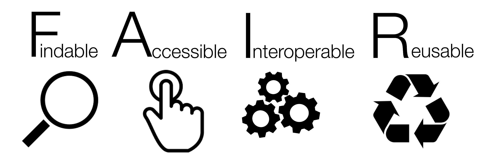

```{r setup, include=FALSE}

options(htmltools.dir.version = FALSE)
knitr::opts_chunk$set(echo = F,
                      fig.retina = 3,
                      warning = F,
                      message = F)
#Plotting and data libraries
library(tidyverse)
library(tidyr)
library(here)

data.dir <- here::here("data")

```

# Open Science, FAIR data, and the Fish Condition project 

.pull-left[
- Plan for **interoperability**

    + [(Meta)data use a formal, accessible, shared, and broadly applicable language for knowledge representation](https://www.go-fair.org/fair-principles/i1-metadata-use-formal-accessible-shared-broadly-applicable-language-knowledge-representation/)

    + [(Meta)data use vocabularies that follow the FAIR principles](https://www.go-fair.org/fair-principles/i2-metadata-use-vocabularies-follow-fair-principles/)

    + [(Meta)data include qualified references to other (meta)data](https://www.go-fair.org/fair-principles/i3-metadata-include-qualified-references-metadata/)



]

.pull-right[
- Common data structures/clear metadata

    + Readable by different software
    
    + Spatial, temporal scale defined
    
    + Units defined
    
    + Source defined
    
- Resources
    
    + https://en.wikipedia.org/wiki/FAIR_data
    
    + https://www.go-fair.org/fair-principles/


Figure by <a href="//commons.wikimedia.org/w/index.php?title=User:SangyaPundir&amp;action=edit&amp;redlink=1" class="new" title="User:SangyaPundir (page does not exist)">SangyaPundir</a> - <span class="int-own-work" lang="en">Own work</span>, <a href="https://creativecommons.org/licenses/by-sa/4.0" title="Creative Commons Attribution-Share Alike 4.0">CC BY-SA 4.0</a>, <a href="https://commons.wikimedia.org/w/index.php?curid=53414062">Link</a>

]

???

---
background-image: url("EDAB_images/herrtopreds.png")
background-size: 550px
background-position: right

## Starting discussion, add bullets as needed!

Input observational datasets
+ id. common needs and sources across all models: environmental, fish, economic
    + NEFSC and other survey data 
    + fishery dependent/industry data 
    + satellite, ...
+ process at highest resolution needed by a model
    + daily length and weight at age?
+ agree on format (e.g. attributes, long vs wide)
+ document and post in project-accessible area 
     + [GitHub](https://github.com/NOAA-EDAB/FisheryConditionLinks) for public data
     + Private repo for confidential data?
          
Linking or modeled "datasets"
+ id. model outputs that become other model inputs 
+ id. resolution: higher &rarr; lower works, not converse
    + [Condition](https://drive.google.com/open?id=1eideEb83ztdA972a21MaVe-Ib4UJaH4Z) output is seasonal but [Prices](https://drive.google.com/drive/folders/1EOr5JqLh_ZYlPqPVB8RcIJXldty9ZAL_) use daily input. Problem?
+ agree on format: how closely can output match needed input? who does additional wrangling?
+ document and post in project-accessible area
