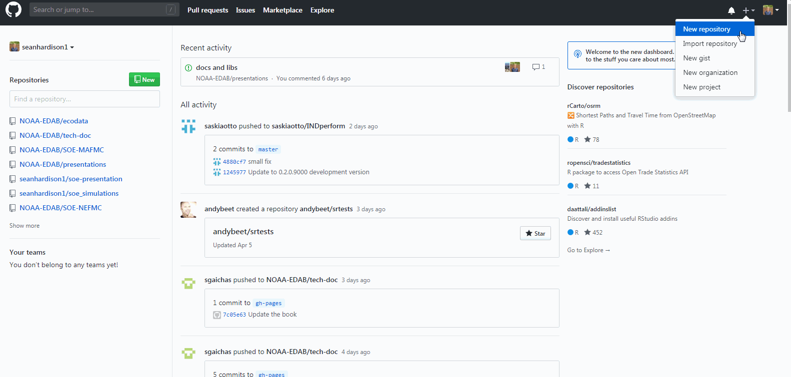
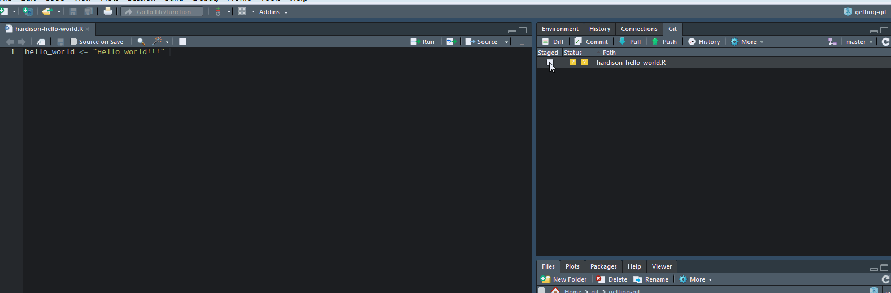
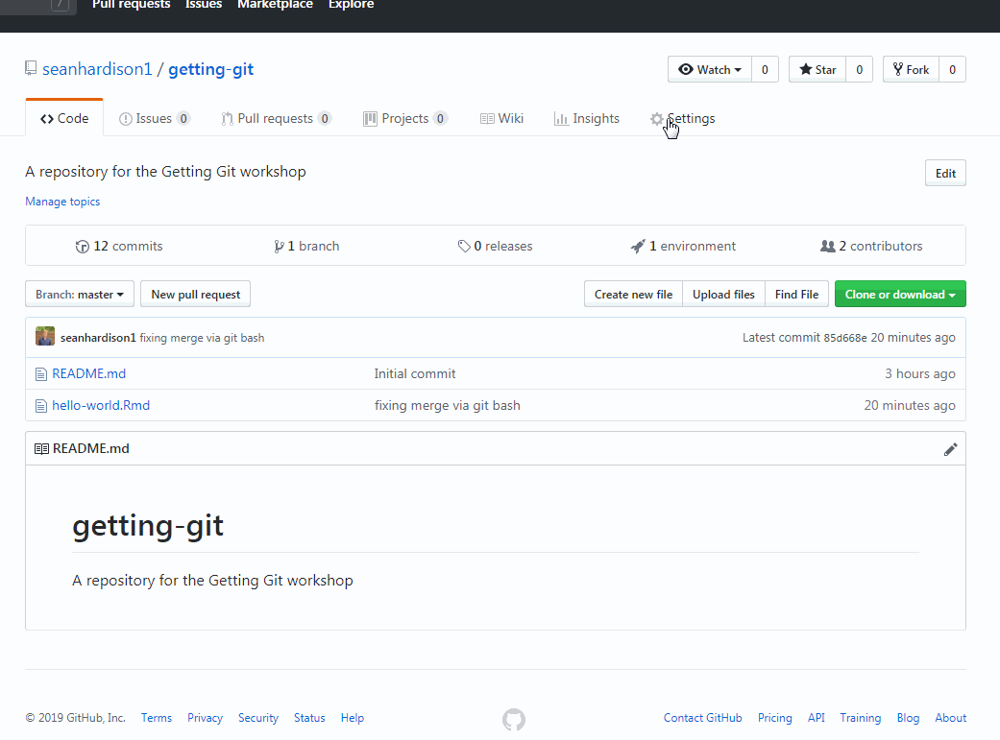

```{r setup, echo = F}

image.dir <- here::here("EDAB_images")
r.dir <- here::here("R")

options(htmltools.dir.version = FALSE)
knitr::opts_chunk$set(echo = F,
                      warning = F,
                      message = F)
```

# Today's workshop

.pull-left[
* Version control systems + Git

* Concepts in Git

* Integration with Github

* Create, collaborate, and share

]

.pull-right[
**Source material**

```{r progit, out.width = "80%", fig.align = "center"}
knitr::include_graphics(file.path(image.dir, "progit.png"))
```

[Available here](https://git-scm.com/book/en/v2)
]

.footnote[
Chacon, Scott, and Ben Straub. Pro git. Apress, 2014.
]

---

## Your friendly neighborhood Version Control System 1:

.pull-left[
* Local Version Control (L-VC): 

  * Developed in response to error-prone manual VC

  * A database keeping track of file changes ("patches")
  
  * Patches can be added and subtracted to revert to documents in a certain state
]

.pull-right[

```{r}
knitr::include_graphics(file.path(image.dir,"LVCS.png"))
```

]

---

## Your friendly neighborhood Version Control System 2:

.pull-left[
* Centralized Version Control (CVC): 

  * Allows collaboration between systems

  * Files can be **checked out** from central server hosting database of file patches
  
  * Centralized server is weakness: If server goes down, VC/collaboration cannot occur 
]

.pull-right[

```{r}
knitr::include_graphics(file.path(image.dir,"CVCS.png"))
```

]

---

## Your friendly neighborhood Version Control System 3:

.pull-left[
* Distributed Version Control (DVC): 

  * Users **check out** copies of full directories rather than individual files

    * These directories, or **repositories**, include the full history of each file
  
  * In short: everyone has the database of patches 

]

.pull-right[

```{r}
knitr::include_graphics(file.path(image.dir,"DVCS.png"))
```


]

---

## Distributed Version Control Systems

* Distributed Version Control (DVC):

  * A copy you create of a remote repository is called a **clone**

.center[

]

* **Git** is a distributed version control software

---

.box-highlight[

**Vocabulary check**

* Repository: A file directory that is being tracked by **Git**
  
  * Also called a "repo"
  
* Clone: An exact copy of a repository containing the full history of project changes

]

---
## How does Git work?

* Git stores information about the state of all files in the repository (think repo "**snapshots**")

```{r snapshots, out.width = "80%", fig.align = "center"}
knitr::include_graphics(file.path(image.dir,"git-snapshots.png"))
```

* Files that have not been changed are not replicated, but linked to

* All information is **local**, and all operations can be performed offline

???
When a snapshot is taken, a file is assigned an id specific to the checksum, or hash. No further changes can be made to that file without Git first knowing about it, and so you cannot lose information.

---

## The Three File States

* Files can be in one of three states after being added to repo

    1. Staged - Files are marked for **committing** (the snapshot)

    2. Modified - Staged files have been modified, but not committed

    3. Committed - Snapshot taken, file states stored to local database

```{r file-states, out.width = "60%", fig.align="center"}
knitr::include_graphics(file.path(image.dir,"file-states.png"))
```

---
## The Three File States continued

* Repository snapshots are transferred between local and remote sessions using **push** and **pull** commands

```{r gh-file-states, out.width = "100%", fig.align="center"}
knitr::include_graphics(file.path(image.dir,"github-file-states.png"))
```

---

## Actually Getting Git: User set-up

**Local Git**

1. Open command line or terminal window

2. Check user name and email address

  .remark-inline-code[
    `git config --global user.name`
  ]
  .remark-inline-code[
    `git config --global user.email`
  ]

3. Check text editor
  .remark-inline-code[
    `git config --global core.editor`
  ]
  
**GitHub (remote Git)**

1. Create Github account if you have not done so already

2. Log in!


???
Important that user name and email map to what you've used to sign up with on github

On windows, you will need to specify the full path to the executable file if changing text editor

---

## Groups & Remote (Github) repository creation

1. Break out into groups of 3 or 4

1. Nominate group leader 

--

1. Create a `getting-git` repository on Github (gif below)

1. Group leaders: Allow group members to collaborate: `Settings -> Collaborators -> [usernames]`

.center[

]


---

## Cloning a repository

**From RStudio**

1. Open RStudio and select `File -> New Project`

2. Select `Version Control`

3. Select `Git`

4. Paste `https://github.com/[leader_username]/getting-git` into repo URL

5. Name your project `getting-git`


**From cmd/terminal**

1. Open command line or terminal

2. `cd` into a directory where you want project to be housed

3. Enter .remark-inline-code[`git clone https://github.com/[leader_username]/getting-git`]


???
RStudio will automatically assign an Rproject file to your repository. 

---

.box-highlight[

**Vocabulary check**

* Commit: Git for "file save"

* Remote: A repository not located on your local machine

    * The repository you just cloned is "the remote"
]


---
## Create, commit, pull, and push

**In RStudio**

1. Create a new file in `/getting-git` (.R, .txt, etc)

2. Stage your file

3. Commit changes

4. **Pull** to download latest snapshot 

5. **Push** to remote repository (Github)

--



---
## Create, commit, pull, and push

**From command line/terminal**

1. Create new file in `/getting-git` 

2. Stage your file:

    * `git add [filename.xyz]`
    
3. Commit changes

    * `git commit` or `git commit -m "[commit message]"`

4. **Pull** to download latest snapshot 

    * `git pull`

5. **Push** to remote repository (Github)

    * `git push`
---
## The Great Merge Conflict of 2019

.center[

]

* Merge conflicts occur when collaborators overwrite each other's content

* A well-orchestrated example

---
## The Great Merge Conflict of 2019 (continued)


In your groups, force a merge conflict and work through it. 

**In someone else's document**

  1. Edit another group member's document

  1. Stage, commit, and push the change

--

**In your document (edited by someone else)**

  1. Make a change overlapping with group member edits. Stage and commit.

  1. Pull from Github: a merge conflict will appear. 

  1. Fix conflict, stage, commit, and push!


--

### In summary: Merge conflicts are a natural part of getting git

---
## Fixing conflicts at the command line/terminal

Assuming conflict exists between remote and local repos:

1. Add changes: `git add [filename.xyz]`

1. Commit changes: `git commit -m "[going about my own business]"`

1. Pull remote to prompt merge conflict: `git pull`

1. Fix conflict
  
1. Add changes, commit, and push!

---
## Sharing your work through Github

**Github Pages** is a free service for hosting repository webpages
  * Hugely flexible; allows for interactivity, JS library integration
  * Easy to use

Some examples from EDAB:

* [SOE Technical Documentation](https://noaa-edab.github.io/tech-doc)

* SOE indicator visualizations:

  * [Macrofauna indicators](http://noaa-edab.github.io/ecodata/macrofauna)
  * [Human Dimensions indicators](http://noaa-edab.github.io/ecodata/human_dimensions)
  * [Lower trophic level indicators](http://noaa-edab.github.io/ecodata/LTL)
  
* [Recent EDAB presentations](https://noaa-edab.github.io/presentations/)

---
## Let's make something to share with the world! 

Group leaders: Go to your repository setting and turn on Github Pages

.center[

]

---
## Let's make something to share with the world! 

1. Open up a new Rmarkdown document

2. Save it as "index.Rmd"

3. Knit the document to HTML

4. Stage, commit, and push index.html and index.Rmd to Github

5. Go to the url: `[leader_username].github.io/[repository_name]`

---
##  Let's make something to share with the world! 

* Once an index.html file has been push to the repo, more .html files can also be hosted

  * `[username].github.io/[repository_name]/[paradigm_shifter.html]`
  
* Interactivity is easy:

.remark-inline-code[
library(dygraphs) <br>
dygraph(nhtemp, main = "New Haven Temperatures") %>% 
  dyRangeSelector(dateWindow = c("1920-01-01", "1960-01-01"))
]

```{r dygraphs-example, echo = F, fig.align = "center", out.width = "80%", out.height="30%"}
library(dygraphs)
dygraph(nhtemp, main = "New Haven Temperatures") %>% 
  dyRangeSelector(dateWindow = c("1920-01-01", "1960-01-01"))
```

---
## Creating your own repository

**From RStudio**

1. Open RStudio and select `File -> New Project`

2. Select `New Directory`

3. Select `New Project`

4. Enter directory name and location

5. **Select `Create a git repository`**


**From cmd/terminal**
1. Open command line or terminal

2. `cd` into a directory where you want project to be housed

3. Create folder for project `mkdir [folder-name]`

4. `cd` into new directory 

5. Initialize repository `git init`

6. [Link to GitHub](https://help.github.com/en/articles/adding-an-existing-project-to-github-using-the-command-line)

---
#### Helpful git commands

Show all settings: `git config --list`

View status of files in git repo: `git status`

View unstaged changes: `git diff`

View staged changes `git diff --staged`

View commit history `git log` (pretty: `git log --pretty=format:"%h - %an, %ar : %s"`)

Rever to commmit: `git checkout [commit-ref] [filename.xyz]`