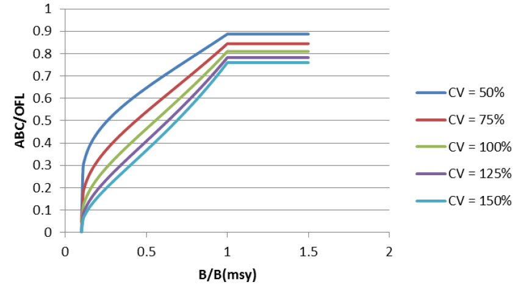

class: top, left

```{r setup, include=FALSE}

options(htmltools.dir.version = FALSE)
knitr::opts_chunk$set(echo = F,
                      fig.retina = 3,
                      warning = F,
                      message = F)
#Plotting and data libraries
library(tidyverse)
library(tidyr)
library(ggrepel)
library(here)
library(ecodata)

#General inline text input for report
#Council
council <- "Mid-Atlantic Fishery Management Council"
council_abbr <- "MAFMC"

#Region identifiers
epu <- "Mid-Atlantic Bight"
epu_abbr <- "MAB"
region <- "Mid-Atlantic"
region_abbr <- "MA" #Some commercial data organized by "MA" or "NE" regions, not by EPU 

```

```{r, load_refs, include=FALSE, cache=FALSE}
library(RefManageR)
BibOptions(check.entries = FALSE,
           bib.style = "authoryear",
           cite.style = "authoryear",
           style = "markdown")
myBib <- ReadBib("./DeepUncertaintyMSE.bib", check = FALSE)

#,
#           hyperlink = FALSE,
#           dashed = FALSE

```


## Fishery management in the US: participatory, with wicked problems

Eight regional Fishery Management Councils establish plans for sustainable management of stocks within their jurisdictions. All are governed by the same law, but tailor management to their regional stakeholder needs.  
.center[

]

More information: http://www.fisherycouncils.org/  
https://www.fisheries.noaa.gov/topic/laws-policies#magnuson-stevens-act

---
## Main concepts  `r Citep(myBib, "dicosimo_use_2010", "methot_implementing_2014")`
.pull-left-30[
MSY: *the largest long-term average catch or yield that can be taken from a stock or stock complex**  

Overfishing 
- *too much catch*
- $F > F_{MSY}$

Overfished 
- *too little biomass*
- $B < \frac12 B_{MSY}$

Rebuilding
- *grow overfished stock back*
- $B = B_{MSY}$


]
.pull-right-70[
```{r stock-status, warning=F, fig.width = 10, fig.asp = 0.6}
#fig.cap = paste0("Mid-Atlantic Fishery Management Council stock status"),
stock_status <- ecodata::stock_status %>%
  mutate(Code = recode(Code, "Dogfish" = "Sp. Dogfish" )) %>% 
  spread(.,Var,Value) %>% 
  filter(Council %in% c("MAFMC","Both")) %>% 
  group_by(Stock) %>% 
  mutate(score = case_when(
    (B.Bmsy <0.5) ~"a",
    (F.Fmsy >1) ~ "a", 
    (F.Fmsy < 1 & B.Bmsy > 0.5 & B.Bmsy < 1) ~ "b",
    (F.Fmsy < 1 & B.Bmsy > 1) ~ "c"))
#Plot constants
y.max <- 2.0 #1.75 mackerel cut off F/Fmsy is 1.8
x.max <- 2.6
#A dataframe that defines custom legend for stocks with unknown status
unknown <- data.frame(text = c("Unknown Status", "Longfin Squid",
                              "Shortfin Squid", "N. Goosefish", "S. Goosefish"),
                    x = rep(0.9*x.max,5), y = seq(0.93*y.max,1.4,-.1))

# Custom Color
custom_color<- c("#56B4E9", "#009E73", "#0072B2")
#Plotting code
ggplot(data = stock_status) +
  geom_vline(xintercept = 1, linetype = "dotted")+
  geom_vline(xintercept = 0.5, linetype = "dashed")+
  geom_hline(yintercept = 1, linetype = "dashed") +
  geom_point(aes(x = B.Bmsy,
                 y = F.Fmsy,
                 shape = Council,
                 color = score)) +
  geom_text_repel(aes(x = B.Bmsy, #geom_text_repel auto-jitters text around points
                      y = F.Fmsy,
                      label = Code, 
                      color = score,
                      size = 20), 
                  show.legend = FALSE, nudge_y = -0.01, nudge_x = 0.05) +
  scale_color_brewer(palette = "Dark2",
                     breaks = stock_status$score) +
  ylim(0,y.max) +
  xlim(0,x.max) +
  geom_text(data = unknown, aes(x = x, y = y, label = text), #Custom legend for unknown stock status
            size = c(4.75,rep(4,4))) +
  annotate("rect", xmin = 0.8*x.max,
           xmax = x.max,
           ymin = 0.65*y.max,
           ymax = 0.90*y.max,
           alpha = 0.1) +
  xlab(expression(~B/B[msy])) +
  ylab(expression(~F/F[msy])) +
  guides(color = FALSE) +
  theme_ts()
```
.center[Mid-Atlantic Fishery Management Council stock status]
]

<p style="color:#FF8C00;">*<i>under prevailing ecological, environmental conditions and fishery technological characteristics (e.g., gear selectivity), and the distribution of catch among fleets.</i></p>


---
background-image: url("EDAB_images/2019 Status of Stocks RtC_FINAL_7-15-20_Page_07.png")
background-size: cover
---
## Details

Optimum Yield (OY) definition

*Magnuson-Stevens Act section (3)(33) defines “optimum,” with respect to the yield from a fishery, as the amount of fish that will provide the greatest overall benefit to the Nation, particularly with respect to food production and recreational opportunities and taking into account the protection of marine ecosystems;* 

*that is prescribed on the basis of the MSY from the fishery, as reduced by any relevant economic, social, or ecological factor;* 

*and, in the case of an overfished fishery, that provides for rebuilding to a level consistent with producing the MSY in such fishery.*

---
## Details

National standards

>Standard 1. Conservation and management measures shall prevent overfishing while achieving, on a continuing basis, the optimum yield (OY) from each fishery for the U.S. fishing industry.
>
[...] guidance on:
>
(i) Specifying maximum sustainable yield (MSY) and OY;
>
(ii) Specifying status determination criteria (SDC) so that overfishing and overfished determinations can be made for stocks and stock complexes in an FMP;
>
(iii) Preventing overfishing and achieving OY, incorporation of scientific and management uncertainty in control rules, and adaptive management using annual catch limits (ACL) and measures to ensure accountability (i.e., accountability measures (AMs)); and
>
(iv) Rebuilding stocks and stock complexes. 

## Regional and Fishery Management Plan (FMP) specific implementation

---
background-image: url("EDAB_images/regionalmgt.png")
background-size: contain
---
background-image: url("EDAB_images/OFLABCACLetc.png")
background-position: left

## Getting to the quota
.right[
SSC = Scientific and  
Statistical Committee

MFMT = Maximum Fishing  
Mortality Threshold,  
typically $F_{MSY}$


]


---
## Where can environmental change come in? National standard 1

>(v) Specifying MSY. (A) ... MSY ... should be re-estimated as required by changes in long-term environmental or ecological conditions, fishery technological characteristics, or new scientific information.  
...  
(C) The MSY for a stock or stock complex is influenced by its interactions with other stocks in its ecosystem and these interactions may shift as multiple stocks in an ecosystem are fished. Ecological and environmental information should be taken into account, to the extent practicable, when assessing stocks and specifying MSY. Ecological and environmental information that is not directly accounted for in the specification of MSY can be among the ecological factors considered when setting OY below MSY.

>(iii) Relationship of Status Determination Criteria (SDC) to environmental and habitat change. 
...  
(A) If environmental changes cause a stock or stock complex to fall below its MSST without affecting its long-term reproductive potential, fishing mortality must be constrained sufficiently to allow rebuilding within an acceptable time frame .... SDC should not be respecified.  

>(B) If environmental, ecosystem, or habitat changes affect the long-term reproductive potential of the stock or stock complex, one or more components of the SDC must be respecified. Once SDC have been respecified, fishing mortality may or may not have to be reduced, depending on the status of the stock or stock complex with respect to the new criteria.


---
## References

```{r refs, echo=FALSE, results="asis"}
PrintBibliography(myBib)
```

## Additional resources

* [National Standard 1--Optimum Yield](https://www.ecfr.gov/cgi-bin/text-idx?SID=71b8c6026001cb90e4b0925328dce685&mc=true&node=se50.12.600_1310&rgn=div8)

* [US Fisheries Stock Status 2019](https://www.fisheries.noaa.gov/national/sustainable-fisheries/status-stocks-2019)

* [2019 Stock Status Determination Criteria](https://www.fisheries.noaa.gov/webdam/download/109102767)

* [2019 Stock Status Table](https://www.fisheries.noaa.gov/webdam/download/109102769)

.footnote[
Slides available at https://noaa-edab.github.io/presentations  
Contact: <Sarah.Gaichas@noaa.gov>

]
