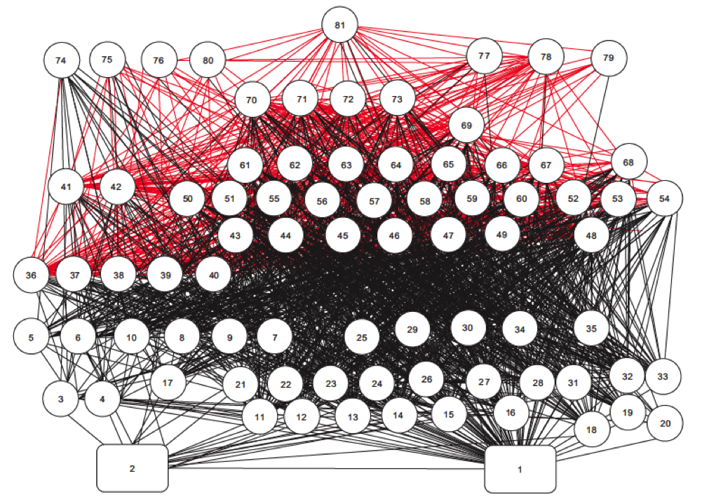

class: top, left

```{r setup, include=FALSE}

options(htmltools.dir.version = FALSE)
knitr::opts_chunk$set(echo = F,
                      fig.retina = 3,
                      warning = F,
                      message = F)
#Plotting and data libraries
library(tidyverse)
library(tidyr)
library(here)
```

```{r, load_refs, include=FALSE, cache=FALSE}
library(RefManageR)
BibOptions(check.entries = FALSE,
           bib.style = "authoryear",
           cite.style = "authoryear",
           style = "markdown")
myBib <- ReadBib("./DeepUncertaintyMSE.bib", check = FALSE)

#,
#           hyperlink = FALSE,
#           dashed = FALSE

```

```{r}
#herring MSE outputs
#allres <- readRDS(file.path(data.dir,"allres.rds"))


#herring MSE plotting
#a better plotting theme than ggplot default? from https://rpubs.com/Koundy/71792
theme_Publication <- function(base_size=14, base_family="") {
      library(grid)
      library(ggthemes)
      (theme_foundation(base_size=base_size, base_family=base_family)
       + theme(plot.title = element_text(face = "bold",
                                         size = rel(1.2), hjust = 0.5),
               text = element_text(),
               panel.background = element_rect(colour = NA),
               plot.background = element_rect(colour = NA),
               panel.border = element_rect(colour = NA),
               axis.title = element_text(face = "bold",size = rel(1)),
               axis.title.y = element_text(angle=90,vjust =2),
               axis.title.x = element_text(vjust = -0.2),
               axis.text = element_text(), 
               axis.line = element_line(colour="black"),
               axis.ticks = element_line(),
               panel.grid.major = element_line(colour="#f0f0f0"),
               panel.grid.minor = element_blank(),
               legend.key = element_rect(colour = NA),
               legend.position = "right",
               legend.direction = "vertical",
               legend.key.size= unit(0.4, "cm"),
               legend.margin = unit(0, "cm"),
               legend.title = element_text(face="italic"),
               plot.margin=unit(c(10,5,5,5),"mm"),
               strip.background=element_rect(colour="#f0f0f0",fill="#f0f0f0"),
               strip.text = element_text(face="bold")
          ))
      
}

scale_fill_Publication <- function(...){
      library(scales)
      discrete_scale("fill","Publication",manual_pal(values = c("#386cb0","#fdb462","#7fc97f","#ef3b2c","#662506","#a6cee3","#fb9a99","#984ea3","#ffff33")), ...)

}

scale_colour_Publication <- function(...){
      library(scales)
      discrete_scale("colour","Publication",manual_pal(values = c("#386cb0","#fdb462","#7fc97f","#ef3b2c","#662506","#a6cee3","#fb9a99","#984ea3","#ffff33")), ...)
}

```

background-image: url("EDAB_images/allcomponents.png")
background-size: 800px
background-position: right bottom

## Are any Atlantic herring harvest control rules good for both fisheries and predators?
.pull-left-30[
**Harvest control rules** are:
- plans for changing fishing based on stock status
- pre-determined
    
*"Which harvest control rules best consider herring's role as forage?"*
- DESIGN a harvest control rule (HCR):
    - balancing fishing benefits and ecological services
    - addressing diverse stakeholder interests
- TRANSPARENTLY within management time frame!
]

---
background-image: url("EDAB_images/MSECSIRO.png")
background-size: 800px
background-position: right

## What is Management Strategy Evaluation?
.pull-left-30[
- Process to develop fishery management procedures  

- First used in S. Africa, Australia, and at International Whaling Commission  late 1980s - early 1990s

.contrib[
>Under this approach, management advice is based on a fully specified set of rules that have been tested in simulations of a wide variety of scenarios that specifically take uncertainty into account. The full procedure includes specifications for the data to be collected and how those data are to be used to provide management advice, in a manner that incorporates a feedback mechanism. `r Cite(myBib, "punt_developing_2007")`
]
]

---
background-image: url("EDAB_images/MgtProcess.png")
background-size: 800px
background-position: right

## The Dream and The Reality
.pull-left-30[
*First MSE within US Council*  
`r Cite(myBib, "feeney_integrating_2018")`
Scope: annual stockwide HCR
Open stakeholder meetings (2)
- ID objectives, uncertainties
- ID acceptable performance
- more diverse, interactive than "normal" process 

Uncertainties identified
- herring mortality (M)
- environmental effects on herring 
- predator response to herring abundance
- assessment uncertainty

]

---
## Operating models and uncertainties 
.pull-left-70[
.table[
```{r OMs,  echo=FALSE, message=FALSE, warnings=FALSE, results='asis'}
#tab.cap="Operating model uncertainties addressed\\label{OMs}",
tabl <- "
|Operating Model Name|Herring Productivity|Herring Growth|Assessment Bias|
|:---------------------|:---------------------|:-----------------|:-----------------|
| LowFastBiased        | Low: high M, low h (0.44)  | 1976-1985: fast | 60% overestimate |
| LowSlowBiased        | Low: high M, low h (0.44)  | 2005-2014: slow | 60% overestimate |
| LowFastCorrect       | Low: high M, low h (0.44)  | 1976-1985: fast | None             |
| LowSlowCorrect       | Low: high M, low h (0.44)  | 2005-2014: slow | None             |
| HighFastBiased       | High: low M, high h (0.79) | 1976-1985: fast | 60% overestimate |
| HighSlowBiased       | High: low M, high h (0.79) | 2005-2014: slow | 60% overestimate |
| HighFastCorrect      | High: low M, high h (0.79) | 1976-1985: fast | None             |
| HighSlowCorrect      | High: low M, high h (0.79) | 2005-2014: slow | None             |
"
# df<-read_delim(tabl, delim="|")
# df<-df[-c(1,2) ,c("Operating Model Name","Herring Productivity","Herring Growth","Assessment Bias")]
# knitr::kable(df, booktabs = TRUE) #%>%
#   kable_styling(latex_options = "scale_down") %>%
#   kable_as_image()

cat(tabl) # output the table in a format good for HTML/PDF/docx conversion
```
] 
&nbsp;
&nbsp;

] 
.pull-right-30[
`r Cite(myBib, "deroba_dream_2018")`
]

Implementation error was included as year-specific lognormal random deviations: 
$F_{a,y}=\bar{F}_yS_ae^{\varepsilon_{\theta,y}-\frac{\sigma_\theta^2}{2}} \;\;\;  \varepsilon_{\theta} \sim N(0,\sigma_\theta^2)$

Assessment error was modeled similarly, with first-order autocorrelation and an optional bias term $\rho$:
$\widehat{N}_{a,y}=[N_{a,y}(\rho+1)]e^{\varepsilon_{\phi,y}-\frac{\sigma_\phi^2}{2}}\;\;\;\; \varepsilon_{\phi,y}=\vartheta\varepsilon_{\phi,y-1}+\sqrt{1-\vartheta^2}\tau_y \;\;\;\;  \tau \sim N(0,\sigma_\phi^2)$ 

---
background-image: url("EDAB_images/OMdesign.png")
background-size: 750px
background-position: right

## Linked models matching stakeholder-identified objectives
.pull-left-30[
The Dream:<sup>1</sup>
Convert the effects of control rules on 4 user groups to dollars:
.contrib[
1. Users of landed herring (Demand)
    - Lobster industry, aquariums
1. Herring harvesters (Supply)
1. Direct users of herring in the ocean (not people)
    - Terns and Whales
    -  Striped Bass, Dogfish
1. Indirect users of herring in the ocean (people, Derived Demand)
    - Bird- and whale-watchers
    - Recreational and Commercial Fishing
]
The Reality
.contrib[
- 8 herring operating models linked to simple predator and economic models, developed in parallel
- limited range of predator response
- limited economic effects, directed fishery only
]
`r Cite(myBib, "deroba_dream_2018")`
]
.footnote[
<sup>1</sup> Credit: [Min-Yang Lee](https://s3.amazonaws.com/nefmc.org/13.Economic-Models_Lee.pdf)
]
---
background-image: url("EDAB_images/herrtopreds.png")
background-size: 640px
background-position: left

## Predators: deterministic population models and herring-predator links
.pull-left[]
.pull-right[.right[

]
.table[
Time constraints forced:
- selection of predators with previous modeling and readily available data
- selection of single strongest herring-predator relationship
- models ignoring high variance in prey-predator relationships 
]
]
---
background-image: url("EDAB_images/herrtopreds_results.png")
background-size: 640px
background-position: left center
## Results summary
Three HCR types were rejected at the second stakeholder meeting for poor fishery and predator performance.
.pull-left[]
.pull-right[.right[
```{r YAY, fig.height=14, fig.width=11.5, out.width='85%', message = FALSE, warning = FALSE, }
# fig.cap="Differences between operating models (OM) for key metrics. Boxplots represent the median (wide line within the box) and 25th and 75th percentiles (box) of the distribution of medians for final 50 years of each simulation for each performance metric (x-axis label, please see text for definitions) and operating model (see Table 2 for definitions) across all control rule types. Boxplot whiskers include the highest and lowest observations within 1.5 box lengths from the box. Observations further than 1.5 box lengths from the box (outliers) are represented by points."\\label{YAY}",
# metrics <- c('stouffer',
#              'stationary',
#              'p50_NR',
#              'PropClosure',
#              'MedSSBrelSSBmsy',
#              'PropSSBrelhalfSSBmsy',
#              'YieldrelMSY',
#              'Yvar',
#              'MedPropYrs_goodProd_Targplustern', 
#              'MedPropYrs_okBstatus', 
#              'MedPropYrs_goodAvWtstatus'
#              )
# metlabels <- c('equilibrium1',
#                'equilibrium2',
#                'revenue',
#                'closure',
#                'relSSB',
#                'overfished',
#                'relyield',
#                'yieldvar',
#                'ternprod',
#                'dogstatus',
#                'tunawt'
#                )

allres <- readRDS(url("https://github.com/sgaichas/herringMSE/blob/master/data/allres.rds?raw=True"))


metrics <- c('YieldrelMSY',
             'Yvar',
             'PropClosure',
             'MedSSBrelSSBmsy',
             'PropSSBrelhalfSSBmsy',
             'MedPropYrs_goodProd_Targplustern', 
             'MedPropYrs_okBstatus', 
             'MedPropYrs_goodAvWtstatus',
             'p50_NR',
             'stouffer',
             'stationary'
             )


metlabels <- c('relyield',
               'yieldvar',
               'closure',
               'relSSB',
               'overfished',
               'ternprod',
               'dogstatus',
               'tunawt',
               'net revenue',
               'equil1',
               'equil2'
               )


OMs <- unique(allres$OM)

OMlabels <- c('LowFastBiased', 
              'LowSlowBiased', 
              'LowFastCorrect', 
              'LowSlowCorrect',  
              'HighFastBiased',  
              'HighSlowBiased', 
              'HighFastCorrect',
              'HighSlowCorrect'
              )

#OM (8) x metric (11) boxplot--

# plotting <- function(d, xvar, yvars, xlabs, ylabs){
#   P <- list()
#   for (i in 1:length(yvars)){
#     if(i < length(yvars)){
#       p <- ggplot(d, aes_string(x=xvar, y=yvars[i])) + 
#       geom_boxplot() + labs(y=ylabs[i]) +
#       theme(axis.title.x=element_blank(),axis.text.x=element_blank(),axis.ticks.x=element_blank())
#     }
#     if(i == length(yvars)){
#       p <- ggplot(d, aes_string(x=xvar, y=yvars[i])) + 
#         geom_boxplot() + labs(y=ylabs[i]) +
#         scale_x_discrete(labels = xlabs)
#     }
#     P <- c(P, list(p))
#   }
#   return(list(plots=P, num=length(yvars)))
# }

#trying to align left side of plots--still not working-- finally works!
plotting <- function(d, xvar, yvars, xlabs, ylabs){
  P <- list()
  for (i in 1:length(yvars)){
    if(i < length(yvars)){
      p <- ggplot(d, aes_string(x=xvar, y=yvars[i])) + 
        geom_boxplot() + labs(y=ylabs[i]) +
        theme_Publication() + scale_colour_Publication() + 
        theme(axis.title.x=element_blank(),axis.text.x=element_blank(),axis.ticks.x=element_blank(), plot.margin=unit(c(2,1,2,1),"mm"))
    }
    if(i == length(yvars)){
      p <- ggplot(d, aes_string(x=xvar, y=yvars[i])) + 
        geom_boxplot() + labs(y=ylabs[i]) +
        scale_x_discrete(labels = xlabs) +
        theme_Publication() + scale_colour_Publication()+ 
        theme(plot.margin=unit(c(0,1,2,1),"mm"))
    }
    #gp <- ggplotGrob(p)
    P[[i]] <- p
  }
  #return(list(plots=P, num=length(yvars)))
  gp <- lapply(P, ggplotGrob)
  g <- do.call(rbind, c(gp, size="first"))
  g$widths <- do.call(unit.pmax, lapply(gp, "[[", "widths"))
  return(g)
}

#PLOTS <- plotting(d)
#do.call(grid.arrange, c(PLOTS$plots, nrow = PLOTS$num))

metOM <- plotting(allres, "OM", metrics, OMlabels, metlabels)
grid.newpage()
grid.draw(metOM)

```
]]

---
## Managing tradeoffs under uncertainty: What control rules give us 90% of everything we want?

- Tern productivity at 1.0 or above more than 90% of the time
- Herring biomass more than 90% of SSBmsy
- Fishery yield more than 90% of MSY
&nbsp;
- AND fishery closures (F=0) less than 1% of the time (plot on right).

.pull-left[
```{r}

Nrulesgoodterns <- allres %>%
  filter(CR %in% c("BB", "BB3yr")) %>%
  group_by(OM,CR)%>%
  filter(MedPropYrs_goodProd_Targplustern>0.9) %>%
  summarize(tern90 = n())

Nrulesgoodfishery <- allres %>%
  filter(CR %in% c("BB", "BB3yr")) %>%
  group_by(OM,CR)%>%
  filter(YieldrelMSY>0.9) %>%
  summarize(yield90 = n())

Nrulesgoodherring <- allres %>%
  filter(CR %in% c("BB", "BB3yr")) %>%
  group_by(OM,CR)%>%
  filter(MedSSBrelSSBmsy>0.9) %>%
  summarize(SSB90 = n())

Nrulesgoodternherrfish <- allres %>%
  filter(CR %in% c("BB", "BB3yr")) %>%
  filter(MedPropYrs_goodProd_Targplustern>0.9 & MedSSBrelSSBmsy>0.9 & YieldrelMSY>0.9) %>%
  group_by(OM,CR)%>%
  summarize(ternfishherr90 = n(), 
            minF = min(FracFtarg), 
            maxF = max(FracFtarg),
            minloB = min(FracBmsyThreshLo), 
            maxloB = max(FracBmsyThreshLo),
            minhiB = min(FracBmsyThreshHi),
            maxhiB = max(FracBmsyThreshHi)
  )

CRsgoodternherrfish <- allres %>%
  filter(CR %in% c("BB", "BB3yr")) %>%
  filter(MedPropYrs_goodProd_Targplustern > 0.9 & MedSSBrelSSBmsy > 0.9 & YieldrelMSY > 0.9) %>%
  group_by(OM,CR) %>%
  select(OM, CR, FracBmsyThreshLo, FracBmsyThreshHi,FracFtarg) %>%
  mutate(id = seq(1:n()),
         Xmin = 0,
         Xmax = 4) %>%
  gather(CRpart, x, Xmin,FracBmsyThreshLo, FracBmsyThreshHi,Xmax) %>%
  arrange(OM, CR, id) %>%
  mutate(y = case_when(CRpart == "Xmin" | CRpart == "FracBmsyThreshLo" ~ 0,
                       CRpart == "FracBmsyThreshHi" | CRpart == "Xmax" ~ FracFtarg)) %>%
  mutate(bigkey = paste0(OM, CR, id))
  
#with(CRsgoodternherrfish, 
#     plot(x=c(0,FracBmsyThreshLo, FracBmsyThreshHi, 4),
#          y=c(0,0,FracFtarg, FracFtarg), type="l"))  
  
p1 <- ggplot(CRsgoodternherrfish, aes(x=x, y=y, colour=CR)) + 
  geom_line(aes(group=bigkey), alpha=0.3) +
  labs(y="F/Fmsy", x="SSB/SSBmsy", colour="Control rule type") +
  guides(colour = guide_legend(override.aes = list(alpha = 1))) +
  theme_Publication() + scale_colour_Publication()

OMlabels <- c(HiM_LowSteep_AssBias_OldWt = 'LowFastBiased', 
              HiM_LowSteep_AssBias_RecWt = 'LowSlowBiased', 
              HiM_LowSteep_NoAssBias_OldWt = 'LowFastCorrect', 
              HiM_LowSteep_NoAssBias_RecWt = 'LowSlowCorrect',  
              LoM_HiSteep_AssBias_OldWt =  'HighFastBiased',  
              LoM_HiSteep_AssBias_RecWt = 'HighSlowBiased', 
              LoM_HiSteep_NoAssBias_OldWt = 'HighFastCorrect',
              LoM_HiSteep_NoAssBias_RecWt = 'HighSlowCorrect'
              )

p1 + facet_wrap("OM", labeller=labeller(OM = OMlabels), nrow=2) + theme(legend.position="bottom")

```
]

.pull-right[
```{r}
Nrulesgoodterns <- allres %>%
  filter(CR %in% c("BB", "BB3yr")) %>%
  group_by(OM,CR)%>%
  filter(MedPropYrs_goodProd_Targplustern>0.9) %>%
  summarize(tern90 = n())

Nrulesgoodfishery <- allres %>%
  filter(CR %in% c("BB", "BB3yr")) %>%
  group_by(OM,CR)%>%
  filter(YieldrelMSY>0.9) %>%
  summarize(yield90 = n())

Nrulesgoodherring <- allres %>%
  filter(CR %in% c("BB", "BB3yr")) %>%
  group_by(OM,CR)%>%
  filter(MedSSBrelSSBmsy>0.9) %>%
  summarize(SSB90 = n())

Nrulesgoodternherrfish <- allres %>%
  filter(CR %in% c("BB", "BB3yr")) %>%
  filter(MedPropYrs_goodProd_Targplustern>0.9 & MedSSBrelSSBmsy>0.9 & YieldrelMSY>0.9 & PropClosure < 0.01) %>%
  group_by(OM,CR)%>%
  summarize(ternfishherr90 = n(), 
            minF = min(FracFtarg), 
            maxF = max(FracFtarg),
            minloB = min(FracBmsyThreshLo), 
            maxloB = max(FracBmsyThreshLo),
            minhiB = min(FracBmsyThreshHi),
            maxhiB = max(FracBmsyThreshHi)
  )

CRsgoodternherrfish <- allres %>%
  filter(CR %in% c("BB", "BB3yr")) %>%
  filter(MedPropYrs_goodProd_Targplustern > 0.9 & MedSSBrelSSBmsy > 0.9 & YieldrelMSY > 0.9 & PropClosure < 0.01) %>%
  group_by(OM,CR) %>%
  select(OM, CR, FracBmsyThreshLo, FracBmsyThreshHi,FracFtarg) %>%
  mutate(id = seq(1:n()),
         Xmin = 0,
         Xmax = 4) %>%
  gather(CRpart, x, Xmin,FracBmsyThreshLo, FracBmsyThreshHi,Xmax) %>%
  arrange(OM, CR, id) %>%
  mutate(y = case_when(CRpart == "Xmin" | CRpart == "FracBmsyThreshLo" ~ 0,
                       CRpart == "FracBmsyThreshHi" | CRpart == "Xmax" ~ FracFtarg)) %>%
  mutate(bigkey = paste0(OM, CR, id))
  
#with(CRsgoodternherrfish, 
#     plot(x=c(0,FracBmsyThreshLo, FracBmsyThreshHi, 4),
#          y=c(0,0,FracFtarg, FracFtarg), type="l"))  
  
p1 <- ggplot(CRsgoodternherrfish, aes(x=x, y=y, colour=CR)) + 
  geom_line(aes(group=bigkey), alpha=0.3) +
  labs(y="F/Fmsy", x="SSB/SSBmsy", colour="Control rule type") +
  guides(colour = guide_legend(override.aes = list(alpha = 1))) +
  theme_Publication() + scale_colour_Publication()

OMlabels <- c(HiM_LowSteep_AssBias_OldWt = 'LowFastBiased', 
              HiM_LowSteep_AssBias_RecWt = 'LowSlowBiased', 
              HiM_LowSteep_NoAssBias_OldWt = 'LowFastCorrect', 
              HiM_LowSteep_NoAssBias_RecWt = 'LowSlowCorrect',  
              LoM_HiSteep_AssBias_OldWt =  'HighFastBiased',  
              LoM_HiSteep_AssBias_RecWt = 'HighSlowBiased', 
              LoM_HiSteep_NoAssBias_OldWt = 'HighFastCorrect',
              LoM_HiSteep_NoAssBias_RecWt = 'HighSlowCorrect'
              )

p1 + facet_wrap("OM", labeller=labeller(OM = OMlabels), nrow=2) + theme(legend.position="bottom")

```
]

---
## Lessons: testing strategies is key, but uncertainty still difficult to convey
.pull-left-30[
Complex food web, generalist predators
- Herring is one of several important prey
- Assess multiple prey together for stronger effects on predator productivity
- Tern/Tuna/Groundfish/Mammal productivity also affected by predators, weather, and other uncertain factors
- Still showed which herring control rules were poor
- Managers selected a harvest control rule considering a wide range of factors!
]
.pull-right-70[

]

---
background-image: url("EDAB_images/salmonscenarios.png")
background-size: 700px
background-position: right
## MSE and uncertainty: incorporate scenario planning?
.pull-left-40[
- Standalone process with stakeholders
    - salmon example
    - right whale example
    - climate example just starting
    - many others!

- Scenarios could specify a set of MSE operating models
    - fewer operating models spanning more uncertainty
    - easier to describe 
    - limits results dimensionality
    
- Climate scenarios for a region could be used in many MSEs
]

.footnote[
Source: [Salmon Climate Scenario Planning Pilot Report](https://www.greateratlantic.fisheries.noaa.gov/policyseries/index.php/GARPS/article/view/15/14)
]
---
background-image: url("EDAB_images/boxscatterbag2.png")
background-size: 800px
background-position: center
## MSE and uncertainty: visualizing many dimensions? Advice from DMDU and RDM?
`r Cite(myBib, "feeney_integrating_2018")`
--


---
background-image: url("EDAB_images/climatescenarioarrow.png")
background-size: 800px
background-position: right
# Conclusions

- NOAA Fisheries supports MSE
    - Dedicated FTE at each Science Center
    - National working group
    
- Climate and EBFM Roadmaps include
    - Scenario planning
    - MSE
    
- Enhance with DMDU

.footnote[
Source: [Salmon Climate Scenario Planning Pilot Report](https://www.greateratlantic.fisheries.noaa.gov/policyseries/index.php/GARPS/article/view/15/14)
]

---
## References

```{r refs, echo=FALSE, results="asis"}
PrintBibliography(myBib)
```

---
## Additional resources

* [New England Atlantic herring management](https://www.nefmc.org/management-plans/herring)

* [New England MSE debrief](https://s3.amazonaws.com/nefmc.org/3_Herring-MSE-debrief-final-report.pdf)

* [MSE video](https://www.youtube.com/watch?v=5JG76VPnHS8)

* [Management procedures video](https://www.youtube.com/watch?v=V9QEG4R4-w0)

* Slides available at https://noaa-edab.github.io/presentations

* Contact: <Sarah.Gaichas@noaa.gov>

# Thank you!
