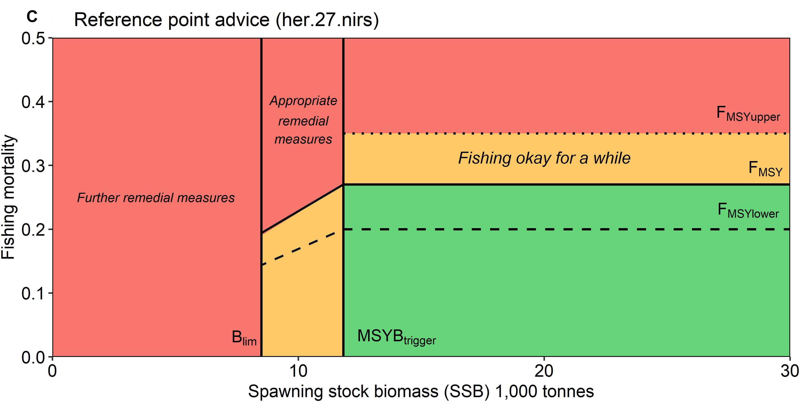

class: top, left

```{r setup, include=FALSE}

options(htmltools.dir.version = FALSE)
knitr::opts_chunk$set(echo = F,
                      fig.retina = 3,
                      warning = F,
                      message = F)
#Plotting and data libraries
library(tidyverse)
library(tidyr)
library(here)
```

```{r, load_refs, include=FALSE, cache=FALSE}
library(RefManageR)
BibOptions(check.entries = FALSE,
           bib.style = "authoryear",
           cite.style = "authoryear",
           longnamesfirst = FALSE,
           max.names = 1,
           style = "markdown")
myBib <- ReadBib("./modreview2.bib", check = FALSE)

#,
#           hyperlink = FALSE,
#           dashed = FALSE

```

```{r}
#herring MSE outputs
#allres <- readRDS(file.path(data.dir,"allres.rds"))

allres <- readRDS(url("https://github.com/sgaichas/herringMSE/blob/master/data/allres.rds?raw=True"))

#herring MSE plotting
#a better plotting theme than ggplot default? from https://rpubs.com/Koundy/71792
theme_Publication <- function(base_size=14, base_family="") {
      library(grid)
      library(ggthemes)
      (theme_foundation(base_size=base_size, base_family=base_family)
       + theme(plot.title = element_text(face = "bold",
                                         size = rel(1.2), hjust = 0.5),
               text = element_text(),
               panel.background = element_rect(colour = NA),
               plot.background = element_rect(colour = NA),
               panel.border = element_rect(colour = NA),
               axis.title = element_text(face = "bold",size = rel(1)),
               axis.title.y = element_text(angle=90,vjust =2),
               axis.title.x = element_text(vjust = -0.2),
               axis.text = element_text(), 
               axis.line = element_line(colour="black"),
               axis.ticks = element_line(),
               panel.grid.major = element_line(colour="#f0f0f0"),
               panel.grid.minor = element_blank(),
               legend.key = element_rect(colour = NA),
               legend.position = "right",
               legend.direction = "vertical",
               legend.key.size= unit(0.4, "cm"),
               legend.margin = unit(0, "cm"),
               legend.title = element_text(face="italic"),
               plot.margin=unit(c(10,5,5,5),"mm"),
               strip.background=element_rect(colour="#f0f0f0",fill="#f0f0f0"),
               strip.text = element_text(face="bold")
          ))
      
}

scale_fill_Publication <- function(...){
      library(scales)
      discrete_scale("fill","Publication",manual_pal(values = c("#386cb0","#fdb462","#7fc97f","#ef3b2c","#662506","#a6cee3","#fb9a99","#984ea3","#ffff33")), ...)

}

scale_colour_Publication <- function(...){
      library(scales)
      discrete_scale("colour","Publication",manual_pal(values = c("#386cb0","#fdb462","#7fc97f","#ef3b2c","#662506","#a6cee3","#fb9a99","#984ea3","#ffff33")), ...)
}

```

# What makes a good model? `r Cite(myBib, "nrc_chapter_2007")`, p 108

.pull-left-30[
>Is the model based on generally accepted science and computational methods?  

>Does it work, that is, does it fulfill its designated task or serve its intended purpose? 

>Does its behavior approximate that observed in the system being modeled?  
]

.pull-right-70[

]

---
background-image: url("EDAB_images/NRCmodelLifeCycle.png")
background-size: 650px
background-position: right

# Model life cycle 
##`r Cite(myBib, "nrc_chapter_2007")`

What makes a good model?

* Differs by life stage 

* Each builds on the next

* Common themes

---
## Best practices 1: Why do we need a model? Identify the problem

.pull-left-70[

]

--

.pull-right-30[

]

---
background-image: url("EDAB_images/2020NSeaherringM2.png")
background-size: 540px
background-position: right bottom

## Problem identification &harr; Appropriateness of model for problem

Define the problem, and why this model is appropriate. 

* What processes need to be modeled to address the problem?

* What focal species, spatial, and temporal resolution are needed to address the problem? 

.pull-left-60[
Example problem `r Cite(myBib, "ices_working_2019")`:

Multiple predators feed on multiple fished prey stocks within a particular ecosystem. There is a need to include predation mortality within assessments for individual prey stocks in that ecosystem. 

Model(s) must estimate predation mortality at age, and to provide M-at-age time series for herring, cod, whiting, haddock, sprat, sandeel, etc. Spatial scale is at the stock level and temporal resolution is annual, starting at a stock-specific year and going to the present. 

Model(s) must provide this output and sensitivity to model assumptions in the output M at age must be evaluated. 
]
.pull-right-40[
]

---
## Problem identification &harr; Appropriateness of model for problem

A different example problem (ICES WKIRISH, `r Cite(myBib, "bentley_refining_2021")`):

.pull-left[
>The aim with the Irish Sea Ecopath is to use the model to “fine tune” the quota advice within the predefined EU Fmsy ranges. In “good” conditions you could fish at the top of the range, in “poor” conditions you should fish lower in the range. The range has already been evaluated as giving good yield while still being precautionary, so this should be fine for ICES to use in advice, so any reviewers should have this in mind.

]

.pull-right[

.contrib[
 https://www.frontiersin.org/files/Articles/602072/fmars-08-602072-HTML-r1/image_m/fmars-08-602072-g001.jpg
]
]

For the Irish Sea EwE model, key outputs will be used to determine where the catch advice should be within the MSY range for each species. Therefore, outputs defining ecosystem conditions and both ecosystem and species productivity under the prevailing conditions are most important.

---
## Best Practices 2: Is the scientific basis of the model sound?

Previously used models often skip this step, reasoning that if the science was sound previously it still is.

(Discuss...)

ICES WGSAM has provided model framework reviews for the LeMans ensemble (2016), FLBEIA (2017), and a multispecies state-space model (2017). “Constructed Model” evaluation issues and best practices apply here: 

1. Spatial and temporal resolution
1. Algorithm choices
1. Assumptions (scientific basis, computational infrastructure; adequacy of conceptual model)
1. Data availability/software tools
1. Quality assurance/quality control (code testing)
1. Test scenarios (for example, stability `r Cite(myBib, "kaplan_guinea_2016")`):
    1. All functional groups persist in an unfished unperturbed run  
    1. Model stabilizes for the last ~20 years of an unfished, unperturbed 80-100 year run  
1. Corroboration with observations
1. Uncertainty/sensitivity analysis
1. Peer review

Note linkages between problem identification and scientific basis

---
## Best Practices 3: Is the input data quality and parameterization sufficient for the problem?

See above defining the problem. Which datasets are adequate, which could be improved, and which are missing?

--

Show the input data as a simple chart: beginning and end of time series, gaps, different length of time series, spatial resolution of data.

--

Give information on input data pedigree/quality, reference for where it comes from, whether it is survey data or comes from other model output, whether confidence intervals or other uncertainty measures are available and used in the model.

--

Categorize the assumptions behind modeled ecological or biological processes. Emphasize those related to species interactions (predation, competition), environmental pressures, and also fleet dynamics if needed to address the problem. If the model is spatial, how do these processes happen in space?

--

Is the parameterization consistent with scientific knowledge (e.g. (PREBAL) diagnostics `r Cite(myBib, "link_adding_2010")` for general relationships across trophic levels, sizes, etc).

---
## Best Practices 4: Does model output compare well with observations? `r Cite(myBib, "kaplan_guinea_2016")`

Characterize the reference dataset used for comparisons. Has the data been used to construct this model? Is the reference dataset from another model? Describe referece data source(s). 

1. Define the hindcast time period where agreement with other data sources or assessments is needed. Error ranges of model output and reference datasets are needed for comparison.  
1. Focal species should match biomass and catch trends over the hindcast time period. For full system models, species comprising a majority of biomass should also match general hindcast trends. Suggested tests include modeling efficiency, RMSE, etc. `r Cite(myBib, c("sterman_appropriate_1984", "stow_skill_2009", "joliff_summary_2009", "allen_multivariate_2009", "lehuta_selection_2013", "lehuta_reconciling_2016", "olsen_ecosystem_2016"))` 
1. Patterns of temporal variability should be captured as appropriate to the problem (emergent or forced with e.g. recruitment time series)  
1. Productivity for focal species (or groups totaling ~80% of system biomass in full system models) should qualitatively match life history expectations (prebal diagnostics)  
1. Natural mortality decreases with age for majority of groups  
1. Age and length structure qualitatively matches expectations for majority of groups  
1. Diet predicted qualitatively matches empirical diet comp for majority of groups  
1. Spatial distribution of outputs match reference datasets for spatial models (most important if output required at spatial resolution of model, comment if a match in aggregate but not at higher resolution)  
1. Ecosystem indicators (relationship between abundance and body size, pelagic to demersal, Large Fish Indicator) match reference data if needed for problem

---
## Intermission: Why include species interactions? ...and why fit criteria alone are not sufficient
*Ignore predation at your peril: results from multispecies state-space modeling  *  `r Cite(myBib, "trijoulet_performance_2020")`
>Ignoring trophic interactions that occur in marine ecosystems induces bias in stock assessment outputs and results in low model predictive ability with subsequently biased reference points.  

.pull-left-40[


EM1: multispecies state space 

EM2: multispecies, no process error 

EM3: single sp. state space, constant M 

EM4: single sp. state space, age-varying M 

*note difference in scale of bias for single species!*

]
.pull-right-60[

]

???
This is an important paper both because it demonstrates the importance of addressing strong species interactions, and it shows that measures of fit do not indicate good model predictive performance. Ignoring process error caused bias, but much smaller than ignoring species interactions.
See also Vanessa's earlier paper evaluating diet data interactions with multispecies models  

---
## Best Practices 5: Uncertainty

Has uncertainty been assessed in the output of interest? Has sensitivity analysis been performed and how does it affect those outputs?

--

Show estimates of uncertainty in the output quantity of interest. Uncertainty analysis estimating confidence intervals is ideal. Otherwise list key sources of uncertainty and expected bounds on outputs based on those (possibly from sensitivity analysis)--i.e. design sensitivity analysis to approximate uncertainty analysis. 

--

Specific analyses:

1. Retrospective analysis (5 year peel of all input data, [example](https://ices-eg.github.io/wg_WGSAM/NS_2020_key_run.html#retrospective_analysis))
1. Forecast uncertainty: remove last 3-5 years of survey index only to see how well the model works in forecast mode, given the catch that actually happened. 
1. Sensitivity to stomach data and other key or low-confidence data sources
1. Sensitivity to key parameters: consumption rates, residual mortality (M1, M0)
1. Sensitivity to initial conditions 

Simpler investigation of uncertainty can be appropriate for complex models with long runtimes `r Cite(myBib, "kaplan_guinea_2016")`.

Retain multiple parameterizations that meet the above criteria to allow scenario testing across a range of parameterizations. A simple method uses bounding (e.g. base, low bound, and high bound productivity scenarios; `r Cite(myBib, "saltelli_how_2010")`.

---
background-image: url("EDAB_images/fmars-06-00641-g001.jpg")
background-size: 600px
background-position: right

## Best Practices 6: Peer review

.pull-left[
What did they point out and have issues been addressed?

Review of constructed models should have evaluated spatial and temporal resolution, algorithm choices, data availability and software tools, quality assurance/quality control of code, and test scenarios. 


`r Cite(myBib, "bentley_refining_2021")` conclude that continuous peer review throughout a process is itself a best practice. 

Also, being part of a management process improves likelihood that the model will address a management problem of interest, and ultimately to have the model used; see also `r Cite(myBib,"townsend_progress_2019")` &rarr;

## How about a real life problem?
]
.pull-right[
]

---
background-image: url("EDAB_images/allcomponents.png")
background-size: 800px
background-position: right bottom

## Are any Atlantic herring harvest control rules good for both fisheries and predators?
.pull-left-30[
**Harvest control rules** are:
- plans for changing fishing based on stock status
- pre-determined
    
*"Which harvest control rules best consider herring's role as forage?"*
- DESIGN a harvest control rule (HCR):
    - balancing fishing benefits and ecological services
    - addressing diverse stakeholder interests
- TRANSPARENTLY within management time frame!
]
.pull-right-70[]

---
background-image: url("EDAB_images/fmars-06-00641-g002.jpg")
background-size: 600px
background-position: right

## Problem identification: New England Herring MSE 

.pull-left[
What is the goal of the model?
* Evaluate effects of herring harvest strategies
    - on herring
    - on herring fisheries
    - on herring predators

Who will use it?
* Modelers, in support of New England Fishery Management Council

What types of decsions will it support?
* Decision on harvest strategy &rarr; *strategic advice*

What data are available to support the model?
* Herring assessment inputs
* Groundfish diet data
* Groundfish assessment inputs
* Seabird diet/population data
]
.pull-right[]


---
background-image: url("EDAB_images/modeling_study.png")
background-size: 450px
background-position: right

## Appropriateness of model for problem

*How do changes in herring populations affect predators?*

Availble models:

## Multispecies catch at age `r Cite(myBib, "curti_evaluating_2013")`  
## Multispecies catch at length `r Cite(myBib, "gaichas_combining_2017")` 
## Multispecies production `r Cite(myBib, "gamble_analyzing_2009")`  

--

all model predation mortality but not prey effects on predators!

--

## Food web `r Cite(myBib, c("link_northeast_2008","lucey_conducting_2020"))`  

models 2 way interactions but aggregated species groups and fishery

---
background-image: url("EDAB_images/OMdesign.png")
background-size: 750px
background-position: right

## MICE for MSE: Addressing stakeholder objectives `r Cite(myBib, "deroba_dream_2018")`  
.pull-left-30[
*The Dream*<sup>1</sup>
Convert the effects of control rules on 4 user groups to dollars:
.table[
1. Users of landed herring (Demand)
    - Lobster industry, aquariums
1. Herring harvesters (Supply)
1. Direct users of herring in the ocean (not people)
    - Terns and Whales
    - Striped Bass, Dogfish
1. Indirect users of herring in the ocean (people, Derived Demand)
    - Bird- and whale-watchers
    - Recreational and Commercial Fishing
]     

*The Reality*
.table[
- parallel development of herring, predator, economic models
- limited predator responses, economic effects
]
]
.pull-right-70[
.footnote[
<sup>1</sup> Credit: [Min-Yang Lee](https://s3.amazonaws.com/nefmc.org/13.Economic-Models_Lee.pdf)
]
]

???
*Develop a harvest control rule considering herring's role as prey*

Species interactions:
- Bottom up only: Predators with herring dependent dynamics
- NO predator feedback to herring
- Alternative Herring operating models with high and low M

(Also, done in ~ 6 months)

---
background-image: url("EDAB_images/herrtopreds.png")
background-size: 640px
background-position: left

## MICE for MSE Predators: deterministic delay-difference population models with herring-predator links
.pull-left[]
.pull-right[.right[

]
.table[
Time constraints forced:
- selection of predators with previous modeling and readily available data
- selection of single strongest herring-predator relationship
- models ignoring high variance in prey-predator relationships 
]
]

???
In general, if support for a relationship between herring and predator recruitment was evident, it was modeled as a predator recruitment multiplier based on the herring population $N_{y}$ relative to a specified threshold $N_{thresh}$:

$$\bar{R}_{y+a}^P = R_{y+a}^P  * \frac{\gamma(N_{y}/N_{thresh})}{(\gamma-1)+(N_{y}/N_{thresh})}$$ 

where $\gamma$ > 1 links herring population size relative to the threshold level to predator recruitment.

If a relationship between predator growth and herring population size was evident, annual changes in growth were modeled by modifying either the Ford-Walford intercept $\alpha_y^P$ or slope $\rho_y^P$:


$$B_{y+1}^P = S_{y}^P (\alpha_y^P N_{y}^P + Fw_{slope} B_{y}^P) + \alpha_y^PR_{y+1}^P$$
or 

$$B_{y+1}^P = S_{y}^P (Fw_{int} N_{y}^P + \rho_y^P B_{y}^P) + Fw_{int} R_{y+1}^P$$

where either $\alpha_y^P$ or $\rho_y^P$ are defined for a predator using herring population parameters.

Finally, herring population size $N_{y}$ could be related to predator survival using an annual multiplier on constant predator annual natural mortality $v$: 

$$v_{y} =  v e ^ {-(\frac{N_{y}}{N_{F=0}})\delta}$$

where 0 < $\delta$ <1 links herring population size to predator survival.

---
## Uncertainty bracketed by herring population and assessment assumptions

Managing tradeoffs under uncertainty: What control rules give us 90% of everything we want?
.pull-left[
.table[
Tern productivity  1.0 > 90% of the time, Herring biomass > 90% of SSBmsy, and Fishery yield > 90% of MSY
]
```{r}

Nrulesgoodterns <- allres %>%
  filter(CR %in% c("BB", "BB3yr")) %>%
  group_by(OM,CR)%>%
  filter(MedPropYrs_goodProd_Targplustern>0.9) %>%
  summarize(tern90 = n())

Nrulesgoodfishery <- allres %>%
  filter(CR %in% c("BB", "BB3yr")) %>%
  group_by(OM,CR)%>%
  filter(YieldrelMSY>0.9) %>%
  summarize(yield90 = n())

Nrulesgoodherring <- allres %>%
  filter(CR %in% c("BB", "BB3yr")) %>%
  group_by(OM,CR)%>%
  filter(MedSSBrelSSBmsy>0.9) %>%
  summarize(SSB90 = n())

Nrulesgoodternherrfish <- allres %>%
  filter(CR %in% c("BB", "BB3yr")) %>%
  filter(MedPropYrs_goodProd_Targplustern>0.9 & MedSSBrelSSBmsy>0.9 & YieldrelMSY>0.9) %>%
  group_by(OM,CR)%>%
  summarize(ternfishherr90 = n(), 
            minF = min(FracFtarg), 
            maxF = max(FracFtarg),
            minloB = min(FracBmsyThreshLo), 
            maxloB = max(FracBmsyThreshLo),
            minhiB = min(FracBmsyThreshHi),
            maxhiB = max(FracBmsyThreshHi)
  )

CRsgoodternherrfish <- allres %>%
  filter(CR %in% c("BB", "BB3yr")) %>%
  filter(MedPropYrs_goodProd_Targplustern > 0.9 & MedSSBrelSSBmsy > 0.9 & YieldrelMSY > 0.9) %>%
  group_by(OM,CR) %>%
  select(OM, CR, FracBmsyThreshLo, FracBmsyThreshHi,FracFtarg) %>%
  mutate(id = seq(1:n()),
         Xmin = 0,
         Xmax = 4) %>%
  gather(CRpart, x, Xmin,FracBmsyThreshLo, FracBmsyThreshHi,Xmax) %>%
  arrange(OM, CR, id) %>%
  mutate(y = case_when(CRpart == "Xmin" | CRpart == "FracBmsyThreshLo" ~ 0,
                       CRpart == "FracBmsyThreshHi" | CRpart == "Xmax" ~ FracFtarg)) %>%
  mutate(bigkey = paste0(OM, CR, id))
  
#with(CRsgoodternherrfish, 
#     plot(x=c(0,FracBmsyThreshLo, FracBmsyThreshHi, 4),
#          y=c(0,0,FracFtarg, FracFtarg), type="l"))  
  
p1 <- ggplot(CRsgoodternherrfish, aes(x=x, y=y, colour=CR)) + 
  geom_line(aes(group=bigkey), alpha=0.3) +
  labs(y="F/Fmsy", x="SSB/SSBmsy", colour="Control rule type") +
  guides(colour = guide_legend(override.aes = list(alpha = 1))) +
  theme_Publication() + scale_colour_Publication()

OMlabels <- c(HiM_LowSteep_AssBias_OldWt = 'LowFastBiased', 
              HiM_LowSteep_AssBias_RecWt = 'LowSlowBiased', 
              HiM_LowSteep_NoAssBias_OldWt = 'LowFastCorrect', 
              HiM_LowSteep_NoAssBias_RecWt = 'LowSlowCorrect',  
              LoM_HiSteep_AssBias_OldWt =  'HighFastBiased',  
              LoM_HiSteep_AssBias_RecWt = 'HighSlowBiased', 
              LoM_HiSteep_NoAssBias_OldWt = 'HighFastCorrect',
              LoM_HiSteep_NoAssBias_RecWt = 'HighSlowCorrect'
              )

p1 + facet_wrap("OM", labeller=labeller(OM = OMlabels), nrow=2) + theme(legend.position="bottom")

```
]

.pull-right[
.table[
All three of the conditions on the left, AND fishery closures (F=0) less than 1% of the time
]
```{r}
Nrulesgoodterns <- allres %>%
  filter(CR %in% c("BB", "BB3yr")) %>%
  group_by(OM,CR)%>%
  filter(MedPropYrs_goodProd_Targplustern>0.9) %>%
  summarize(tern90 = n())

Nrulesgoodfishery <- allres %>%
  filter(CR %in% c("BB", "BB3yr")) %>%
  group_by(OM,CR)%>%
  filter(YieldrelMSY>0.9) %>%
  summarize(yield90 = n())

Nrulesgoodherring <- allres %>%
  filter(CR %in% c("BB", "BB3yr")) %>%
  group_by(OM,CR)%>%
  filter(MedSSBrelSSBmsy>0.9) %>%
  summarize(SSB90 = n())

Nrulesgoodternherrfish <- allres %>%
  filter(CR %in% c("BB", "BB3yr")) %>%
  filter(MedPropYrs_goodProd_Targplustern>0.9 & MedSSBrelSSBmsy>0.9 & YieldrelMSY>0.9 & PropClosure < 0.01) %>%
  group_by(OM,CR)%>%
  summarize(ternfishherr90 = n(), 
            minF = min(FracFtarg), 
            maxF = max(FracFtarg),
            minloB = min(FracBmsyThreshLo), 
            maxloB = max(FracBmsyThreshLo),
            minhiB = min(FracBmsyThreshHi),
            maxhiB = max(FracBmsyThreshHi)
  )

CRsgoodternherrfish <- allres %>%
  filter(CR %in% c("BB", "BB3yr")) %>%
  filter(MedPropYrs_goodProd_Targplustern > 0.9 & MedSSBrelSSBmsy > 0.9 & YieldrelMSY > 0.9 & PropClosure < 0.01) %>%
  group_by(OM,CR) %>%
  select(OM, CR, FracBmsyThreshLo, FracBmsyThreshHi,FracFtarg) %>%
  mutate(id = seq(1:n()),
         Xmin = 0,
         Xmax = 4) %>%
  gather(CRpart, x, Xmin,FracBmsyThreshLo, FracBmsyThreshHi,Xmax) %>%
  arrange(OM, CR, id) %>%
  mutate(y = case_when(CRpart == "Xmin" | CRpart == "FracBmsyThreshLo" ~ 0,
                       CRpart == "FracBmsyThreshHi" | CRpart == "Xmax" ~ FracFtarg)) %>%
  mutate(bigkey = paste0(OM, CR, id))
  
#with(CRsgoodternherrfish, 
#     plot(x=c(0,FracBmsyThreshLo, FracBmsyThreshHi, 4),
#          y=c(0,0,FracFtarg, FracFtarg), type="l"))  
  
p1 <- ggplot(CRsgoodternherrfish, aes(x=x, y=y, colour=CR)) + 
  geom_line(aes(group=bigkey), alpha=0.3) +
  labs(y="F/Fmsy", x="SSB/SSBmsy", colour="Control rule type") +
  guides(colour = guide_legend(override.aes = list(alpha = 1))) +
  theme_Publication() + scale_colour_Publication()

OMlabels <- c(HiM_LowSteep_AssBias_OldWt = 'LowFastBiased', 
              HiM_LowSteep_AssBias_RecWt = 'LowSlowBiased', 
              HiM_LowSteep_NoAssBias_OldWt = 'LowFastCorrect', 
              HiM_LowSteep_NoAssBias_RecWt = 'LowSlowCorrect',  
              LoM_HiSteep_AssBias_OldWt =  'HighFastBiased',  
              LoM_HiSteep_AssBias_RecWt = 'HighSlowBiased', 
              LoM_HiSteep_NoAssBias_OldWt = 'HighFastCorrect',
              LoM_HiSteep_NoAssBias_RecWt = 'HighSlowCorrect'
              )

p1 + facet_wrap("OM", labeller=labeller(OM = OMlabels), nrow=2) + theme(legend.position="bottom")

```
]

---
## Peer review, March 2017

[Report](https://s3.amazonaws.com/nefmc.org/Final-Peer-review-report.pdf)

>The Panel agreed that the NEFSC technical team constructed a series of models (Atlantic
herring, predator, and economic) appropriate for evaluating ABC control rules for the Atlantic
herring fishery in the context of herring’s role as a forage fish. The Panel detailed areas of
strength and areas for improvement in the MSE workshop process, modeling, and synthesis. The
Panel concluded that the data, methods, and results of the MSE are sufficient for the Council to
use when identifying and analyzing a range of ABC control rule alternatives for the Atlantic
Herring Fishery Management Plan. Overall, the Panel concluded that the Atlantic herring MSE
represents the best available science at this time for evaluating the performance of herring
control rules and their potential impact on key predators. 

But, predator models were simple and may not capture all important effects, combination of approaches may be better, integrate impacts of predators on herring, consider predator's alternative prey, include process error in predator models.


---
background-image: url("EDAB_images/herrup10pann.png")
background-size: 830px
background-position: right bottom

## Epilogue: Herring MSE food web modeling supplemental results

- Tradeoffs between forage groups and mixed impacts to predators apparent when multiple species and full predator prey interaction feedbacks can be included

.pull-left-30[
- Rpath Ecosense functions evaluate parameter uncertainty within a scenario

- Now we have MSE closed loop possibilities in Rpath `r Cite(myBib, "lucey_evaluating_2021")`

- Can implement HCRs with predator prey interactions 

]
.pull-right-70[

]
---
## References

.scroll-output[

.contrib[
```{r refs, echo=FALSE, results="asis"}
PrintBibliography(myBib)
```
]

]

---
## Additional resources

* [New England herring MSE peer review](https://s3.amazonaws.com/nefmc.org/Final-Peer-review-report.pdf)

* [New England herring MSE debrief](https://s3.amazonaws.com/nefmc.org/3_Herring-MSE-debrief-final-report.pdf)

.footnote[
Slides available at https://noaa-edab.github.io/presentations  
Contact: <Sarah.Gaichas@noaa.gov>
]

???
## ms-keyrun project objectives

EBFM Objective 1: what happens with all the species in the region under a certain management regime?
* Model needs to minimally
    - Include all the species in the region
    - Implement the alternative management regimes
* Define "what happens"
    - Increase/decrease relative to base?
    - Status relative to reference points? (model needs to estimate reference points)
    - Details on distribution, demographics needed? 

EBFM Objective 2: how well do multispecies models perform for assessment?  
* Which models are better at what (size/age structured and biomass dynamics)
    - Define "better"
    - Define "what" key outputs are most important, what are we assessing
* What data are necessary?
* Which species actually need to be included? Use Rpath to id
* Need a fleet based model? Add econ?

The above includes fits to historical data for all the models

Overall goal: tools vetted and ready to go with any of further questions from the Council

