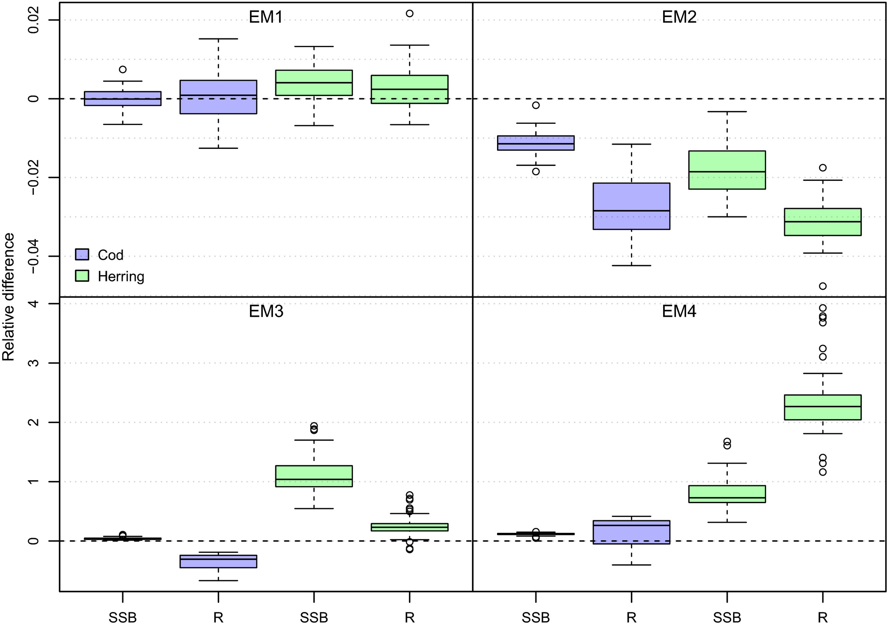
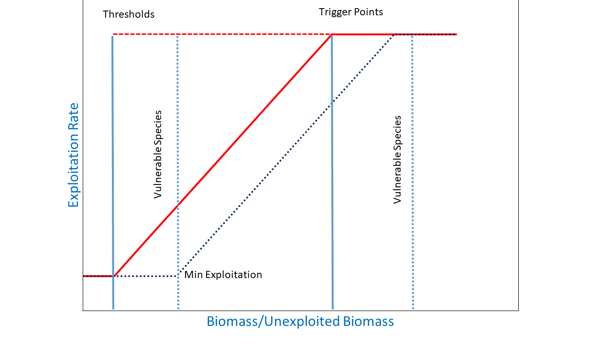
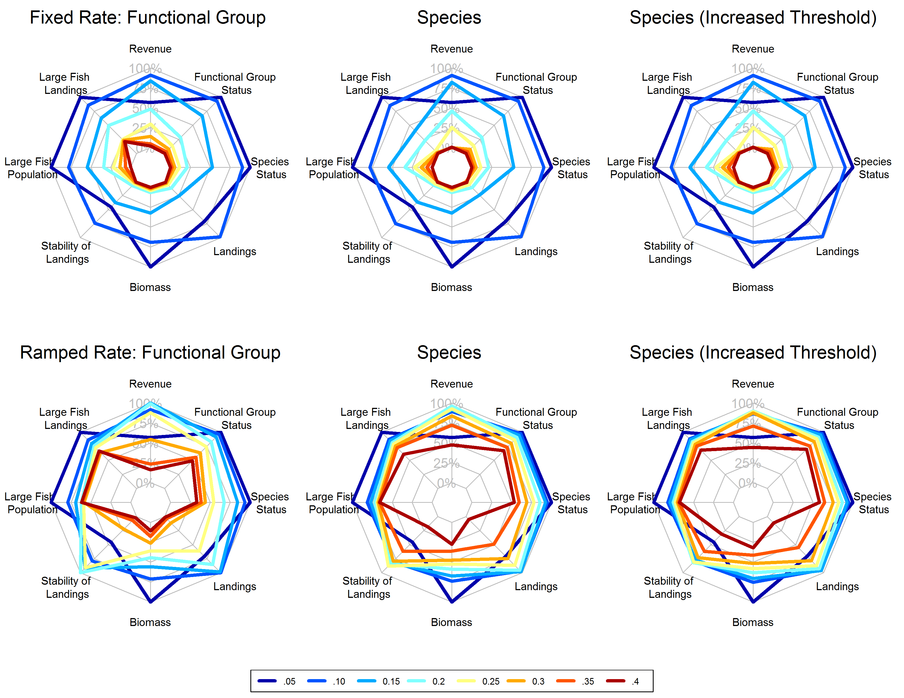

class: top, left

```{r setup, include=FALSE}

options(htmltools.dir.version = FALSE)
knitr::opts_chunk$set(echo = F,
                      fig.retina = 3,
                      warning = F,
                      message = F)
#Plotting and data libraries
library(tidyverse)
library(tidyr)
library(here)
```

```{r, load_refs, include=FALSE, cache=FALSE}
library(RefManageR)
BibOptions(check.entries = FALSE,
           bib.style = "authoryear",
           cite.style = "authoryear",
           longnamesfirst = FALSE,
           max.names = 1,
           style = "markdown")
myBib <- ReadBib("./modreview2.bib", check = FALSE)

#,
#           hyperlink = FALSE,
#           dashed = FALSE

```

```{r}
#herring MSE outputs
#allres <- readRDS(file.path(data.dir,"allres.rds"))

allres <- readRDS(url("https://github.com/sgaichas/herringMSE/blob/master/data/allres.rds?raw=True"))

#herring MSE plotting
#a better plotting theme than ggplot default? from https://rpubs.com/Koundy/71792
theme_Publication <- function(base_size=14, base_family="") {
      library(grid)
      library(ggthemes)
      (theme_foundation(base_size=base_size, base_family=base_family)
       + theme(plot.title = element_text(face = "bold",
                                         size = rel(1.2), hjust = 0.5),
               text = element_text(),
               panel.background = element_rect(colour = NA),
               plot.background = element_rect(colour = NA),
               panel.border = element_rect(colour = NA),
               axis.title = element_text(face = "bold",size = rel(1)),
               axis.title.y = element_text(angle=90,vjust =2),
               axis.title.x = element_text(vjust = -0.2),
               axis.text = element_text(), 
               axis.line = element_line(colour="black"),
               axis.ticks = element_line(),
               panel.grid.major = element_line(colour="#f0f0f0"),
               panel.grid.minor = element_blank(),
               legend.key = element_rect(colour = NA),
               legend.position = "right",
               legend.direction = "vertical",
               legend.key.size= unit(0.4, "cm"),
               legend.margin = unit(0, "cm"),
               legend.title = element_text(face="italic"),
               plot.margin=unit(c(10,5,5,5),"mm"),
               strip.background=element_rect(colour="#f0f0f0",fill="#f0f0f0"),
               strip.text = element_text(face="bold")
          ))
      
}

scale_fill_Publication <- function(...){
      library(scales)
      discrete_scale("fill","Publication",manual_pal(values = c("#386cb0","#fdb462","#7fc97f","#ef3b2c","#662506","#a6cee3","#fb9a99","#984ea3","#ffff33")), ...)

}

scale_colour_Publication <- function(...){
      library(scales)
      discrete_scale("colour","Publication",manual_pal(values = c("#386cb0","#fdb462","#7fc97f","#ef3b2c","#662506","#a6cee3","#fb9a99","#984ea3","#ffff33")), ...)
}

```

# What makes a good model? `r Cite(myBib, "nrc_chapter_2007")`, p 108

.pull-left-30[
>Is the model based on generally accepted science and computational methods?  

>Does it work, that is, does it fulfill its designated task or serve its intended purpose? 

>Does its behavior approximate that observed in the system being modeled?  
]

.pull-right-70[

]

---
## Best practices 1: Why are we building a model? Identify the problem

.pull-left[

]

--

.pull-right[

]


---
## ms-keyrun project objectives

EBFM Objective 1: what happens with all the species in the region under a certain management regime? (Rpath)
* Paper! DONE!
* What do we need to do
* Fitting routines
* Time series of data
* Doing actual fitting
EBFM Objective 2: how well do multispecies models perform for assessment? (Hydra, MSCAA/VADER, Kraken)
* Which models are better at what (size/age structured and biomass dynamics)
* What data are necessary?
* Which species actually need to be included? Use Rpath to id
* Need a fleet based model? Add econ?
The above includes fits to historical data for all the models
Overall goal: tools vetted and ready to go with any of further questions from the Council

---
## Why include species interactions?
*Ignore predation at your peril: results from multispecies state-space modeling  *  `r Cite(myBib, "trijoulet_performance_2020")`
>Ignoring trophic interactions that occur in marine ecosystems induces bias in stock assessment outputs and results in low model predictive ability with subsequently biased reference points.  

.pull-left-40[


EM1: multispecies state space 

EM2: multispecies, no process error 

EM3: single sp. state space, constant M 

EM4: single sp. state space, age-varying M 

*note difference in scale of bias for single species!*

]
.pull-right-60[

]

???
This is an important paper both because it demonstrates the importance of addressing strong species interactions, and it shows that measures of fit do not indicate good model predictive performance. Ignoring process error caused bias, but much smaller than ignoring species interactions.
See also Vanessa's earlier paper evaluating diet data interactions with multispecies models
---
background-image: url("EDAB_images/modeling_study.png")
background-size: 380px
background-position: right bottom

# Today: compare and contrast species interactions

## Multispecies catch at age `r Cite(myBib, "curti_evaluating_2013")`  
## Multispecies catch at length `r Cite(myBib, "gaichas_combining_2017")` 
## Multispecies production `r Cite(myBib, "gamble_analyzing_2009")`  
## Food web `r Cite(myBib, "lucey_conducting_2020")`  
## MICE for MSE `r Cite(myBib, "deroba_dream_2018")`  

---
## Multispecies catch at age estimation model: *seeking catchy name* [FIT: MSCAA](https://nmfs-ecosystem-tools.github.io/MSCAA/)

Species interactions: 
- Predation: Top down only (predators increase M of prey, predators grow regardless of prey)

*Based on standard age structured stock assessment population dynamics equations*
- First, split $M$ for species $i$ age $a$ into components: $$M_{i,a,t} = M1_i + M2_{i,a,t}$$  
- Calculate $M2$ with MSVPA predation equation, which applies a predator consumption:biomass ratio to the suitable prey biomass for that predator. 
- Suitability is a function of predator size preference (based on an age-specific predator:prey weight ratio) and prey vulnerability (everything about the prey that isn't size related). 
- Also sensitive to "other food"

$$M2_{i,a,t} = \frac{1}{N_{i,a,t}W_{i,a,t}}\sum_j \sum_b CB_{j,b} B_{j,b,t} \frac{\phi_{i,a,j,b,t}}{\phi_{j,b,t}}$$
???

Size preference is $$g_{i,a,j,b,t}=\exp\bigg[\frac{-1}{2\sigma_{i,j}^2}\bigg(\ln\frac{W_{j,b,t}}{W_{i,a,t}}-\eta_{i,j}\bigg)^2\bigg]$$

Suitability, $\nu$ of prey $i$ to predator $j$:
$$\nu_{i,a,j,b,t}=\rho_{i,j}g_{i,a,j,b,t}$$

Scaled suitability: 
$$\tilde\nu_{i,a,j,b,t}=\frac{\nu_{i,a,j,b,t}}{\sum_i \sum_a \nu_{i,a,j,b,t} + \nu_{other}}$$

Suitable biomass of prey $i$ to predator $j$:
$$\phi_{i,a,j,b,t}=\tilde\nu_{i,a,j,b,t}B_{i,a,t}$$

Available biomass of other food, where $B_other$ is system biomass minus modeled species biomass:
$$\phi_{other}=\tilde\nu_{other}B_{other,t}$$
Total available prey biomass:
$$\phi_{j,b,t}=\phi_{other} + \sum_i \sum_a \phi_{i,a,j,b,t}$$
---
## Multispecies catch at length simulation model: [Hydra](https://github.com/NOAA-EDAB/hydra_sim)

Species interactions: 
- Predation: Top down only (predators increase M of prey, predators grow regardless of prey)  

*Same MSVPA predation equation as MSCAA (but length based), same dependencies and caveats*

- Suitability, $\rho$, of prey species $m$ size $n$ for a given predator species $i$ size $j$ a function of size preference and vulnerability  {0,1}. 
- Food intake $I$ for each predator-at-size is temperature dependent consumption rate times mean stomach content weight. 

$$M2_{m,n,t} = \sum_i \sum_j I_{i,j,t} N_{i,j,t} \frac{\rho_{i,j,m,n}}{\sum_a \sum_b \rho_{i,j,a,b} W_{a,b} N_{a,b} + \Omega}$$

*Associated GitHub repositories*
* [hydra-sim Wiki](https://github.com/NOAA-EDAB/hydra_sim/wiki)
* [hydradata](https://github.com/NOAA-EDAB/hydradata)
* [LeMANS](https://github.com/NOAA-EDAB/LeMANS)
* [hydra-est](https://github.com/NOAA-EDAB/hydra_est) Work in progress to convert to estimation model
* [mscatch](https://github.com/NOAA-EDAB/mscatch) Multispecies fishery catch data

???
But:
- Covariates on growth, maturity, recruitment possible; intended for environmental variables
- So could hack in prey-dependent growth but making it dynamic is difficult

We specify 'preferred' predator-prey weight ratio (log scale) $\Psi_j$ and variance in predator size preference $\sigma_j$ to compare with the actual predator-prey weight ratio $(w_n / w_j)$ to get the size preference $\vartheta$. 

$$\vartheta_{n,j} = \frac{1}{(w_n / w_j)\sigma_j \sqrt{2\pi}} e^{-\frac{[log_e(w_n / w_j) - \Psi_j]}{2\sigma_j^2}}$$

Food intake is $$I_{i,j,t} = 24 [\delta_j e^{\omega_i T}]\bar{C}_{i,j,k,t}$$

---
## Multispecies production simulation: [Kraken](https://github.com/NOAA-EDAB/Kraken) and estimation [FIT: MSSPM](https://nmfs-ecosystem-tools.github.io/MSSPM/)

Species interactions: 
- Predation: Top down (predation decreases population growth of prey, predator population growth independent of prey)
- Competition: Within and between species groups

*Based on Shaefer and Lotka-Volterra population dynamics and predation equations*
- Species have intrinsic population growth rate $r_i$
- Full model has 
    - Carrying capacity $K$ at the species group level $K_G$ and at the full system level $K_\sigma$
    - Within group competition $\beta_{ig}$ and between group competition $\beta_{iG}$ slow population growth near $K$
    - Predation $\alpha_{ip}$ and harvest $H_i$ reduce population

$$\frac{dN_i}{dt} = r_iN_i \bigg(1 - \frac{N_i}{K_G} - \frac{\sum_g \beta_{ig}N_g}{K_G} - \frac{\sum_G \beta_{iG}N_G}{K_\sigma - K_G} \bigg) - N_i\sum_p\alpha_{ip}N_p - H_iN_i$$

- Simpler version used in most applications has interaction coefficient $\alpha$ that incorporates carrying capacity
$$B_{i,t+1}=B_{i,t} + r_iB_{i,t} - B_{i,t}\sum_j\alpha_{i,j}B_{j,t} - C_{i,t}$$
???
Interaction coefficients $\alpha_{i,j}$ can be positive or negative

$C$ can be a Catch time series, an exploitation rate time series $B_{i,t}*F_{i,t}$ or an $qE$ (catchability/Effort) time series.

Environmental covariates can be included on growth or carrying capacity (in the model forms that have an explicit carrying capacity).


---
background-image: url("EDAB_images/Balance_concept.png")
background-size: 700px
background-position: right

## Food web: [Rpath](https://github.com/NOAA-EDAB/Rpath) in collaboration with AFSC
.pull-left[ 
Species interactions:
- Full predator-prey: Consumption leads to prey mortality and predator growth
- Static and dynamic model components

Static model: 
For each group, $i$, specify: 

   Biomass $B$ (or Ecotrophic Efficiency $EE$)  
   Population growth rate $\frac{P}{B}$  
   Consumption rate $\frac{Q}{B}$  
   Diet composition $DC$  
   Fishery catch $C$  
   Biomass accumulation $BA$  
   Im/emigration $IM$ and $EM$  
   
Solving for $EE$ (or $B$) for each group:

$$B_i\Big(\frac{P}{B}\Big)_i*EE_i+IM_i+BA_i=\sum_{j}\Big[ B_j\Big (\frac{Q}{B}\Big)_j*DC_{ij}\Big ]+EM_i+C_i$$  
]

.pull-right[

]

???
Predation mortality $$M2_{ij} = \frac{DC_{ij}QB_jB_j}{B_i}$$

Fishing mortality $$F_i = \frac{\sum_{g = 1}^n (C_{ig,land} + C_{ig,disc})}{B_i}$$

Other mortality $$M0_i = PB_i \left( 1 - EE_i \right)$$
---
background-image: url("EDAB_images/ForagingArena.png")
background-size: 380px
background-position: right

## Food web: [Rpath](https://github.com/NOAA-EDAB/Rpath) in collaboration with AFSC

.pull-left-70[ 
Dynamic model (with MSE capability):

$$\frac{dB_i}{dt} = \left(1 - A_i - U_i \right) \sum_{j} Q \left(B_i, B_j \right) -  \sum_{j} Q \left( B_j, B_i \right) - M0_iB_i  - C_m B_i$$
Consumption: 

$$Q \left( B_i, B_j \right) = Q_{ij}^* \Bigg( \frac{V_{ij} Ypred_j}{V_{ij} - 1 + \left( 1 - S_{ij} \right) Ypred_j + S_{i} \sum_k \left( \alpha_{kj} Ypred_k \right)} \Bigg) \times \\\Bigg( \frac{D_{ij} Yprey_i^{\theta_{ij}}}{D_{ij} - 1 + \big( \left( 1 - H_{ij} \right) Yprey_i + H_{i} \sum_k \left( \beta_{ik} Yprey_k \right) \big)^{\theta_{ij}}} \Bigg)$$  
Where $V_{ij}$ is vulnerability, $D_{ij}$ is “handling time” accounting for predator saturation, and $Y$ is relative biomass which may be modified by a foraging time multiplier $Ftime$,

$$Y[pred|prey]_j =  Ftime_j \frac {B_j}{B_j^*}$$

]

.pull-right-30[

]
???
The parameters $S_{ij}$ and $H_{ij}$ are flags that control whether the predator density dependence $S_{ij}$ or prey density dependence $H_{ij}$ are affected solely by the biomass levels of the particular predator and prey, or whether a suite of other species’ biomasses in similar roles impact the relationship. 

For the default value for $S_{ij}$ of 0 (off), the predator density dependence is only a function of that predator biomass and likewise for prey with the default value of 0 for $H_{ij}$.  

Values greater than 0 allow for a density-dependent effects to be affected by a weighted sum across all species for predators, and for prey.  The weights $\alpha_{kj}$ and $\beta_{kj}$ are normalized such that the sum for each functional response (i.e. $\sum_k\alpha_{kj}$ and $\sum_k\beta_{kj}$ for the functional response between predator *j* and prey *i*) sum to 1.  The weights are calculated from the density-independent search rates for each predator/prey pair, which is equal to $2Q_{ij}^*V_{ij} / (V_{ij} - 1)B_i^*B_j^*$.  

---
background-image: url("EDAB_images/OMdesign.png")
background-size: 750px
background-position: right

## MICE for MSE: Linked models

.pull-left-30[
*Develop a harvest control rule considering herring's role as prey*

Species interactions:
- Bottom up only: Predators with herring dependent dynamics
- NO predator feedback to herring
- Alternative Herring operating models with high and low M

(Also, done in ~ 6 months)

]
.pull-right-70[]

---
background-image: url("EDAB_images/herrtopreds.png")
background-size: 640px
background-position: left

## MICE for MSE Predators: deterministic delay-difference population models with herring-predator links
.pull-left[]
.pull-right[.right[

]
.table[
Time constraints forced:
- selection of predators with previous modeling and readily available data
- selection of single strongest herring-predator relationship
- models ignoring high variance in prey-predator relationships 
]
]

???
In general, if support for a relationship between herring and predator recruitment was evident, it was modeled as a predator recruitment multiplier based on the herring population $N_{y}$ relative to a specified threshold $N_{thresh}$:

$$\bar{R}_{y+a}^P = R_{y+a}^P  * \frac{\gamma(N_{y}/N_{thresh})}{(\gamma-1)+(N_{y}/N_{thresh})}$$ 

where $\gamma$ > 1 links herring population size relative to the threshold level to predator recruitment.

If a relationship between predator growth and herring population size was evident, annual changes in growth were modeled by modifying either the Ford-Walford intercept $\alpha_y^P$ or slope $\rho_y^P$:


$$B_{y+1}^P = S_{y}^P (\alpha_y^P N_{y}^P + Fw_{slope} B_{y}^P) + \alpha_y^PR_{y+1}^P$$
or 

$$B_{y+1}^P = S_{y}^P (Fw_{int} N_{y}^P + \rho_y^P B_{y}^P) + Fw_{int} R_{y+1}^P$$

where either $\alpha_y^P$ or $\rho_y^P$ are defined for a predator using herring population parameters.

Finally, herring population size $N_{y}$ could be related to predator survival using an annual multiplier on constant predator annual natural mortality $v$: 

$$v_{y} =  v e ^ {-(\frac{N_{y}}{N_{F=0}})\delta}$$

where 0 < $\delta$ <1 links herring population size to predator survival.

---
background-image: url("EDAB_images/herrup10pann.png")
background-size: 830px
background-position: right bottom

## Epilogue: Herring MSE food web modeling supplemental results

- Tradeoffs between forage groups and mixed impacts to predators apparent when multiple species and full predator prey interaction feedbacks can be included

.pull-left-30[
- Rpath Ecosense functions evaluate parameter uncertainty within a scenario

- Now we have MSE closed loop possibilities in Rpath!

- Can implement HCRs with predator prey interactions (Lucey et al. accepted)

]
.pull-right-70[

]
---
## References
.contrib[
```{r refs, echo=FALSE, results="asis"}
PrintBibliography(myBib)
```
]

## Additional resources

* [New England herring MSE peer review](https://s3.amazonaws.com/nefmc.org/Final-Peer-review-report.pdf)

* [New England herring MSE debrief](https://s3.amazonaws.com/nefmc.org/3_Herring-MSE-debrief-final-report.pdf)

.footnote[
Slides available at https://noaa-edab.github.io/presentations  
Contact: <Sarah.Gaichas@noaa.gov>
]

---

---
## Hydra: details and current uses
.pull-left[
*2018 CIE for Ecosystem Based Fishery Management Strategy* 
* [EBFM strategy review](https://www.nefsc.noaa.gov/program_review/)
* Multispecies model simulations
```{r hydrahcr, out.width="75%"}

```

]
.pull-right[

]

---
## Herring MSE details: Operating models and uncertainties 
.pull-left-70[
.table[
```{r OMs,  echo=FALSE, message=FALSE, warnings=FALSE, results='asis'}
#tab.cap="Operating model uncertainties addressed\\label{OMs}",
tabl <- "
|Operating Model Name|Herring Productivity|Herring Growth|Assessment Bias|
|:---------------------|:---------------------|:-----------------|:-----------------|
| LowFastBiased        | Low: high M, low h (0.44)  | 1976-1985: fast | 60% overestimate |
| LowSlowBiased        | Low: high M, low h (0.44)  | 2005-2014: slow | 60% overestimate |
| LowFastCorrect       | Low: high M, low h (0.44)  | 1976-1985: fast | None             |
| LowSlowCorrect       | Low: high M, low h (0.44)  | 2005-2014: slow | None             |
| HighFastBiased       | High: low M, high h (0.79) | 1976-1985: fast | 60% overestimate |
| HighSlowBiased       | High: low M, high h (0.79) | 2005-2014: slow | 60% overestimate |
| HighFastCorrect      | High: low M, high h (0.79) | 1976-1985: fast | None             |
| HighSlowCorrect      | High: low M, high h (0.79) | 2005-2014: slow | None             |
"
# df<-read_delim(tabl, delim="|")
# df<-df[-c(1,2) ,c("Operating Model Name","Herring Productivity","Herring Growth","Assessment Bias")]
# knitr::kable(df, booktabs = TRUE) #%>%
#   kable_styling(latex_options = "scale_down") %>%
#   kable_as_image()

cat(tabl) # output the table in a format good for HTML/PDF/docx conversion
```
] 
&nbsp;
&nbsp;

] 
.pull-right-30[
`r Cite(myBib, "deroba_dream_2018")`
]

Implementation error was included as year-specific lognormal random deviations: 
$F_{a,y}=\bar{F}_yS_ae^{\varepsilon_{\theta,y}-\frac{\sigma_\theta^2}{2}} \;\;\;  \varepsilon_{\theta} \sim N(0,\sigma_\theta^2)$

Assessment error was modeled similarly, with first-order autocorrelation and an optional bias term $\rho$:
$\widehat{N}_{a,y}=[N_{a,y}(\rho+1)]e^{\varepsilon_{\phi,y}-\frac{\sigma_\phi^2}{2}}\;\;\;\; \varepsilon_{\phi,y}=\vartheta\varepsilon_{\phi,y-1}+\sqrt{1-\vartheta^2}\tau_y \;\;\;\;  \tau \sim N(0,\sigma_\phi^2)$ 

---
background-image: url("EDAB_images/herrtopreds_results.png")
background-size: 650px
background-position: left center
## Herring MSE details: Results summary
Three HCR types were rejected at the second stakeholder meeting for poor fishery and predator performance.
.pull-left[]
.pull-right[.right[
```{r ZZZ, fig.height=11, fig.width=8.5, out.width='80%', message = FALSE, warning = FALSE}
#fig.cap="Differences between control rule types for key metrics. Boxplots represent the median (wide line within the box) and 25th and 75th percentiles (box) of the distribution of medians for final 50 years of each simulation for each performance metric (x-axis label, please see text for definitions) and control rule type (CR; described in the text Harvest control rules section: biomass based with 1 (BB), 3 (BB3yr), and 5 (BB5yr) quota blocks, biomass based 3 year quota block with a 15\\% restriction on interannual quota change (BB3yrPerc), constant catch (CC), and conditional constant catch(CCC)) across all operating models. Boxplot whiskers include the highest and lowest observations within 1.5 box lengths from the box. Observations further than 1.5 box lengths from the box (outliers) are represented by points.\\label{ZZZ}",
#note this one is over ALL OM

# metrics <- c(
#              'PropClosure',
#              'MedSSBrelSSBmsy',
#              'PropSSBrelhalfSSBmsy',
#              'YieldrelMSY',
#              'Yvar',
#              'MedPropYrs_goodProd_Targplustern',
#              'stouffer',
#              'p50_NR'
#              )
# 
# metlabels <- c(
#                'closure',
#                'relSSB',
#                'overfished',
#                'relyield',
#                'yieldvar',
#                'ternprod',
#                'equil1',
#                'net revenue'
#                )

metrics <- c('YieldrelMSY',
             'Yvar',
             'PropClosure',
             'MedSSBrelSSBmsy',
             'PropSSBrelhalfSSBmsy',
             'MedPropYrs_goodProd_Targplustern',
             'stouffer',
             'p50_NR'
             )

metlabels <- c('relyield',
               'yieldvar',
               'closure',
               'relSSB',
               'overfished',
               'ternprod',
               'equil1',
               'net revenue'
               )
plotting2 <- function(d, xvar, yvars, ylabs){
  P <- list()
  for (i in 1:length(yvars)){
    if(i < length(yvars)){
      p <- ggplot(d, aes_string(x=xvar, y=yvars[i])) +
        geom_boxplot() + labs(y=ylabs[i]) +
        theme_Publication() + scale_colour_Publication() + 
        theme(axis.title.x=element_blank(),axis.text.x=element_blank(),axis.ticks.x=element_blank(), plot.margin=unit(c(2,1,2,1),"mm"))
    }
    if(i == length(yvars)){
      p <- ggplot(d, aes_string(x=xvar, y=yvars[i])) +
        geom_boxplot() + labs(y=ylabs[i]) +
        theme_Publication() + scale_colour_Publication() + 
        theme(plot.margin=unit(c(0,1,2,1),"mm"))
    }
    #gp <- ggplotGrob(p)
    P[[i]] <- p
  }
  #return(list(plots=P, num=length(yvars)))
  gp <- lapply(P, ggplotGrob)
  g <- do.call(rbind, c(gp, size="first"))
  g$widths <- do.call(unit.pmax, lapply(gp, "[[", "widths"))
  return(g)
}

#PLOTS <- plotting(d)
#do.call(grid.arrange, c(PLOTS$plots, nrow = PLOTS$num))

metCR <- plotting2(allres, "CR", metrics, metlabels)
#do.call(grid.arrange, c(metCR$plots, nrow = metCR$num))
grid.newpage()
grid.draw(metCR)

```
]]

---
## Managing tradeoffs under uncertainty: What control rules give us 90% of everything we want?

- Tern productivity at 1.0 or above more than 90% of the time
- Herring biomass more than 90% of SSBmsy
- Fishery yield more than 90% of MSY
&nbsp;
- AND fishery closures (F=0) less than 1% of the time (plot on right).

.pull-left[
```{r}

Nrulesgoodterns <- allres %>%
  filter(CR %in% c("BB", "BB3yr")) %>%
  group_by(OM,CR)%>%
  filter(MedPropYrs_goodProd_Targplustern>0.9) %>%
  summarize(tern90 = n())

Nrulesgoodfishery <- allres %>%
  filter(CR %in% c("BB", "BB3yr")) %>%
  group_by(OM,CR)%>%
  filter(YieldrelMSY>0.9) %>%
  summarize(yield90 = n())

Nrulesgoodherring <- allres %>%
  filter(CR %in% c("BB", "BB3yr")) %>%
  group_by(OM,CR)%>%
  filter(MedSSBrelSSBmsy>0.9) %>%
  summarize(SSB90 = n())

Nrulesgoodternherrfish <- allres %>%
  filter(CR %in% c("BB", "BB3yr")) %>%
  filter(MedPropYrs_goodProd_Targplustern>0.9 & MedSSBrelSSBmsy>0.9 & YieldrelMSY>0.9) %>%
  group_by(OM,CR)%>%
  summarize(ternfishherr90 = n(), 
            minF = min(FracFtarg), 
            maxF = max(FracFtarg),
            minloB = min(FracBmsyThreshLo), 
            maxloB = max(FracBmsyThreshLo),
            minhiB = min(FracBmsyThreshHi),
            maxhiB = max(FracBmsyThreshHi)
  )

CRsgoodternherrfish <- allres %>%
  filter(CR %in% c("BB", "BB3yr")) %>%
  filter(MedPropYrs_goodProd_Targplustern > 0.9 & MedSSBrelSSBmsy > 0.9 & YieldrelMSY > 0.9) %>%
  group_by(OM,CR) %>%
  select(OM, CR, FracBmsyThreshLo, FracBmsyThreshHi,FracFtarg) %>%
  mutate(id = seq(1:n()),
         Xmin = 0,
         Xmax = 4) %>%
  gather(CRpart, x, Xmin,FracBmsyThreshLo, FracBmsyThreshHi,Xmax) %>%
  arrange(OM, CR, id) %>%
  mutate(y = case_when(CRpart == "Xmin" | CRpart == "FracBmsyThreshLo" ~ 0,
                       CRpart == "FracBmsyThreshHi" | CRpart == "Xmax" ~ FracFtarg)) %>%
  mutate(bigkey = paste0(OM, CR, id))
  
#with(CRsgoodternherrfish, 
#     plot(x=c(0,FracBmsyThreshLo, FracBmsyThreshHi, 4),
#          y=c(0,0,FracFtarg, FracFtarg), type="l"))  
  
p1 <- ggplot(CRsgoodternherrfish, aes(x=x, y=y, colour=CR)) + 
  geom_line(aes(group=bigkey), alpha=0.3) +
  labs(y="F/Fmsy", x="SSB/SSBmsy", colour="Control rule type") +
  guides(colour = guide_legend(override.aes = list(alpha = 1))) +
  theme_Publication() + scale_colour_Publication()

OMlabels <- c(HiM_LowSteep_AssBias_OldWt = 'LowFastBiased', 
              HiM_LowSteep_AssBias_RecWt = 'LowSlowBiased', 
              HiM_LowSteep_NoAssBias_OldWt = 'LowFastCorrect', 
              HiM_LowSteep_NoAssBias_RecWt = 'LowSlowCorrect',  
              LoM_HiSteep_AssBias_OldWt =  'HighFastBiased',  
              LoM_HiSteep_AssBias_RecWt = 'HighSlowBiased', 
              LoM_HiSteep_NoAssBias_OldWt = 'HighFastCorrect',
              LoM_HiSteep_NoAssBias_RecWt = 'HighSlowCorrect'
              )

p1 + facet_wrap("OM", labeller=labeller(OM = OMlabels), nrow=2) + theme(legend.position="bottom")

```
]

.pull-right[
```{r}
Nrulesgoodterns <- allres %>%
  filter(CR %in% c("BB", "BB3yr")) %>%
  group_by(OM,CR)%>%
  filter(MedPropYrs_goodProd_Targplustern>0.9) %>%
  summarize(tern90 = n())

Nrulesgoodfishery <- allres %>%
  filter(CR %in% c("BB", "BB3yr")) %>%
  group_by(OM,CR)%>%
  filter(YieldrelMSY>0.9) %>%
  summarize(yield90 = n())

Nrulesgoodherring <- allres %>%
  filter(CR %in% c("BB", "BB3yr")) %>%
  group_by(OM,CR)%>%
  filter(MedSSBrelSSBmsy>0.9) %>%
  summarize(SSB90 = n())

Nrulesgoodternherrfish <- allres %>%
  filter(CR %in% c("BB", "BB3yr")) %>%
  filter(MedPropYrs_goodProd_Targplustern>0.9 & MedSSBrelSSBmsy>0.9 & YieldrelMSY>0.9 & PropClosure < 0.01) %>%
  group_by(OM,CR)%>%
  summarize(ternfishherr90 = n(), 
            minF = min(FracFtarg), 
            maxF = max(FracFtarg),
            minloB = min(FracBmsyThreshLo), 
            maxloB = max(FracBmsyThreshLo),
            minhiB = min(FracBmsyThreshHi),
            maxhiB = max(FracBmsyThreshHi)
  )

CRsgoodternherrfish <- allres %>%
  filter(CR %in% c("BB", "BB3yr")) %>%
  filter(MedPropYrs_goodProd_Targplustern > 0.9 & MedSSBrelSSBmsy > 0.9 & YieldrelMSY > 0.9 & PropClosure < 0.01) %>%
  group_by(OM,CR) %>%
  select(OM, CR, FracBmsyThreshLo, FracBmsyThreshHi,FracFtarg) %>%
  mutate(id = seq(1:n()),
         Xmin = 0,
         Xmax = 4) %>%
  gather(CRpart, x, Xmin,FracBmsyThreshLo, FracBmsyThreshHi,Xmax) %>%
  arrange(OM, CR, id) %>%
  mutate(y = case_when(CRpart == "Xmin" | CRpart == "FracBmsyThreshLo" ~ 0,
                       CRpart == "FracBmsyThreshHi" | CRpart == "Xmax" ~ FracFtarg)) %>%
  mutate(bigkey = paste0(OM, CR, id))
  
#with(CRsgoodternherrfish, 
#     plot(x=c(0,FracBmsyThreshLo, FracBmsyThreshHi, 4),
#          y=c(0,0,FracFtarg, FracFtarg), type="l"))  
  
p1 <- ggplot(CRsgoodternherrfish, aes(x=x, y=y, colour=CR)) + 
  geom_line(aes(group=bigkey), alpha=0.3) +
  labs(y="F/Fmsy", x="SSB/SSBmsy", colour="Control rule type") +
  guides(colour = guide_legend(override.aes = list(alpha = 1))) +
  theme_Publication() + scale_colour_Publication()

OMlabels <- c(HiM_LowSteep_AssBias_OldWt = 'LowFastBiased', 
              HiM_LowSteep_AssBias_RecWt = 'LowSlowBiased', 
              HiM_LowSteep_NoAssBias_OldWt = 'LowFastCorrect', 
              HiM_LowSteep_NoAssBias_RecWt = 'LowSlowCorrect',  
              LoM_HiSteep_AssBias_OldWt =  'HighFastBiased',  
              LoM_HiSteep_AssBias_RecWt = 'HighSlowBiased', 
              LoM_HiSteep_NoAssBias_OldWt = 'HighFastCorrect',
              LoM_HiSteep_NoAssBias_RecWt = 'HighSlowCorrect'
              )

p1 + facet_wrap("OM", labeller=labeller(OM = OMlabels), nrow=2) + theme(legend.position="bottom")

```
]

