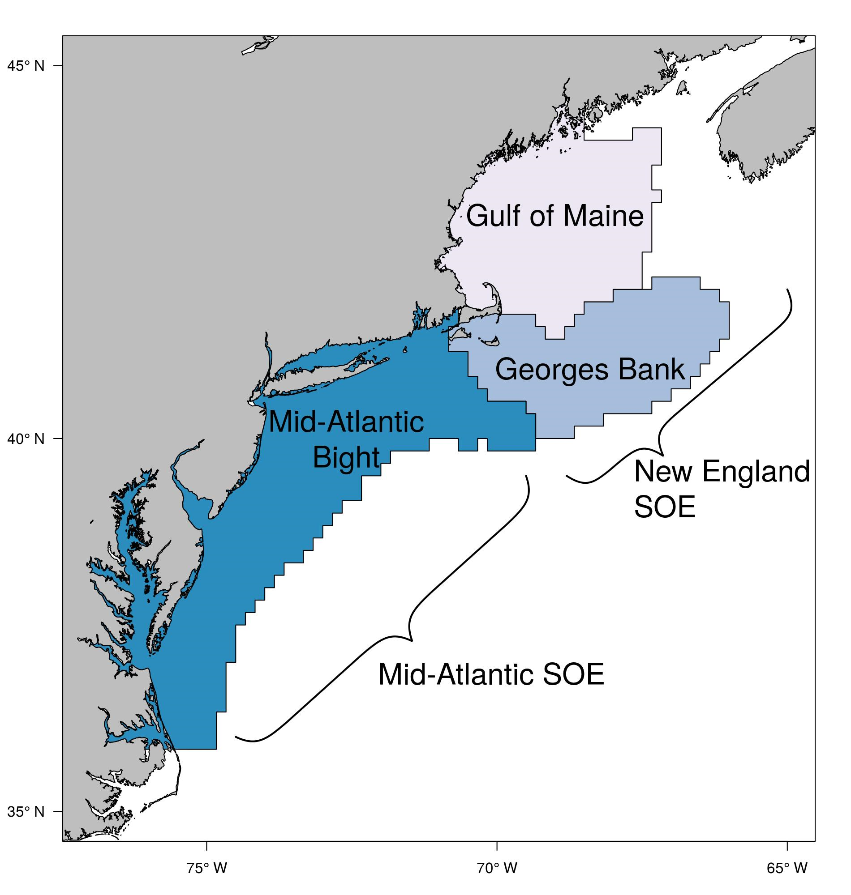
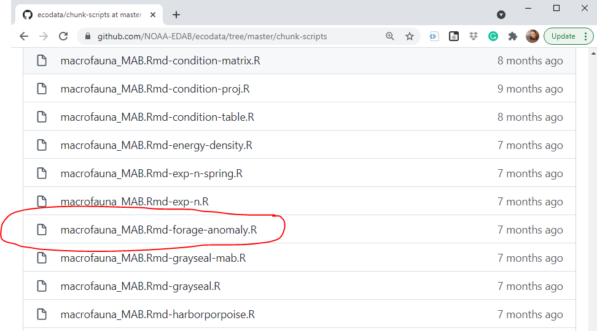
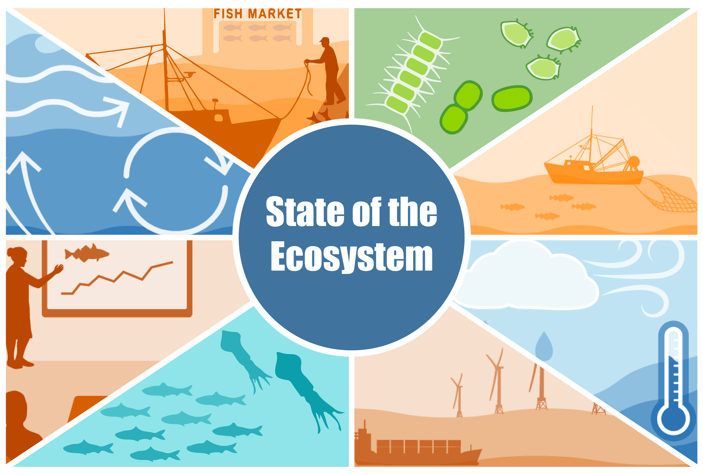

class: top, left

```{r setup, include=FALSE}
options(htmltools.dir.version = FALSE)
knitr::opts_chunk$set(echo = F,
                      fig.retina = 3,
                      #fig.width = 4,
                      #fig.height = 2,
                      fig.asp = 0.45,
                      warning = F,
                      message = F)
#Plotting and data libraries
library(tidyverse)
library(tidyr)
library(here)

#General inline text input for report
#Council
council <- "Mid-Atlantic Fishery Management Council"
council_abbr <- "MAFMC"
#Region identifiers
epu <- "Mid-Atlantic Bight"
epu_abbr <- "MAB"
region <- "Mid-Atlantic"
region_abbr <- "MA" 

#Time series constants
shade.alpha <- 0.3
shade.fill <- "lightgrey"
lwd <- 1
pcex <- 2
trend.alpha <- 0.5
trend.size <- 2
hline.size <- 1
hline.alpha <- 0.35
hline.lty <- "dashed"
label.size <- 5
hjust.label <- 1.5
letter_size <- 4
feeding.guilds <- c("Apex Predator","Piscivore","Planktivore","Benthivore","Benthos")
x.shade.min <- 2010
x.shade.max <- 2020
```

# Presentation Overview
.pull-left[

### SOE Overview

### Workflow Structure

### Cool technique for propagating plots throughout workflow.

]

.pull-right[

]


---


# SOE Overview 

## State of the Ecosystem Reports
.pull-left[
* 2 Annual reports that give ecosystem context to fisheries managers.
* 2 councils, 3 Ecological Production Units
* ~50 Indicator datasets, Over 60 data contributors
* Evolving since 2016
* Supporting products
  * [Technical Documentation](https://github.com/NOAA-EDAB/tech-doc) 
  * [Response Memo](https://github.com/NOAA-EDAB/memos/tree/master/SOE-response-memo)
  * [Presentations](https://github.com/NOAA-EDAB/presentations), etc.

.contrib[

[State of the Ecosystem 2022, Mid-Atlantic](https://apps-nefsc.fisheries.noaa.gov/rcb/publications/SOE-MAFMC-2021-508-Final.pdf)

[State of the Ecosystem 2022, New England](https://apps-nefsc.fisheries.noaa.gov/rcb/publications/SOE-NAFMC-2021-508-Final.pdf)
]  
]

.pull-right[

]


---

# SOE Workflow Structure

## State of the Ecosystem workflow tree


---
# ecodata

.pull-left[


.contrib[

https://github.com/NOAA-EDAB/ecodata
]
]

.pull-right[
## ecodata package purpose

* Data Processing
* Data Sharing
* Data Visualization

### Data Processing
* Rscipts that format contributor data

### Data Sharing
* Data saved in `data` folder
* Can be lazyloaded with package
  * mtcars
]

---
## Data Visualization and Propagation

Plots built in Visualization.Rmd 

```{r, fig.asp = 0.55, fig.width=12, code = readLines("https://raw.githubusercontent.com/NOAA-EDAB/ecodata/master/chunk-scripts/macrofauna_MAB.Rmd-forage-anomaly.R")}

```

.contrib[

https://noaa-edab.github.io/ecodata/macrofauna_MAB#Forage_Anomaly
]

---
## Data Visualization and Propagation

Rmd Code Chunks converted to Individual R scripts

Rscripts stored on github




.contrib[

* https://github.com/NOAA-EDAB/ecodata/blob/master/data-raw/code_chunks_to_scripts.R
* https://github.com/NOAA-EDAB/ecodata/tree/master/chunk-scripts
]

---
## Data Visualization and Propagation

use `code = readLines` in Rmd


---
# Benefits

.pull-left[

]

.pull-right[

* No copy/paste errors
<br />
* All associated products get most up-to-date figure
<br />
* Clearly defined tasks for individuals
<br />
* Keeps code all in one place
<br />
* Easier to maintain 100+ plots
<br />
* Easy to set up and update

]
---
# Questions??

.center[


]