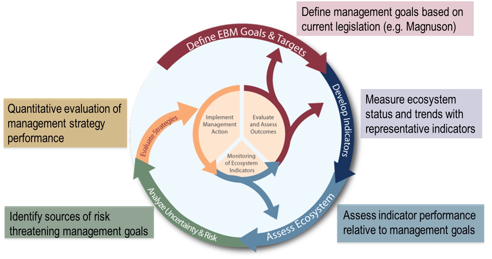

class: top, left

```{r setup, include=FALSE}

options(htmltools.dir.version = FALSE)
knitr::opts_chunk$set(echo = F,
                      warning = F,
                      message = F)
```

## Overview

.pull-left[
1. U.S. fisheries management
1. Ecosystem-based Fishery Management (.red[EBFM])
1. Strategies and tools for EBFM
1. Discussion and questions
]
.pull-right[

.image-cap[
"anna marie" by peter.clark is licensed under CC BY-NC 2.0
]
]

???
Let's be casual and curious. Ask questions, interject. It's OK. Fisheries and government science typically uses a lot of acronyms and abbreviations. When I define a frequently used abbreviation, I've tried to highlight with .red[red text].

---
## Why do we manage fisheries?
.pull-left[

Objectives
* Sustain, protect, and increase domestic seafood supply
* Maintain and enhance recreational and subsistence fishing opportunities
* Protect ecosystem health and sustainability
* Create jobs, support related economic and social benefits, and sustain community resilience
]

.pull-right[
Milestones
* Not overfished: Fish populations need to stay above a certain level.
* No overfishing: Harvest rates need to stay at a level that allows the fish to produce its maximum sustainable yield .red[MSY].
]

???
Under U.S. law, NOAA Fisheries is responsible for managing marine fisheries within the U.S. exclusive economic zone, the 4.4-million-square-mile zone that extends from 3 to 200 nautical miles off the coast of the United States. Individual states are generally responsible for fishery management from their coastline out to three miles. We work with federal, regional, state, and territorial partners to ensure the sustainable management of U.S. fisheries in the EEZ.

* Bonus, which states have EEZs <3 nm? (Florida and Texas, 9mi)

---
## Who works on U.S. fisheries management issues?

Eight regional Fishery Management Councils (.red[FMCs]) establish plans for sustainable management of stocks within their jurisdictions. All are governed by the same law, but tailor management to their regional stakeholder needs.


More information: http://www.fisherycouncils.org/
https://www.fisheries.noaa.gov/topic/laws-policies#magnuson-stevens-act
???
NOAA Fisheries works closely with eight regional fishery management councils, who are responsible for the fisheries in their region. Council members represent commercial and recreational fishing as well as environmental, academic, and government interests. The councils

* Develop fishery management plans.
* Convene committees and advisory panels and conduct public meetings.
* Develop research priorities.
* Select fishery management options.
* Set annual catch limits based on best available science.
* Develop and implement rebuilding plans.

--- 
## What laws relate to fisheries management?

U.S. fisheries management is guided by several laws, including the Magnuson-Stevens Fishery Conservation and Management Act, Marine Mammal Protection Act, and Endangered Species Act.

The MSA works to:
* Prevent overfishing.
* Rebuild overfished stocks.
* Increase long-term economic and social benefits of fisheries.
* Ensure a safe and sustainable seafood supply.

???
Fishery management plans must comply with a number of requirements, including 10 National Standards—principles that promote sustainable fisheries management. These National Standards address everything from preventing overfishing while achieving optimum yield in fisheries, to reducing bycatch, to ensuring safety at sea.

Under the MMPA, NOAA Fisheries is responsible for protecting whales, dolphins, porpoises, seals, and sea lions. It also establishes a system to govern interactions with marine mammals during commercial fishing.

The ESA protects species that are at risk of extinction and also provides for the conservation of the ecosystems on which they depend. Regional fishery management councils must take both the MMPA and the ESA into consideration when developing fishery management plans.

---
## How to sustainably manage fisheries?

Using data gathered from commercial and recreational fishermen and other scientific observations, stock assessments:

.pull-left[
* Describe the past and current status of a fish population.
* Answer questions about the size of the stock.
* Help predict how a fishery will respond to management measures.
]

.pull-right[
.center[


]
]

.footnote[More information on U.S. Fisheries Management: [Understanding Fisheries Management in the United States](https://www.fisheries.noaa.gov/insight/understanding-fisheries-management-united-states#:~:text=U.S.%20fisheries%20management%20is%20guided,The%20MSA%20works%20to%3A&text=Increase%20long%2Dterm%20economic%20and,safe%20and%20sustainable%20seafood%20supply)
]

???
Scientists routinely monitor fisheries to ensure they are sustainably managed. Stock assessments are critical to this process. This information helps us determine the current status of a fish stock. Stock status determinations focus on the concept of maximum sustainable yield—the largest long-term average catch that can be taken from a fish stock under prevailing environmental and fishery conditions. 


---
## Fish and fisheries occur within coupled socio-ecological systems

<br>
<br>
.center[

]


---
## Policy defines EBFM as:

> A systematic approach to fisheries management in a geographically specified area that contributes to the resilience and sustainability of the ecosystem; recognizes the physical, biological, economic, and social interactions among the affected fishery-related components of the ecosystem, including humans; and seeks to optimize benefits among a diverse set of societal goals. 


.center[

]

.footnote[
https://www.fisheries.noaa.gov/resource/document/ecosystem-based-fisheries-management-policy
]

---
# Why EBFM:

* Allows for consideration of trade-offs between different priorities
* Provides more information for management decisions
* Contributes to improved ability to predict management outcomes
* Ensures ecosystem-level measures remain stable

.center[

]


???
From providing additional information for making decisions, to increasing the certainty about the impact of those decisions, EBFM has many benefits. In particular, EBFM:

* Facilitates trade-offs between different stakeholder priorities, balancing social and ecological needs. It accomplishes this by:
    + Addressing multiple legal mandates simultaneously.
    + Maintaining ecosystem goods and services to deliver social, economic, and cultural benefits to society.
    + Addressing cumulative impacts.
    + Increasing stakeholder participation.
* Provides more information to make management decisions, which improves our ability to sustainably manage fisheries. It accomplishes this by:
    + Improving managers’ understanding of the ecosystem as a whole.
* Contributes to an increased ability to predict likely outcomes of management actions. It accomplishes this by:
    + Forecasting pressures and impacts on both single and aggregated components of a marine ecosystem.
    + Providing a better understanding of how ecosystems and their components respond to multiple stressors.
* Ensures that ecosystem-level measures remain stable, which could translate into better regulatory stability and business plans. It accomplishes this by:
    + Being cost-effective.
    + Providing a more effective management framework.
    + Being adaptive.

---

## 


---
## EBFM Guiding Principles


---
## Finding the right tool for the job

.pull-left-70[
* How to manage human activities within an ecosystem?
* Can we model everything?
* What do managers want?
]

.pull-right-30[

]


???
There are many questions about the best way to manage human activities within a complex and changing ecosystem. It is important to have a range of models capable of addressing these questions. Models built to mimic the behavior of one component of the system may lack the ability to predict other important components of interest to managers. For this reason, it is also important to understand the questions managers have when developing and using multispecies and ecosystem models. Using several different models together to address a question can provide the most insight. When different models agree on an outcome, managers have more confidence in the prediction. This “ensemble” approach is currently used by hurricane forecasters in the United States. Our scientists are working towards this goal. 


---
## Start with conceptual models
.center[

]
???

The first step in developing a mathematical model is to outline key processes and relationships. A conceptual model depicts these relationships. It can be used in various ways:

* As a communication tool on its own.
* As a checklist to ensure that no key processes are missed in further quantitative modeling.
* To outline areas for further research.
* To relate information across multiple scientific fields.

---

.center[

]

???
A model is a simple representation of an object or system. Models are used to develop a common understanding of the object or system, and to predict possible outcomes of different changes to the system. At the Northeast Fisheries Science Center, we use mathematical models for research and for management advice. The models vary in complexity, from simple equations to model primary productivity to single species assessment models to models with multiple species to complete ecosystems.

---
## Integrated Ecosystem Assessment



.footnote[IEAs in the wild: https://www.integratedecosystemassessment.noaa.gov/
]


???
This approach integrates all components of an ecosystem, including humans, into the decision-making process so that managers can balance trade-offs and determine what is more likely to achieve their desired goals. The approach is a NOAA-wide initiative, that provides a consistent national approach but is flexible to accommodate regional needs. It is overseen by the IEA program, which directs the execution of Integrated Ecosystem Assessments within five regions in the United States ocean and coastal ecosystems. 

---
## Food web models

.center[

]


.footnote[
Foodweb models in the wild: [Whitehouse and Aydin, 2020 *Ecological Modeling*](https://www.sciencedirect.com/science/article/pii/S0304380020301460)
]

???
Food web models track energy flow in an ecosystem from primary producers (phytoplankton) up to zooplankton, fish, top predators, and fisheries. They simultaneously account for deaths due to predation and fishing. These models may factor in information including: 

* Changes in biomass of a species like production models.
* Track age groups like age structured models.
* Combine these functions for different groups in the food web. 
Food web models are useful for management strategy evaluation that addresses fishery and predator-prey interactions. We have developed food web models for the Gulf of Maine, Georges Bank, Southern New England, and the Mid-Atlantic. Recently, we used an updated Gulf of Maine model to evaluate the potential impacts of changes in Atlantic herring fishery regulations, along with more detailed species models. 

---
## Discussion questions
[Link 2002 *Fisheries*](https://www.researchgate.net/profile/Jason_Link/publication/269576198_What_does_ecosystem-based_fisheries_management_mean/links/5499b4310cf21eb3df60dc7d.pdf)
1. Describe two competing ocean management goals (hint, pretend you are a lobster fisher and a whale watcher, a scallop fisher and an off-shore wind company, be creative). 
1. How would managers identify the best goal (hint, how do you define "best")?

[Gulf of Maine, Explained: Ecosystem Modeling](https://www.youtube.com/watch?v=bwdhCYAL_8w)
1. Besides temperature (that Dr. Mills mentions in the video) what are some other things that might influence where fish are found? 
1. What data would scientists need to build and evaluate that model? How would they collect the data?

---
## Other questions
1. What role might consumers have for supporting EBFM? (e.g., One example might be [*Eating with the Ecosystem*](https://www.eatingwiththeecosystem.org/))
1. In your region, what "sectors" of human use intersect with living resource management and how has conflict been addressed (e.g., [Northeast US shipping lanes moved to protect endangered whales](https://www.fisheries.noaa.gov/national/endangered-species-conservation/reducing-ship-strikes-north-atlantic-right-whales))?

---
## External Resources

* [SOE Technical Documentation](https://noaa-edab.github.io/tech-doc)

* [ecodata R package](https://github.com/noaa-edab/ecodata)

  * [Macrofauna indicators](http://noaa-edab.github.io/ecodata/macrofauna)
  * [Human Dimensions indicators](http://noaa-edab.github.io/ecodata/human_dimensions)
  * [Lower trophic level indicators](http://noaa-edab.github.io/ecodata/LTL)

* [ERDDAP server](https://comet.nefsc.noaa.gov/erddap/index.html)

* [NOAA SOE summary webpage](https://www.fisheries.noaa.gov/new-england-mid-atlantic/ecosystems/state-ecosystem-reports-northeast-us-shelf)

* Slides available at https://noaa-edab.github.io/presentations/

---
.center[

]

.footnote[Questions? Thank you and have a great PEP experience!]
