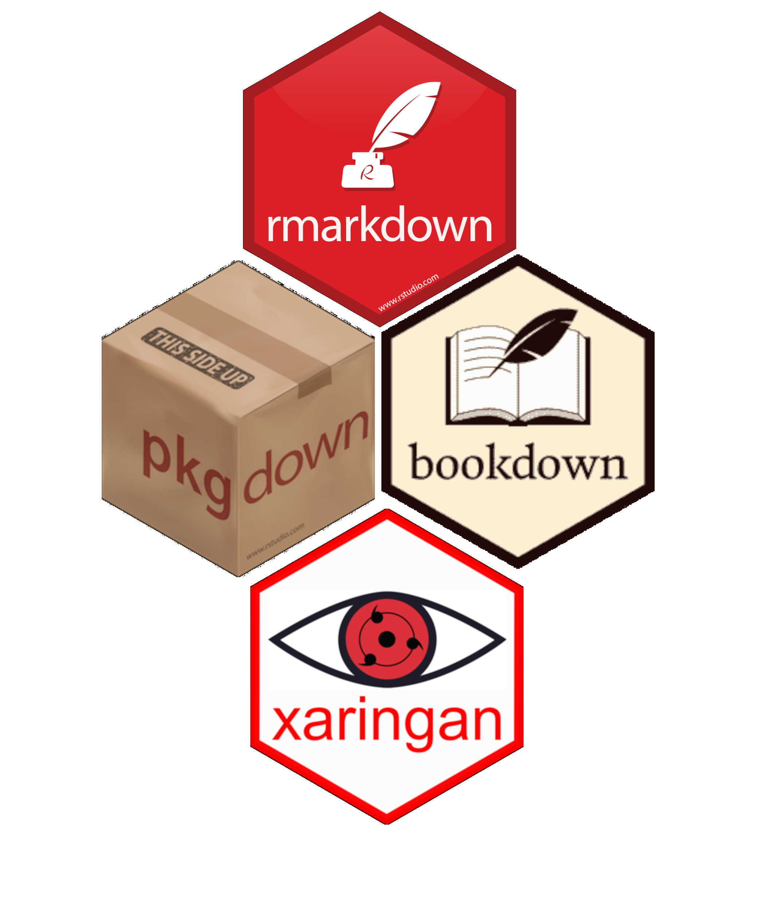

```{r setup, include=FALSE}
knitr::opts_chunk$set(echo = FALSE)
```


.pull-left[

# What is R Markdown

Simplified work flow that can aid in reproducibility by containing computer code and narrative in the same document

Can be used to generate:
- Letters
- Websites
- Journal articles
- Books
- Presentations

]

.pull-right[

.rotate20-left[

]

<br>
<br>
[Get the online version here](https://bookdown.org/yihui/rmarkdown/)
]

---

# How does it work?

- Uses the `knitr` package to embed R or other computer language in to markdown
  - Markdown is plain text that can be read by both humans and computers
- Pandoc then converts the markdown into the output format of your choice
- Output can be Word, PDF, html
- Some features work better than others depending on what output you choose

<br>
<br>
<br>
<br>
<br>

.center[

]

---

# Three basic components

.pull-left[
## Metadata
- Written between the pair of three dashes ---
  - Syntax called YAML ([YAML Ain’t Markup Language](https://en.wikipedia.org/wiki/YAML))
- Indentation matters! 
  
## Text
- Syntax is Markdown

## Code
- Can be incorporated in two ways
- Inline using  
- Code chunk using   
  
]

.pull-right[

```
---
  title: "Rmarkdown:<br /> Improving reproducibility"
subtitle: "RefReshing FRiday<br \> 09 April 2021"
author: "Sean Lucey"
output:
  xaringan::moon_reader:
  css: ["default", "libs/EDAB_theme3_508_SOE_16by9.css"]
---
  
```

<br>
  
```
This is how you make something **bold** or *italicized*
  
```
This is how you make something **bold** or *italicized*

<br>

```{r, eval = F, echo = T}
`r 2+2` 
```

````markdown
`r ''````{r}
x <- 2
y <- 2
x + y
```````
]

---

# Packages that extend R Markdown

.pull-left[
- bookdown - facilitates writing books and long-form articles/reports
  - [techdoc](https://github.com/NOAA-EDAB/tech-doc)
- linl - LaTeX letter template
  - [Response memo](https://github.com/NOAA-EDAB/memos)
- rticles - LaTeX journal article templates
  - [Rpath MSE manuscript](https://github.com/NOAA-EDAB/RPath_MSE)
- pkgdown - build a website for your package
  - [Survdat](https://noaa-edab.github.io/survdat/)
- xaringan - generate presentations
  - [This presentation]()
]

.pull-right[

]
